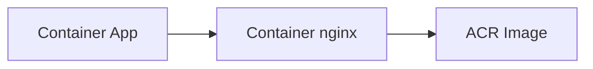

# Create Container App

## 1. Concept Overview

A **Container App** runs your container image with CPU/memory limits, scale rules, and (next lesson) ingress settings.

**App name:** `devops-lab-<yourname>-app`

---

## 2. Why DevOps Engineers Version via Revisions

Each change can create a new **revision** — shift traffic or roll back (blue-green style within the app).

---

## 3. Important Terms

| Term | Meaning |
|------|---------|
| **Target port** | Container listen port — **80** for nginx |
| **CPU / Memory** | Smallest combo for lab (e.g. 0.25 CPU, 0.5 Gi) |
| **Min / max replicas** | Start with min **1**, max **2** for lab |

---

## 4. Architecture Diagram

---

## 5. Before You Start

ACR image URI ready. Environment exists. If no push yet, use a public nginx image as fallback.

> **Cost warning:** Replicas bill when running (and sometimes cold-start behaviors with scale-to-zero).

---

## 6. Step-by-Step Console Lab

1. **Container Apps** → **Create**
2. **Basics:**
   - **Container app name:** `devops-lab-<yourname>-app`
   - **Resource group:** `devops-lab-<yourname>-rg`
   - **Container Apps environment:** `devops-lab-<yourname>-env`
   - Region inherits from environment (Southeast Asia)
3. **Container:**
   - Use image from ACR: `devopslab<yourname>acr.azurecr.io/devops-lab-<yourname>-app:latest`
   - Authenticate: Admin credentials **or** managed identity with **AcrPull** (preferred if wizard offers)
   - **CPU:** 0.25, **Memory:** 0.5 Gi (or smallest allowed)
   - **Container port / target port:** **80**
4. **Ingress:** enable External on port 80 now **or** configure fully in the next lesson — either works if you finish lesson 06 before testing
5. **Scale:** min replicas **1**, max **2** (avoid large max)
6. Tags → **Create**
7. Wait until app revision is **Running**

---

## 7. Validation

| Check | Expected |
|-------|----------|
| Container App | Running |
| Image | ACR path (or agreed public fallback) |
| Replicas | At least 1 |

---

## 8. Troubleshooting

| Problem | Solution |
|---------|----------|
| ImagePull failure | Registry auth / AcrPull role; wrong tag |
| App crash loop | Container must listen on configured target port |
| CPU/mem invalid | Pick allowed combination from dropdown |

---

## 9. Cleanup

Delete app before environment in [cleanup.md](cleanup.md).

---

## 10. Interview Questions

1. **Revision vs replica?**
   - *Revision is a deployment version; replicas are scaled instances of that revision.*

---

## 11. What We Achieved

- Container App running from ACR image

**Next:** [06-ingress-and-test.md](06-ingress-and-test.md)
