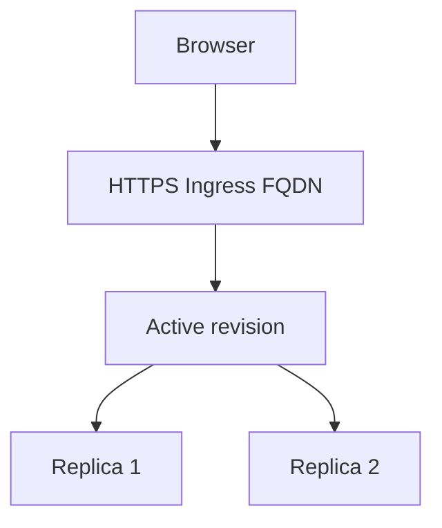

# Ingress and Test

## 1. Concept Overview

**Ingress** on Container Apps provides a managed HTTPS endpoint and FQDN (application URL). This replaces the separate ALB + target group pattern used with ECS for the basic “expose HTTP app” goal.

**You do not need to create Azure Load Balancer or Application Gateway** for this basic lab — ingress is built in. Those remain valid for advanced multi-service or WAF front doors later.

---

## 2. Why DevOps Engineers Use Built-in Ingress

Stable FQDN, TLS termination for `*.azurecontainerapps.io`, health-based routing to replicas, optional traffic splitting across revisions.

---

## 3. Important Terms

| Term | Meaning |
|------|---------|
| **External ingress** | Accept traffic from the internet |
| **Internal ingress** | Only inside the environment/VNet |
| **Target port** | Container port (80) |
| **Application URL** | `https://<app>.<env-unique>.<region>.azurecontainerapps.io` |

---

## 4. Architecture Diagram

---

## 5. Before You Start

Container App exists. Prefer External ingress for browser testing.

> **Cost warning:** App still running — delete **today** after tests.

---

## 6. Step-by-Step Console Lab

### Step 1 — Configure ingress

1. Open `devops-lab-<yourname>-app` → **Ingress**
2. **Ingress traffic:** Accepting traffic from anywhere (**External**)
3. **Ingress type:** HTTP
4. **Target port:** **80**
5. **Transport:** Auto / HTTP
6. Save if changed — new revision may create

### Step 2 — Test Application URL

1. Overview → copy **Application Url**
2. Open HTTPS URL in browser
3. See nginx / custom `devops-lab-<yourname>` page
4. Confirm padlock / HTTPS (platform-managed certificate on default domain)

### Step 3 — Scale test (optional)

1. **Scale** → set min **2**, max **2** → save
2. Wait replicas → refresh browser
3. Set min back to **1** (or **0** if scale-to-zero allowed) before cleanup to reduce cost

### Step 4 — Revision traffic (concept)

1. Open **Revision management**
2. Note active revision; optional traffic split is advanced — skip deep demo unless instructor asks

---

## 7. Validation

| Check | Expected |
|-------|----------|
| Ingress | External enabled, target 80 |
| Application URL | HTTPS 200, page loads |
| Replicas | Healthy |

---

## 8. Troubleshooting

| Problem | Solution |
|---------|----------|
| 404 / blank | Wrong target port; app not listening on 80 |
| Image pull errors in logs | ACR auth; check Log stream / System logs |
| URL timeout | Ingress disabled or internal-only |
| HTTP works but expecting LB DNS | Container Apps uses its own FQDN — not a separate LB resource |

---

## 9. Cleanup

[cleanup.md](cleanup.md) **immediately after test**.

---

## 10. Interview Questions

1. **Container Apps ingress vs Azure Load Balancer?**
   - *Ingress is built-in HTTP(S) for the app; LB is a separate L4 resource you manage for VMs/VMSS.*

2. **Container App vs revision vs replica?**
   - *App is the resource; revision is a versioned deployment; replicas are scaled instances.*

---

## 11. What We Achieved

- Container App exposed via built-in HTTPS FQDN and verified in browser
- End-to-end container deployment on Azure (ACR → Environment → App → Ingress)

**Next:** [cleanup.md](cleanup.md)
