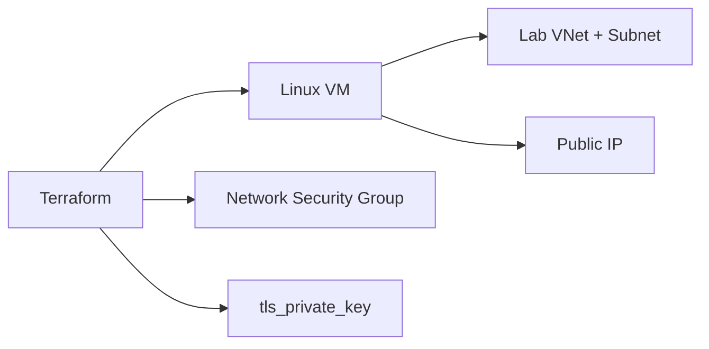

# Terraform Lab 01 — VM Lab Network

Repeat Portal lab VM (default-style lab network) using Terraform.

Azure has no AWS-style "default VPC," so this lab creates a **simplified lab Resource Group + VNet + subnet** — same outcome as Portal: Ubuntu VM, SSH, nginx on port 80.

---

## 1. Architecture



---

## 2. Files Explained

| File | Purpose |
|------|---------|
| `versions.tf` | Terraform + azurerm/tls/local providers, `provider` with `features {}` |
| `variables.tf` | Location, student name, SSH CIDR, VM size |
| `main.tf` | RG, VNet, subnet, NSG, Public IP, NIC, VM + nginx custom_data, SSH key |
| `outputs.tf` | Public IP, SSH command, HTTP URL |
| `terraform.tfvars.example` | Template — copy to `terraform.tfvars` |

> **State warning:** Do not commit `terraform.tfstate` or `terraform.tfvars`. See repo [`.gitignore`](../../../.gitignore).

---

## 3. Commands to Run

```bash
az account show
cd 05-terraform/labs/01-vm-default-vnet

cp terraform.tfvars.example terraform.tfvars
# Edit: student_name, allowed_ssh_cidr (curl https://ifconfig.me)

terraform init
terraform fmt
terraform validate
terraform plan
terraform apply
```

---

## 4. Expected Output

After `apply`:

```
Apply complete! Resources: N added, 0 changed, 0 destroyed.

Outputs:
http_url = "http://20.x.x.x"
public_ip = "20.x.x.x"
ssh_command = "ssh -i devops-lab-yourname-tf-key.pem azureuser@20.x.x.x"
```

---

## 5. Validation

```bash
terraform output http_url
curl $(terraform output -raw http_url)

# Or SSH
eval $(terraform output -raw ssh_command | sed 's/^ssh/ssh -o StrictHostKeyChecking=accept-new/')
```

Browser: open `http_url` from output.

---

## 6. Cleanup

```bash
terraform destroy
rm -f devops-lab-*-tf-key.pem
```

Verify in Portal: Resource Group `devops-lab-*-tf-rg` is gone.

---

## 7. Troubleshooting

| Issue | Fix |
|-------|-----|
| `Error building AzureRM Client` | `az login` / `az account set` |
| SSH timeout | Update `allowed_ssh_cidr` in tfvars; `terraform apply` |
| Empty public IP | Wait 1 min; check Public IP allocation |
| `git wants to commit .pem` | Add `*.pem` to `.gitignore` (already in repo root) |

---

## 8. What We Achieved

- Provisioned Ubuntu VM in a lab VNet with Terraform
- Used variables, outputs, custom_data, and tls SSH keys
- Destroyed stack with `terraform destroy`

**Next:** [../02-custom-vnet-vm/](../02-custom-vnet-vm/)
