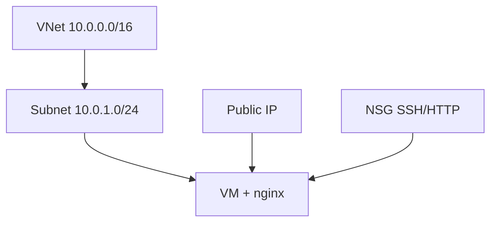

# Terraform Lab 02 — Custom VNet VM

## 1. Architecture



## 2. Files Explained

| File | Creates |
|------|---------|
| `main.tf` | RG, VNet, subnet, NSG, Public IP, NIC, VM |
| `variables.tf` | CIDR, location, SSH CIDR |
| `outputs.tf` | VNet ID, URLs |

No NAT Gateway / Bastion — keeps cost low (public subnet + Public IP).

## 3. Commands

```bash
cd 05-terraform/labs/02-custom-vnet-vm
cp terraform.tfvars.example terraform.tfvars
terraform init && terraform fmt && terraform validate
terraform plan && terraform apply
```

## 4. Expected Output

`public_ip`, `http_url`, `vnet_id` in outputs.

## 5. Validation

```bash
curl $(terraform output -raw http_url)
terraform output ssh_command
```

## 6. Cleanup

```bash
terraform destroy
rm -f *.pem
```

## 7. Troubleshooting

| Issue | Fix |
|-------|-----|
| Destroy VNet fails | Run `terraform destroy` again; delete dependent NICs first |
| No internet | Check Public IP attached and NSG allows outbound (default allow) |

## 8. What We Achieved

- Full custom VNet stack as code
- Same result as Portal custom VNet lab

**Next:** [../03-managed-disks/](../03-managed-disks/)
