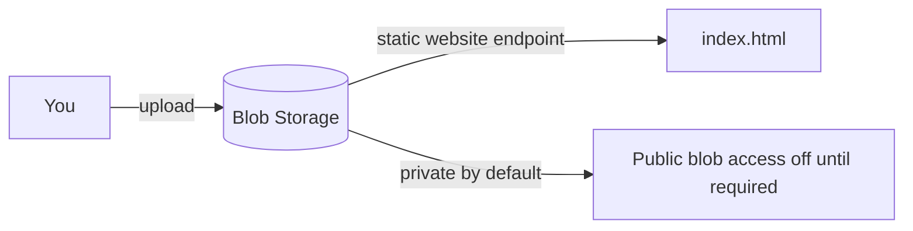

# Capstone Project 01 — Static Website on Blob Storage

**Level:** Beginner | **Est. time:** 2–3 hours | **Cost:** Low (pennies for small objects)

Combine skills from **Portal**, **CLI**, or **Terraform** Blob Storage labs into one portfolio project.

---

## Goal

Host a simple static HTML page using **Azure Storage static website** hosting. Understand the concept and **why public access must be controlled**.

---

## What You Will Build

| Component | Purpose |
|-----------|---------|
| Storage account | Store `$web` content (`index.html`, optional CSS/images) |
| Encryption | Microsoft-managed keys by default |
| Public access awareness | Understand anonymous read before enabling static website |
| Optional | Front Door / CDN later (not required for this project) |

---

## Architecture



**Static website concept:** Blob Storage can serve HTML/CSS/JS without a web server VM via the **static website** feature (`$web` container). Production often adds **Front Door / CDN**, not wide-open anonymous data access on other containers.

---

## Step-by-Step (Portal Path)

### 1. Create `index.html` locally

```html
<!DOCTYPE html>
<html>
<head>
  <title>devops-lab-<yourname> — Azure Capstone</title>
  <style>
    body { font-family: sans-serif; max-width: 600px; margin: 2rem auto; }
    h1 { color: #0078d4; }
  </style>
</head>
<body>
  <h1>Hello from Azure Static Website</h1>
  <p>Project by devops-lab-<strong>yourname</strong></p>
  <p>Region: southeastasia</p>
</body>
</html>
```

### 2. Create storage account

- Name: `devopslab<yourname>cap<random>` (lowercase alphanumeric only)
- Location: `southeastasia`
- **Allow Blob public access:** only enable if instructor runs a supervised static website demo
- Prefer **Microsoft Entra** auth for management tasks

### 3. Enable static website

Portal → storage account → **Data management** → **Static website**:

- Enable
- Index document: `index.html`
- Upload `index.html` into the `$web` container

### 4. Verify

Copy the **Primary endpoint** URL from Static website settings and open in a browser (only when static website is enabled intentionally).

Private verification without public site:

```bash
az storage blob download \
  --account-name <storage-account> \
  --container-name '$web' \
  --name index.html \
  --file ./test.html \
  --auth-mode login
```

Open `test.html` locally if you kept the site private.

### 5. Security warning

Opening storage widely for anonymous `Get Blob` has caused major data leaks. For this capstone:

- Prefer supervised static website demo **or** private upload/download
- Do not set random containers to public anonymous access
- Delete the account when done

---

## CLI Path (Alternative)

```bash
export LOCATION=southeastasia
export YOURNAME="<yourname>"
export RG="devops-lab-${YOURNAME}-rg"
export SA="devopslab${YOURNAME}cap$(date +%y%m)"
export SA=$(echo "$SA" | tr '[:upper:]' '[:lower:]' | tr -cd 'a-z0-9' | cut -c1-24)

az group create --name "$RG" --location "$LOCATION"
az storage account create \
  --name "$SA" --resource-group "$RG" --location "$LOCATION" \
  --sku Standard_LRS --kind StorageV2 \
  --allow-blob-public-access true

az storage blob service-properties update \
  --account-name "$SA" \
  --static-website \
  --index-document index.html \
  --auth-mode login

az storage blob upload \
  --account-name "$SA" \
  --container-name '$web' \
  --name index.html \
  --file index.html \
  --auth-mode login \
  --overwrite true

az storage account show \
  --name "$SA" --resource-group "$RG" \
  --query "primaryEndpoints.web" -o tsv
```

If `--auth-mode login` fails, assign **Storage Blob Data Contributor** (see Blob CLI lab).

---

## Terraform Path (Alternative)

Copy [05-terraform/labs/04-blob-storage/](../05-terraform/labs/04-blob-storage/) and add a blob resource for `$web/index.html` with `source = "index.html"`.

---

## Validation Checklist

- [ ] Storage account in `southeastasia`
- [ ] `index.html` uploaded (`$web` if static website enabled)
- [ ] Understood public vs private trade-offs
- [ ] Encryption / HTTPS defaults understood
- [ ] Can download object via CLI as owner

---

## Cleanup

```bash
az storage account delete --name <storage-account> --resource-group <rg> --yes
```

Or `terraform destroy` if using Terraform.

Verify account gone in Portal.

---

## What You Achieved

- Built a static site **asset pipeline** to Blob Storage
- Understood static hosting vs secure private containers

**Next:** [project-02-vm-nginx-custom-vnet.md](project-02-vm-nginx-custom-vnet.md)
