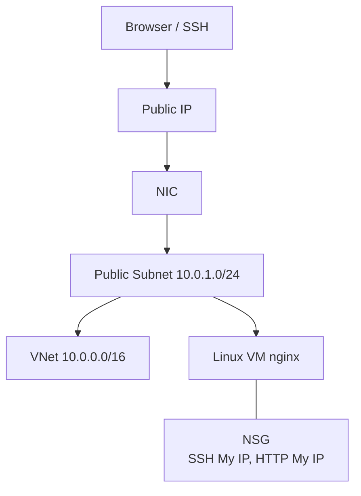

# Capstone Project 02 — Nginx on VM in Custom VNet

**Level:** Beginner–Intermediate | **Est. time:** 3–4 hours | **Cost:** Low (VM `Standard_B1s`)

End-to-end project: **custom VNet**, **public subnet**, **public IP**, **routing**, **VM**, **NSG**, **nginx**, **browser test**.

---

## Goal

Prove you can build a secure, internet-reachable web server on a network **you designed** — not the Portal defaults alone.

---

## Architecture



---

## Resource Naming

| Resource | Name |
|----------|------|
| Resource group | `devops-lab-<yourname>-rg` |
| VNet | `devops-lab-<yourname>-capstone-vnet` |
| Address space | `10.0.0.0/16` |
| Public subnet | `10.0.1.0/24` |
| VM | `devops-lab-<yourname>-capstone-web` |

---

## Build Options

| Method | Reference |
|--------|-----------|
| **Portal** | [03-console-labs/03-custom-vnet-vm/](../03-console-labs/03-custom-vnet-vm/) |
| **CLI** | [04-azure-cli/commands/custom-vnet-vm.md](../04-azure-cli/commands/custom-vnet-vm.md) |
| **Terraform** | [05-terraform/labs/02-custom-vnet-vm/](../05-terraform/labs/02-custom-vnet-vm/) |

---

## Security Requirements

| Rule | Setting |
|------|---------|
| SSH (22) | **My IP** only — not `0.0.0.0/0` |
| HTTP (80) | **My IP** for lab test (or Load Balancer in production) |
| NAT Gateway | Do not create NAT Gateway |

---

## Step-by-Step Summary (Portal)

1. Create VNet `10.0.0.0/16`
2. Public subnet `10.0.1.0/24`
3. NSG: SSH + HTTP from My IP → associate to subnet or NIC
4. Public IP (Standard) + NIC in the subnet
5. Launch Ubuntu `Standard_B1s` using that NIC
6. SSH → install nginx → custom `index.html`
7. Browser: `http://<public-ip>`

```bash
ssh -i ~/.ssh/id_rsa azureuser@<PUBLIC_IP>
sudo apt-get update -y
sudo apt-get install -y nginx
sudo systemctl enable nginx --now
echo "<h1>Capstone VNet — <yourname></h1>" | sudo tee /var/www/html/index.html
```

---

## Validation Checklist

- [ ] VNet address space correct
- [ ] Subnet has associated NSG with My IP rules
- [ ] VM has public IP
- [ ] `curl localhost` on server works
- [ ] Browser loads page from laptop
- [ ] SSH fails from wrong IP (optional test)

---

## Cleanup

**Portal:** Follow [03-custom-vnet-vm/cleanup.md](../03-console-labs/03-custom-vnet-vm/cleanup.md)

**Terraform:**

```bash
cd 05-terraform/labs/02-custom-vnet-vm
terraform destroy
```

**CLI:** Run cleanup commands from custom-vnet-vm CLI guide.

---

## What You Achieved

- Designed and deployed a custom VNet web stack
- Applied practical NSG rules

**Next:** [project-03-container-apps-web.md](project-03-container-apps-web.md)
