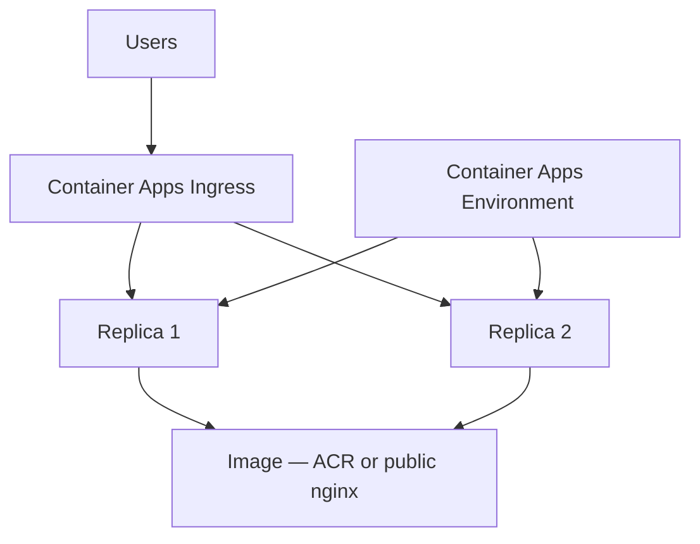

# Capstone Project 03 — Container Web App on Azure Container Apps

**Level:** Intermediate | **Est. time:** 4–5 hours | **Cost:** Medium (Container Apps + ACR — **destroy same day**)

Final project: **ACR**, **Container Apps Environment**, **Container App**, **ingress**, **health**, optional **scale to 2 replicas**.

---

## Goal

Run a containerized web app on Azure the way many DevOps teams deploy services — ingress-enabled and scalable without managing VMs.

---

## Architecture



---

## Components Checklist

| Component | Your resource name pattern |
|-----------|---------------------------|
| Resource group | `devops-lab-<yourname>-rg` |
| ACR | `devopslab<yourname>capacr` |
| Environment | `devops-lab-<yourname>-capstone-cae` |
| Container App | nginx container port 80 |
| Ingress | external HTTPS |
| Replicas | min=2 / max=2 for demo |
| Location | `southeastasia` |

---

## Build Paths

| Method | Reference |
|--------|-----------|
| **Portal** | [03-console-labs/08-container-apps/](../03-console-labs/08-container-apps/) |
| **CLI** | [04-azure-cli/commands/container-apps.md](../04-azure-cli/commands/container-apps.md) |
| **Terraform** | [05-terraform/labs/07-container-apps/](../05-terraform/labs/07-container-apps/) |

---

## Recommended Flow (Portal)

1. Build Docker image locally (`nginx` + custom `index.html`)
2. Create ACR → push image
3. Create Container Apps Environment
4. Create Container App (0.25 CPU, 0.5 Gi, external ingress, target port 80)
5. Set min replicas = 2
6. Open app FQDN in browser
7. Optional: stop one replica / scale briefly → verify traffic still works

---

## Docker Quick Start

```bash
mkdir capstone-aca && cd capstone-aca
echo '<h1>Container Apps Capstone — yourname</h1>' > index.html
cat > Dockerfile << 'EOF'
FROM nginx:alpine
COPY index.html /usr/share/nginx/html/index.html
EOF
docker build -t capstone-app .
```

Push to ACR using Portal push instructions or `az acr login` + `docker push`.

---

## Validation Checklist

- [ ] ACR has `latest` image (or public image for simplified path)
- [ ] Container App provisioning Succeeded
- [ ] At least one healthy revision (prefer 2 replicas)
- [ ] `curl https://<app-fqdn>` returns HTML
- [ ] Target port 80 / ingress configured

---

## Cleanup

Follow [03-console-labs/08-container-apps/cleanup.md](../03-console-labs/08-container-apps/cleanup.md) or:

```bash
terraform destroy   # in labs/07-container-apps
```

Delete: Container App → Environment → ACR → leftover Log Analytics workspace → Resource Group if lab-only.

---

## Cost Warning

> Container Apps + ACR left running overnight can add real charges. Destroy immediately after demo.

---

## What You Achieved

- Deployed containerized app on Azure with managed ingress
- Completed the Portal → CLI → Terraform learning arc

**Final step:** [final-cleanup-checklist.md](final-cleanup-checklist.md)
