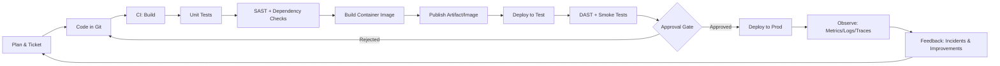
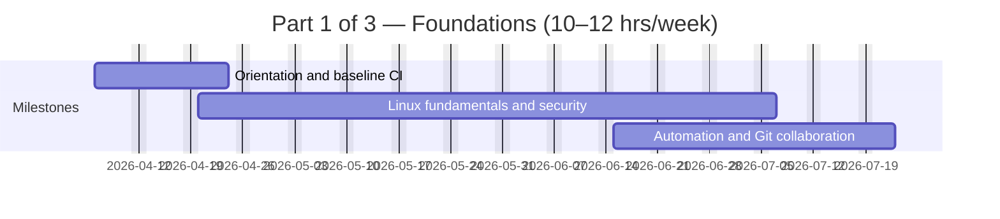
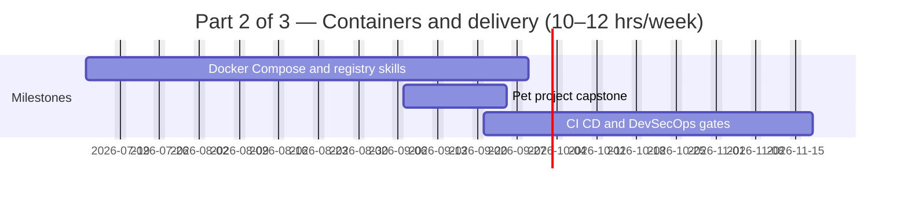
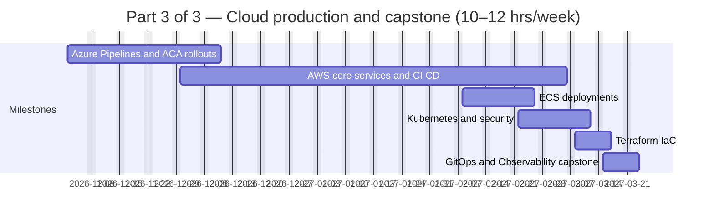
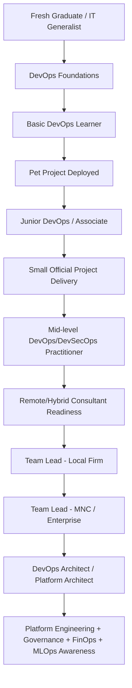
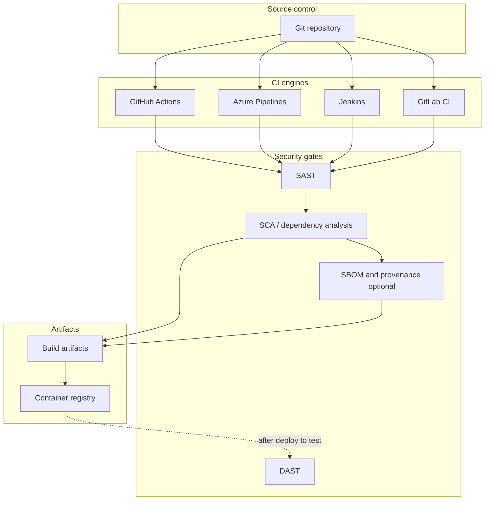
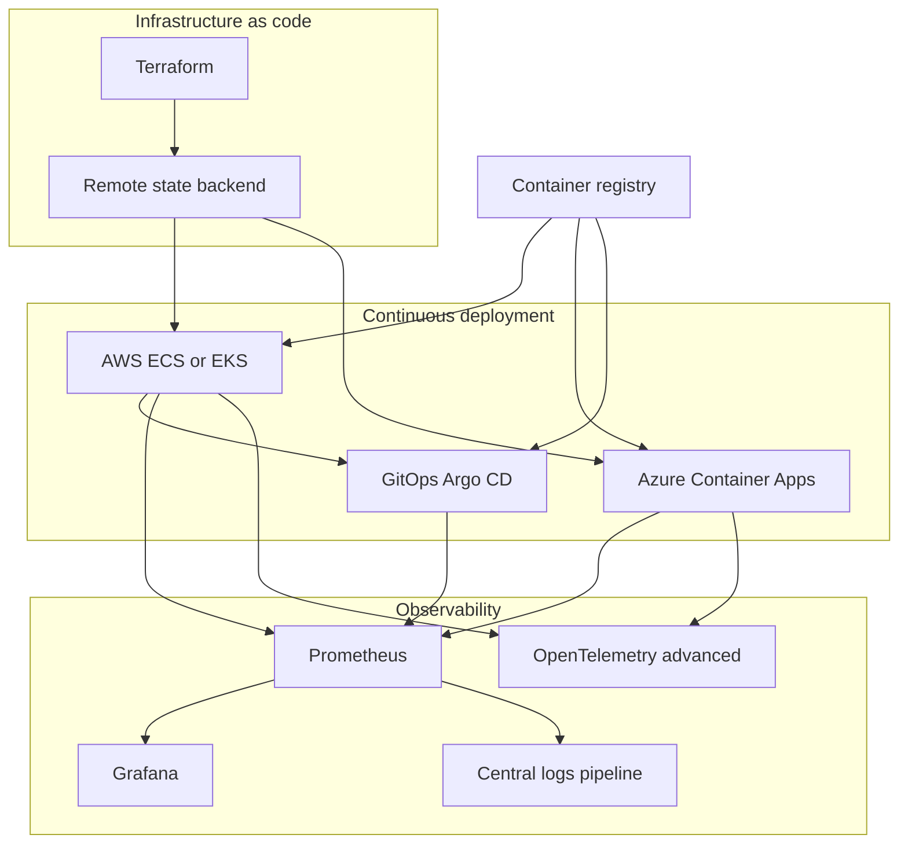

# Professional DevOps and DevSecOps Curriculum and One-Year Learning Roadmap

## Executive summary

This curriculum is designed for a mixed cohort (fresh graduates, IT generalists, and learners new to DevOps) and targets a practical progression: **deploy a personal pet project**, then deliver a **small “official” project** with repeatable CI/CD, security gates, infrastructure-as-code, and operational observability. The program aligns learning and assessment to measurable delivery outcomes using evidence-based performance metrics (deployment frequency, lead time, change failure impact, and recovery time), so students learn to improve systems—not just “use tools.”

The core toolchain is cloud-realistic across **AWS and Azure**, emphasizing secure-by-default pipelines (“shift-left” security), automated configuration, containerized deployment, and continuous reconciliation (GitOps). It integrates application security testing approaches (SAST/DAST) and software supply chain controls (dependency analysis, provenance/SBOM concepts) in a way that scales from entry-level practice to architect-level governance.

By the end of the year, a successful student can: build and operate CI/CD pipelines across multiple engines, deploy containers to managed runtimes (including Azure Container Apps traffic shifting and autoscaling), implement cloud-native release workflows, provision infrastructure safely with Terraform and shared state, and run basic on-call readiness practices supported by monitoring, logging, and incident response playbooks.

## Course synopsis and learning outcomes

### Professional course description

This is a student-facing, job-aligned DevOps/DevSecOps program that teaches learners to deliver software through a modern production toolchain: Linux operations, automation, version control workflows, containerization, CI/CD, security testing, cloud CI/CD services and architectures, Kubernetes deployment and security controls, infrastructure-as-code, GitOps deployment, and observability (metrics/logs/alerts). Cloud practice spans **AWS-first** delivery patterns and includes **Azure DevOps, Azure Container Apps (ACA), and GitHub Actions** as additional, industry-relevant equivalents for multi-platform competence.

To anchor the toolchain in verifiable, official behaviors, the curriculum explicitly teaches the “as-code” interfaces used in production: pipeline definitions (e.g., a Jenkinsfile and YAML workflows), build specifications, and deployment specifications—because these define repeatability and auditability.

**Toolchain scope (one-time reference list):** the program centers cloud work on **Amazon Web Services (AWS)** and **Microsoft Azure**, with CI/CD patterns transferable to multiple engines including **GitHub** Actions, **Jenkins** pipelines, and **GitLab** CI/CD. Containerization fundamentals use **Docker** standards and registries. IaC foundations use **HashiCorp Terraform** with remote/shared state. Kubernetes and cloud-native patterns leverage **Kubernetes** concepts and security controls; GitOps relies on **Argo CD** reconciliation; observability covers **Prometheus** metrics and **Grafana** alerting and dashboards; logs include **Elastic** Logstash pipeline patterns and Loki-style label indexing. Security guidance references **OWASP** DevSecOps practices, and supply-chain rigor cites **NIST** SBOM definitions.

> **Suggested visuals (for slides or handouts):** DevOps CI/CD pipeline overview; AWS CodePipeline stages; Azure Container Apps revision traffic splitting.

### Learning outcomes

On successful completion, a student can demonstrate all outcomes below with working repositories, reproducible lab scripts, and evidence artifacts (pipeline logs, security reports, dashboards, runbooks):

1. Operate Linux-based environments for application delivery: secure users/permissions, manage services/logs, and troubleshoot basic networking and runtime issues.
2. Automate configuration reliably using idempotent automation and inventories for repeatable deployments across multiple targets.
3. Use Git workflows suitable for teams (branching strategies, PR discipline, and controlled history modification), understanding how merge vs rebase affects history and collaboration.
4. Containerize applications using Dockerfile best practices and define multi-service local environments with Docker Compose (services, networks, volumes).
5. Build CI/CD pipelines “as code,” including a minimum viable pipeline that builds, tests, packages artifacts, and deploys to an environment, using at least two CI/CD engines (e.g., Jenkins + GitHub Actions or GitLab CI).
6. Integrate DevSecOps gates: SAST (static) and DAST (dynamic) testing, plus software composition analysis concepts for third-party dependency risk management.
7. Implement AWS-native SDLC automation using CodePipeline orchestration and CodeBuild build specifications, and use CodeDeploy deployment specifications where relevant.
8. Deploy containers to managed runtimes (ECR/ECS patterns; Kubernetes/EKS patterns) and apply baseline Kubernetes security controls (Pod Security Standards and enforcement methods).
9. Provision infrastructure via Terraform (modules + remote/shared state) as a team-safe practice aligned to real operations.
10. Apply GitOps principles by reconciling desired state in Git to actual cluster runtime state using Argo CD.
11. Implement practical observability with Prometheus metrics collection, Grafana dashboards/alerts, and centralized logging patterns (indexing/labeling and pipeline stages).
12. Compare and translate solution patterns to Azure: use Azure DevOps for integrated planning/repos/pipelines, deploy to Azure Container Apps with revisions + traffic splitting and KEDA-powered autoscaling, and run CI/CD with GitHub Actions workflows.

## Classroom-ready prerequisites and lab setup

### Prerequisites checklist

**Accounts (student must have)**
- One Git hosting account on GitHub (for repos, workflows, portfolio visibility).
- Docker Hub account for image registry exercises; students must understand pull rate limits and fair-use constraints (important for classroom labs).
- AWS account with root-account security hygiene (MFA, avoid root access keys, and use least-privilege IAM).
- Azure account for Azure DevOps and Azure Container Apps practice.

**Hardware (recommended minimums for a smooth class experience)**
- CPU with virtualization support enabled in BIOS/UEFI.
- RAM: 16 GB recommended (8 GB workable with tighter constraints).
- Storage: 60–100 GB free space (VM images + container layers grow quickly).
- Reliable internet, since public registries and cloud consoles are used regularly.

**Software (standard classroom stack)**
- VirtualBox for consistent VM labs (two Linux VMs).
- Docker Desktop (or Docker Engine on Linux); note that Docker Desktop has published system requirements and licensing conditions that may matter for employer-sponsored learners.
- Optional (Windows learners): WSL for running GNU/Linux tooling without a full additional VM, with Windows prerequisites defined by Microsoft.
- Optional local Kubernetes: “kind” can run local clusters using container “nodes,” and Docker Desktop can provision Kubernetes using kind or kubeadm.

### Standard VM layout

A two-VM layout supports nearly every foundational lab (Linux, SSH, reverse proxy, Ansible, CI agents) while staying teachable:

- **VM-1: Control/Tools VM (DevOps workstation)**
 Git client, Ansible, Docker CLI, Terraform, CI tooling clients, kubectl (later), and scripting tools.
- **VM-2: Target/Workload VM (managed node)**
 Web server, database, runtime dependencies, and security-hardening targets.

If the cohort is stronger, add a third VM later as a “production-like” isolated network or as a Kubernetes worker node for realism.

### Cost-safety and security rules for student cloud work

These are non-negotiables in a 1-year curriculum because students will inevitably make mistakes—and the course must be safe to fail:

- **Secure AWS root access**: enable MFA, do not create root access keys, and use root only for tasks that require it.
- **Budgets + alerts day one**: create AWS Budgets notifications (actual or forecasted overspend) and practice reacting to them as part of “operations.”
- **Azure cost control**: set budgets and alerts (Azure supports budget creation and alert-driven actions through defined monitoring mechanisms).
- **Secrets handling discipline**: never store secrets in pipeline YAML as plain text; teach each platform’s secret storage early. GitHub supports repository/environment/organization secrets; Azure Pipelines provides encrypted secret variables with recommended handling methods.
- **Registry safety**: class labs must account for Docker Hub pull limits; enforce authenticated pulls and caching strategies where possible to reduce 429 “Too Many Requests.”

## One-year weekly roadmap

### Pacing assumptions and assessment model

**Time budget:** 10–12 hours/week. A sustainable weekly split for mixed-background students is: 2 hours reading/videos, 6–8 hours hands-on labs, 1–2 hours reflection/documentation (runbooks + READMEs). Evidence-based delivery improvement is reinforced by tracking DORA metrics concepts and documenting time-to-build/time-to-recover during controlled simulations.

**Assessments (repeated every week):**
- **Lab evidence**: repo commits + screenshots/log outputs + short “what broke / how I fixed it” notes.
- **Practical checkpoint**: rubric-scored deliverable (works, reproducible, secure handling, documented).
- **Short concept quiz** (10–15 minutes) to reinforce fundamentals (Linux, Git, containers, CI/CD, security).

### Capstone structure

- **Capstone A (pet project deployment)**: mid-year, student deploys a personal application end-to-end with CI/CD and secure configs.
- **Capstone B (official small project)**: end-year, student delivers a “client-style” project with IaC, release strategy, security gates, and observability dashboards.
- **Capstone C (consultant/architect package)**: a portfolio bundle: architecture diagram, cost-safety plan, incident playbook, and a small “platform blueprint” describing reusable golden paths.

### Weekly plan (52 weeks)

The full year is split into **four tables** (quarters) so each block fits typical viewers, PDF export, and slide decks without horizontal scrolling.

#### Quarter 1 — weeks 1–13

| Week | Focus topics | Weekly deliverable | Assessment criteria (pass) |
|---:|---|---|---|
| 1 | DevOps mindset, SDLC flow, lab bootstrap | Working lab notebook repo + baseline workflow | Repo created, reproducible setup notes |
| 2 | CI/CD overview, “build-test-release” concept | Minimal CI pipeline (build + test stub) | Pipeline runs reliably from clean clone |
| 3 | Linux foundations: files, users, permissions | Linux command drills + permission lab | Correct permission model + explanation |
| 4 | Networking basics: SSH, ports, DNS, curl | SSH hardening + connectivity checklist | Access works; basics of troubleshooting |
| 5 | System services, logs, systemd | Service management runbook | Can start/stop/debug a service |
| 6 | Web server basics (Nginx), reverse proxy | Reverse proxy to sample app | Request routing works, config documented |
| 7 | TLS/HTTPS fundamentals | HTTPS enabled on local lab | Cert configured; explains renewal plan |
| 8 | Databases: install + connect (1 engine) | App ↔ DB connection verified | Connection string and access controlled |
| 9 | Linux security basics | Hardening checklist + audit notes | Clear before/after + risk rationale |
| 10 | Bash scripting for ops | Scripted log cleanup + backup | Script idempotent; failure handling |
| 11 | Automation intro: inventory, ad-hoc ops | Inventory + ad-hoc commands | Targets grouped correctly; repeatable |
| 12 | Automation: variables, modules | Playbook for web stack install | Runs clean twice (idempotency) |
| 13 | Automation: roles, templates | Role-based playbook refactor | Clear role structure; reusable defaults |

#### Quarter 2 — weeks 14–26

| Week | Focus topics | Weekly deliverable | Assessment criteria (pass) |
|---:|---|---|---|
| 14 | Automation lab: web + DB full provisioning | One-click provisioning | Full stack provisioned + validation script |
| 15 | Git fundamentals: branching/merging | Feature branch + PR workflow | Clean history; review checklist used |
| 16 | Git collaboration: rebase vs merge practice | Controlled rebase + conflict resolution | Demonstrated conflict resolution + notes |
| 17 | Containers: images vs containers | Containerize “hello service” | Image builds predictably |
| 18 | Dockerfile fundamentals | Dockerfile with linted structure | Small image, correct entrypoint/cmd |
| 19 | Volumes + persistence | Stateful service w/ volume | Data persists across restarts |
| 20 | Docker networks | Multi-container network connectivity | Services resolve and communicate |
| 21 | Docker Compose | Compose for app + DB | Single command brings stack up |
| 22 | Registry workflows | Push/pull images; tagging strategy | Tags meaningful; rollback tag exists |
| 23 | Container security basics | Minimal container hardening notes | Non-root runtime where possible |
| 24 | Reference app selection | Choose pet app + define MVP | Clear scope, endpoints, data needs |
| 25 | Pet project build sprint | App container builds in CI | CI produces a versioned artifact |
| 26 | Pet project deploy sprint | Pet app deployed to test env | Demo link + basic health checks |

#### Quarter 3 — weeks 27–39

| Week | Focus topics | Weekly deliverable | Assessment criteria (pass) |
|---:|---|---|---|
| 27 | CI/CD engine A: pipeline-as-code | 3-stage pipeline (build/test/deploy) | Pipeline deterministic + documented |
| 28 | CI/CD engine A: artifacts + environments | Artifact promotion dev→test | Promotion recorded + rollback notes |
| 29 | Security gate: SAST | SAST stage + remediation notes | Findings triaged; severity explained |
| 30 | Security gate: DAST | DAST executed against test | Scan evidence; false positives tracked |
| 31 | Dependency risk basics (SCA concept) | Dependency inventory + policy | Explains third-party risk approach |
| 32 | CI/CD engine B (choose: GitHub Actions or GitLab CI) | Equivalent pipeline in engine B | Same outcomes, different engine |
| 33 | Azure Pipelines intro | Pipeline running in Azure DevOps | Uses YAML; secrets not in YAML |
| 34 | Azure Container Apps basics | Deploy container to ACA | Revisions visible; ingress working |
| 35 | ACA traffic splitting | Blue/green traffic split demo | Gradual rollout evidence |
| 36 | ACA autoscaling patterns | Scaling rule set + observed scaling | Scaling behavior explained |
| 37 | AWS core concepts | VPC sketch + basic networking plan | Correct subnet/security group rationale |
| 38 | EC2 fundamentals | EC2 instance + hardened SSH | Access controlled; baseline hardening |
| 39 | S3 basics for artifacts | Artifact bucket + lifecycle note | Storage + cleanup policy documented |

#### Quarter 4 — weeks 40–52

| Week | Focus topics | Weekly deliverable | Assessment criteria (pass) |
|---:|---|---|---|
| 40 | RDS fundamentals | Managed DB proof-of-setup | Connectivity secure + least privilege |
| 41 | DNS basics with Route 53 | DNS route to endpoint (lab-safe) | Clear mapping and rollback steps |
| 42 | AWS CI/CD intro | Pipeline stages designed on paper | Stage gates and approvals defined |
| 43 | CodeBuild buildspec usage | Buildspec executes unit tests | Build logs + artifact saved |
| 44 | CodeDeploy spec (where relevant) | Deployment spec + hooks concept | Lifecycle hooks understood |
| 45 | CodePipeline orchestration | End-to-end AWS pipeline (dev→test) | Runs reliably; clear stage ownership |
| 46 | Release strategy | Blue/green or safe rollout narrative | Rollback procedure validated |
| 47 | Container registry on AWS | Push image to ECR + auth method | Repeatable push/pull steps |
| 48 | ECS deployment patterns | Deploy service on ECS | Service healthy; revision strategy documented |
| 49 | Kubernetes foundations | Deploy app to local K8s | Manifests/Helm/Kustomize chosen + explained |
| 50 | Kubernetes security baseline | Pod security + basic policy plan | Enforces safer defaults |
| 51 | Terraform IaC core | IaC repo with module + remote state plan | Plan/apply discipline + state safety |
| 52 | GitOps + Observability recap | Argo CD sync + dashboards + logs | GitOps drift corrected; alerts meaningful |

**Adjustability note:** If your cohort struggles with Kubernetes + Terraform + GitOps, shift Weeks 49–52 into a **4–8 week extension term** (same pace) to protect mastery. Terraform remote/shared state and GitOps reconciliation are the “make-or-break” skills for production readiness and should not be rushed.

## Role-based curriculum and career mapping

This section maps the curriculum into three teaching phases that produce four career outcomes: **basic learner**, **mid-level practitioner**, **team lead**, and **DevOps architect**.

### Phase foundations

**Primary outcome:** Basic DevOps learner (deploy and operate a pet project)

Core competencies:
- Linux operations and baseline hardening habits, including troubleshooting and runbook writing.
- Git teamwork workflow and correct use of rebasing vs merging.
- Docker/Compose packaging and environment parity (services/networks/volumes).
- One CI/CD system running reliably “as code” (e.g., Jenkinsfile-defined pipeline).
- Intro DevSecOps gates: basic SAST and DAST concepts and placement in the pipeline.

Required deliverables:
- Pet project deployment with build/test pipeline and a minimal rollback method.
- “Day-2” documentation: health checks, logs location, restart procedure.

Suggested certifications (optional at this stage):
- GitHub Foundations (good starter credential platform-side).

### Phase practitioner

**Primary outcome:** Mid-level DevOps/DevSecOps practitioner (deliver a small official project)

Core competencies:
- AWS service fundamentals for delivery architecture: VPC isolation, EC2 baseline, S3 artifact location, RDS managed DB concepts, DNS routing.
- AWS CI/CD mechanics: CodePipeline stages/actions and CodeBuild buildspec YAML.
- Container registry and managed runtime deployment patterns: ECR push workflows; ECS task definitions as deployment blueprints.
- Kubernetes concept literacy + baseline controls: understanding components, cluster layout, and adopting Pod Security Standards (and enforcement via Pod Security Admission when used).
- Terraform IaC discipline with state safety (remote/shared state and locking).
- Observability essentials: Prometheus scraping/queries and Grafana alerting/dashboards.

Required deliverables:
- “Official small project” deployed with IaC, versioned releases, and basic dashboards + alerts.
- Evidence pack: pipeline logs, security scan reports, and deployment rollback proof.

Suggested certifications (choose based on career direction):
- Terraform Associate (aligned to IaC competency).
- GitHub Actions certification (if the learner is building pipeline depth across engines).
- CKA for hands-on Kubernetes administration competency.

### Phase leadership and architecture

**Outcomes:** Team lead (local firm → MNC readiness) and DevOps architect

Team lead competencies:
- Standardize pipeline and environment practices across teams; define reusable templates and guardrails (secrets policies, promotion rules, approvals).
- Run operational drills: alert quality (symptom-based, actionable), incident role clarity, post-incident learning discipline.
- Translate DevOps toolchain decisions: all-in-one vs composable toolchains and the integration costs of heterogeneous ecosystems.

DevOps architect competencies:
- Evaluate designs using the AWS Well-Architected pillars and tradeoff reasoning (security, reliability, cost, performance, sustainability, and operational excellence).
- GitOps operating model: reconcile desired vs live state and manage drift through controlled promotion in Git.
- Observability architecture: metrics + logs + traces, including vendor-neutral telemetry via OpenTelemetry.
- Supply-chain security: SBOM reasoning and provenance/attestation thinking (e.g., SLSA levels), plus component risk management via SCA.
- Cloud cost governance foundations (FinOps mindset) and operating budgets, attribution, and optimization discussions credibly.

Suggested senior certifications (strategic, not mandatory):
- AWS Certified DevOps Engineer – Professional (maps to SDLC automation, IaC, monitoring/logging, incident response).
- Microsoft AZ-400 (DevOps Engineer Expert track) for Azure DevOps solution delivery capabilities.
- CKS to validate Kubernetes security competence (noting prerequisites).
- CGOA for GitOps literacy and terminology alignment.

## Complementary skills and when to learn them

This curriculum produces strong DevOps practitioners. Architect-level performance requires expanding beyond tools into adjacent engineering domains.

### Coding and software engineering

**When:** begin Week 10 and continue throughout (small, consistent practice beats bursts).

Why it matters: most high-impact DevOps work becomes **automation engineering**—glue code, internal tools, test harnesses, and reliability scripts. The curriculum should require students to write small utilities and pipeline helpers early, then expand into simple services later.

Recommended focus:
- Python or JavaScript basics, CLI tool creation, and API usage patterns.
- Reading application code sufficiently to troubleshoot builds and runtime issues.
- Testing fundamentals (unit tests and integration test boundaries).

### Data engineering literacy

**When:** add after students can deploy and monitor (roughly Weeks 35–52).

Why it matters: modern systems are event-driven; DevOps leaders must understand how streaming and orchestration tools affect reliability, cost, and governance.

Recommended focus (conceptual + one lab each):
- Event streaming basics with Apache Kafka.
- Workflow orchestration basics with Apache Airflow (pipelines as code).
- Analytics engineering basics with dbt for reproducible transformations and documentation.

### MLOps relevance

**When:** architect track (post “official project” maturity) or an optional extension term.

Why it matters: DevOps architects increasingly support ML workloads and must understand continuous delivery plus continuous training patterns and production governance.

Recommended focus:
- CI/CD + CT concepts for ML systems and the difference between deploying code and deploying models.
- Platform tooling for MLOps in cloud contexts (e.g., SageMaker MLOps features).

### Platform engineering and internal developer platforms

**When:** team lead → architect transition.

Why it matters: platform engineering formalizes how to deliver “golden paths” and self-service workflows that reduce cognitive load for product teams.

Recommended focus:
- Platform engineering definitions and self-service enablement concepts (CNCF perspective).
- Developer portals and software catalog patterns (Backstage as a common reference implementation).

## Labs, templates, and authoritative resources

### Lab exercise catalog (classroom-ready)

This list is intentionally structured so each lab produces a shareable artifact (repo, config, pipeline run log, dashboard screenshot). Tool behaviors are anchored to official documentation.

Linux and networking labs:
- Secure SSH setup, service debugging with logs, and reverse proxy configuration tied to a runbook.

Automation labs:
- Inventory-driven automation across two VMs; validate idempotency and implement safe variable handling.

Container labs:
- Dockerfile implementation and Compose multi-service stack using networks and volumes.
- Registry push/pull workflows, with classroom rules that account for Docker Hub rate limits.

CI/CD and security labs:
- Jenkins pipeline defined in a Jenkinsfile, stored in source control.
- GitLab CI job and pipeline structure in `.gitlab-ci.yml`.
- SAST and DAST placement and interpretation using OWASP DevSecOps guidance.
- Optional: basic SCA and component risk reasoning.

AWS labs:
- Build a minimal VPC and explain isolation, subnets, and security groups.
- Deploy to EC2 and demonstrate operating procedures.
- Use S3 for artifact storage concepts.
- Use RDS for managed relational DB proofs.
- Create a CodePipeline with stages/actions; implement buildspec with CodeBuild and use deployment specifications when appropriate.
- ECS deployment with a task definition “blueprint.”

Azure labs:
- Azure DevOps pipeline (YAML) with correct secret-handling patterns.
- Deploy to Azure Container Apps and demonstrate revisions, traffic splitting, and blue/green rollout.
- Autoscaling using KEDA-powered rules for ACA.

Kubernetes, IaC, GitOps, and observability labs:
- Kubernetes fundamentals and cluster architecture exercises.
- Enforce Pod Security Standards and understand admission enforcement.
- Terraform with remote state for team-safe operations.
- GitOps sync/drift resolution with Argo CD.
- Prometheus “scrape + query + rule” and Grafana dashboards + alerting.
- Central logs: Loki label model and Logstash inputs→filters→outputs pipeline concept.

### Project templates (recommended repo structure)

Use a standard template so every student portfolio looks professional and reviewable:

```text
repo/
  app/                    # application source (any stack)
  infra/                  # Terraform modules, environment configs
  deploy/
    docker/               # Dockerfile(s), compose for local dev
    k8s/                  # manifests/helm/kustomize (one chosen approach)
    aca/                  # Azure Container Apps deployment notes/specs
  pipelines/
    github-actions/       # workflows
    azure-pipelines/      # azure-pipelines.yml and templates
    jenkins/              # Jenkinsfile(s)
  security/
    sast/                 # rules/config, suppressions policy
    dast/                 # scan profiles, baseline comparisons
    sbom/                 # SBOM outputs (optional advanced)
  observability/
    prometheus/           # scrape config, rules, alerts
    grafana/              # dashboards as JSON (exported)
    logging/              # Loki/Logstash configs
  runbooks/
    deployment.md
    rollback.md
    incident-response.md
  README.md
```

### Prioritized authoritative resources (official-first)

- **AWS CI/CD:** CodePipeline overview and pipeline model; CodeBuild buildspec reference; CodeDeploy AppSpec reference; ECS/ECR docs and blue/green deployment guidance.
- **Azure DevOps & ACA:** Azure DevOps overview; Azure Pipelines concepts and YAML schema; Azure Container Apps overview, revisions, traffic splitting, and scaling rules.
- **GitHub Actions:** workflow syntax + secrets guidance and secure deployment patterns (including OIDC to reduce long-lived secrets).
- **Containers:** Dockerfile reference + Compose specification reference + volumes persistence docs.
- **Automation:** Ansible inventory fundamentals.
- **Kubernetes:** concepts, cluster architecture, and Pod Security Standards.
- **IaC:** Terraform backends/remote state guidance.
- **GitOps:** Argo CD core reconciliation model.
- **Observability:** Prometheus getting started; Grafana alerting; Loki model and labels; Logstash pipeline stages.
- **SRE readiness:** incident management guide and SLO definitions.
- **Architecture:** AWS Well-Architected framework pillars.
- **Training portals:** AWS training for DevOps engineers; Microsoft Learn DevOps engineer path; Kubernetes tutorials; Terraform certification learning path.

## Summary tables and diagrams

### Viewing Mermaid diagrams

If diagrams do not render in your editor, open the file in [GitHub](https://github.com) (or Gitea/GitLab) preview, use the **Mermaid** extension in VS Code / Cursor, or paste the fenced `mermaid` blocks into [mermaid.live](https://mermaid.live) to export **PNG** or **SVG** for slides. Some native PDF exporters skip Mermaid; exporting images from mermaid.live is the most reliable path for handouts.

### Module-to-weeks professional summary table

This table compares the curriculum modules, when they appear, the primary tools, required deliverables, and how they are assessed.

| Module | Weeks (recommended) | Primary tools | Key deliverables | Assessment criteria |
|---|---|---|---|---|
| DevOps foundations & SDLC | 1–2 | Any CI engine | Working repo + minimal CI | Reproducibility, clarity, evidence |
| Linux for DevOps | 3–10 | Linux, Nginx | Secure service + runbooks | Troubleshooting ability, hardening logic |
| Automation with Ansible | 11–14 | Ansible | Idempotent provisioning | Runs twice cleanly; variables managed |
| Git workflows | 15–16 | Git + PR flow | PR-based delivery | Clean collaboration evidence |
| Docker & Compose | 17–24 | Docker, Compose | Containerized app + DB | Correct persistence/networking |
| Pet project capstone | 25–26 | Prior stack | Pet app deployed | Demo + operational docs |
| CI/CD + DevSecOps | 27–32 | Jenkins/GitLab + SAST/DAST | Secure pipeline | Scan evidence + remediation notes |
| Azure CI/CD & ACA | 33–36 | Azure Pipelines + ACA | Revisioned rollout | No secrets leakage; rollout proof |
| AWS core services | 37–42 | VPC/EC2/S3/RDS/DNS | Cloud baseline | Secure access + cost-safety |
| AWS SDLC automation | 43–46 | CodePipeline/Build/Deploy | AWS pipeline | Determinism + rollback |
| ECR/ECS deployments | 47–48 | ECR/ECS | Managed container deployment | Service health + version strategy |
| Kubernetes & security | 49–50 | Kubernetes/EKS concepts | K8s deployment + policy | Resource correctness + safer defaults |
| Terraform (IaC) | 51 | Terraform | IaC module + state plan | State safety + apply discipline |
| GitOps + Observability | 52 | Argo CD + Prometheus/Grafana/logging | Sync + dashboards + logs | Drift fixed via Git; alerts actionable |

### CI/CD pipeline flowchart (mermaid)



### Learning timeline Gantt charts (mermaid) — three parts

The full-year Gantt is split into **three smaller charts** (foundations, containers and CI/CD, cloud production) so each renders reliably in Mermaid and fits slide or document width. Together they match the single timeline implied by the weekly tables above.

**Notional start date:** 2026-04-06. Shift all dates equally to match your cohort start.

#### Part 1 of 3 — Foundations (~14 weeks)



#### Part 2 of 3 — Containers and delivery (~18 weeks)



#### Part 3 of 3 — Cloud-native production (~18 weeks)



### Career progression flowchart (mermaid)



### Toolchain integration component diagrams (mermaid) — two parts

The toolchain is split into **two diagrams**: (1) source through build, security, and artifacts; (2) infrastructure, deployment, and observability. This avoids wide graphs and fixes a common Mermaid issue where edges pointed at a subgraph id (`Observe`) instead of concrete nodes, which breaks rendering in many viewers.

#### Diagram 1 — Source, CI, security, artifacts



#### Diagram 2 — IaC, deployment, observability



*Diagram 2* assumes images from the registry in diagram 1; the `reg` node is repeated here so this figure stands alone on slides.