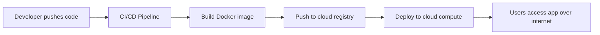

# What Is Cloud Computing?

## Learning Goal

By the end of this lesson, you can explain cloud computing in simple words and connect it to real DevOps work.

---

## Simple Definition

**Cloud computing** is the on-demand delivery of IT resources over the internet. You pay only for what you use, and you can scale up or down quickly.

Instead of buying your own servers and keeping them in your office, you use resources from a cloud provider like **Amazon Web Services (AWS)**, Microsoft Azure, or Google Cloud.

Think of it like electricity:

- You do not build your own power plant.
- You plug into the grid and pay for what you consume.
- If you need more power, you do not wait months to build new capacity.

Cloud works the same way for servers, storage, databases, and networking.

---

## Five Key Characteristics of Cloud

| Characteristic | What It Means | DevOps Example |
|----------------|---------------|----------------|
| **On-demand self-service** | You provision resources yourself without calling a vendor | A DevOps engineer launches an EC2 instance from the AWS Console in minutes |
| **Broad network access** | Access services over the internet from many devices | Your team deploys from a laptop using Git, CI/CD, and SSH |
| **Resource pooling** | The provider shares hardware across many customers | Your `t3.micro` VM runs on shared physical servers managed by AWS |
| **Rapid elasticity** | Scale out or in quickly based on demand | Auto Scaling adds EC2 instances during a traffic spike, removes them after |
| **Measured service** | Usage is tracked and billed | AWS Cost Explorer shows how much each service cost last month |

---

## What Problems Does Cloud Solve?

### Before Cloud (Traditional IT)

A company wanted a new web application. The process looked like this:

1. Request budget for servers (weeks or months)
2. Buy hardware
3. Wait for delivery and rack installation
4. Install OS, patch, configure networking
5. Finally deploy the application

If traffic grew, they had to repeat much of this process. If traffic dropped, expensive servers sat idle.

### With Cloud

The same company today can:

1. Open the AWS Console (or run Terraform)
2. Launch compute, storage, and database resources in minutes
3. Scale automatically with load
4. Pay only for active usage
5. Shut everything down when the project ends

This is why startups and enterprises both use cloud: **speed, flexibility, and cost control**.

---

## Cloud Is Not Just "Someone Else's Computer"

You will hear this joke in engineering teams. It is partly true, but incomplete.

Cloud gives you more than rented hardware:

- **Managed services** — RDS manages database patching; S3 manages durability
- **Global infrastructure** — deploy closer to users worldwide
- **API-driven automation** — everything can be scripted (perfect for DevOps)
- **Built-in security building blocks** — IAM, encryption, VPC, monitoring

As a DevOps engineer, you care about cloud because it lets you **automate infrastructure** the same way developers automate application code.

---

## Real-World DevOps Examples

| Scenario | Cloud Approach |
|----------|----------------|
| New staging environment for testing | Spin up EC2 + RDS for 2 hours, destroy after CI pipeline finishes |
| Website traffic spike on launch day | Auto Scaling Group adds instances behind a load balancer |
| Backup storage for build artifacts | Push Docker images and release packages to S3 |
| Disaster recovery | Replicate data to another AWS Region |
| Internal tool hosting | Run containers on ECS instead of maintaining physical servers |

---

## How Cloud Fits Your DevOps Journey

You already know Linux, Git, Docker, and CI/CD. Cloud is where those skills run in production.

In this course, you will learn AWS step by step: Console first, then CLI, then Terraform.

---

## Common Confusion

| Confusion | Clarification |
|-----------|---------------|
| "Cloud means no servers exist" | Servers still exist — they are in AWS data centers, not your office |
| "Cloud is always cheaper" | Not always. Poorly designed workloads can cost more than on-premises |
| "Cloud removes the need for ops" | Wrong. DevOps work shifts to automation, security, monitoring, and cost control |
| "One cloud provider does everything best" | Most companies use one primary provider (here: AWS) but may use SaaS tools from others |
| "Free Tier means everything is free" | Free Tier has limits and time bounds. Always check pricing |

---

## Small Example (Conceptual)

Your team needs a Linux server to test nginx for one afternoon.

**On-premises:** Wait for IT to provision a VM — might take days.

**Cloud:** Launch an EC2 instance at 10:00 AM, test nginx, terminate at 4:00 PM. You pay for roughly 6 hours of a small instance.

No lab steps yet — this is the *idea* you will practice in Module 03.

---

## Interview-Style Questions

1. **What is cloud computing in one sentence?**
   - *On-demand IT resources delivered over the internet with pay-as-you-go pricing.*

2. **Name three benefits of cloud for a DevOps team.**
   - *Speed of provisioning, elasticity/scaling, and automation through APIs.*

3. **What is elasticity?**
   - *The ability to increase or decrease resources based on demand.*

4. **Is cloud the same as virtualization?**
   - *No. Virtualization is one technology. Cloud adds self-service, elasticity, measured billing, and broad network access.*

5. **Why do companies still hire DevOps engineers if cloud is "managed"?**
   - *Someone must design, deploy, secure, monitor, and optimize workloads. Cloud manages the platform; you manage the workload.*

---

## References to Verify

- [NIST Definition of Cloud Computing (SP 800-145)](https://csrc.nist.gov/publications/detail/sp/800-145/final) — official characteristics of cloud
- [AWS — What is Cloud Computing?](https://aws.amazon.com/what-is-cloud-computing/) — AWS overview
- [AWS Cloud Concepts Hub](https://aws.amazon.com/getting-started/cloud-essentials/) — beginner-friendly AWS learning path

---

**Next:** [02-saas-paas-iaas.md](02-saas-paas-iaas.md) — understand *who manages what* in the cloud.
