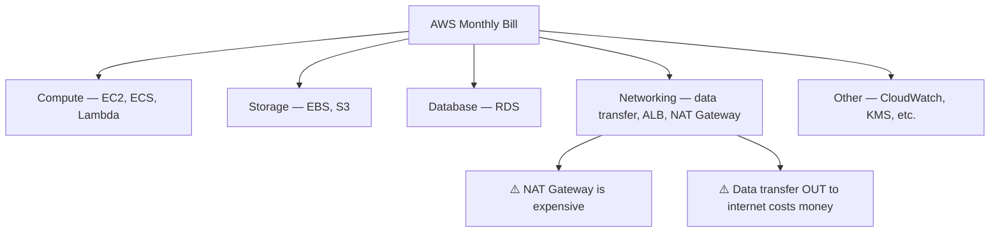

# Cloud Pricing Basics

## Learning Goal

Understand how cloud providers charge for services so you can design cost-aware infrastructure and avoid surprise bills.

---

## Core Pricing Idea

In cloud, you typically pay for:

1. **What you provision** (e.g., an EC2 instance type running 24/7)
2. **What you consume** (e.g., S3 storage GB, API requests, data transfer out)
3. **How long you use it** (per second, per hour, or per month)

> **DevOps rule:** If a resource exists, it probably costs money. If you are not using it, shut it down or delete it.

---

## Main AWS Pricing Models

| Model | How It Works | Best For | AWS Examples |
|-------|--------------|----------|--------------|
| **On-Demand** | Pay per use, no commitment | Dev/test, unpredictable workloads | On-Demand EC2, S3 Standard |
| **Reserved** | Commit 1 or 3 years for lower rate | Steady production workloads | Reserved Instances, Savings Plans |
| **Spot** | Bid on spare capacity — can be interrupted | Fault-tolerant batch jobs, CI workers | Spot EC2 instances |
| **Free Tier** | Limited free usage for new accounts | Learning, small experiments | 12-month Free Tier, always-free services |

---

## On-Demand Pricing

**Simplest model.** No upfront payment. Pay for compute by the hour or second.

### DevOps Example

You launch a `t3.micro` EC2 in `ap-southeast-1` for a 3-hour lab:

- Billed for ~3 hours of compute
- Stop or terminate when done
- No contract required

**Good for:** Labs, spikes, unknown duration workloads.

---

## Reserved Capacity and Savings Plans

When you know a workload will run 24/7 for months, on-demand is often the **most expensive** option.

| Option | Commitment | Savings (typical) |
|--------|------------|-------------------|
| **Reserved Instances (RI)** | 1 or 3 years, specific instance type/region | Up to ~72% vs on-demand |
| **Savings Plans** | 1 or 3 years, $/hour commitment (more flexible) | Up to ~72% vs on-demand |

### DevOps Example

Production API servers run 3× `t3.small` year-round:

- Team buys a Compute Savings Plan after 2 months of stable usage
- Finance approves because forecast is predictable

**Not for:** Short labs or coursework — stick to on-demand and Free Tier.

---

## Spot Instances

AWS sells unused EC2 capacity at a **large discount** (up to 90%). AWS can **interrupt** (terminate) your instance with 2 minutes notice.

### DevOps Example

| Workload | Spot OK? |
|----------|----------|
| Nightly data processing job | ✅ Yes — job can retry |
| CI build farm | ✅ Yes — with checkpointing |
| Production payment API | ❌ No — use On-Demand or Reserved |
| Student lab EC2 | ❌ No — use On-Demand for simplicity |

---

## Free Tier — Read the Fine Print

AWS Free Tier includes:

| Type | Detail |
|------|--------|
| **12-month Free Tier** | Available for 12 months after account creation (e.g., 750 hrs/month of `t3.micro` Linux) |
| **Always Free** | Limited monthly allowance that never expires (e.g., 1 million Lambda requests) |
| **Short-term trials** | Time-limited trials for specific services |

### Common Free Tier Mistakes

- Leaving EC2 running overnight after a lab
- Creating RDS instances (not always fully free)
- Running ALB for days (ALB has hourly charges — **not** beginner-friendly for long idle periods)
- Exceeding storage or request limits on S3

Always check: [AWS Free Tier page](https://aws.amazon.com/free/)

---

## What Drives Your Bill?

### Cost Drivers DevOps Engineers Must Know

| Service | Billing Pattern | Lab Tip |
|---------|-----------------|---------|
| **EC2** | Per second/hour while running | Terminate after lab |
| **EBS** | Per GB-month even if instance is stopped | Delete unattached volumes |
| **S3** | Storage + requests + transfer | Delete test buckets |
| **RDS** | Instance hours + storage + backups | Delete instance when done |
| **ALB** | Per hour + LCU usage | Delete after HA lab |
| **NAT Gateway** | Per hour + per GB processed | Avoid in beginner VPC labs |
| **Elastic IP** | Free when attached to running instance; **charged if idle/unattached** | Release unused IPs |

---

## Data Transfer Costs (Often Surprising)

| Transfer Type | Typical Cost |
|---------------|--------------|
| Data **into** AWS (ingress) | Usually free |
| Data **out** to internet (egress) | Charged per GB |
| Between AZs in same Region | Charged |
| Between Regions | Charged |

### DevOps Example

Serving 1 TB of video from S3 to internet users worldwide:

- Storage cost is one line item
- **Egress** (data transfer out) can be the larger bill
- CloudFront (CDN) can reduce origin load and sometimes cost — advanced topic

---

## Cost Control Habits for DevOps

| Habit | Tool / Practice |
|-------|-----------------|
| Tag everything | `Project=aws-basic-lab`, `Owner=student-name` |
| Set billing alerts | AWS Budgets → alert at $5, $10, $20 |
| Review weekly | AWS Cost Explorer |
| Automate teardown | `terraform destroy`, cleanup scripts |
| Right-size instances | Do not use `t3.large` when `t3.micro` is enough |
| Schedule dev environments | Start 8 AM, stop 6 PM |

---

## Pricing Page Workflow

When estimating cost for any AWS service:

1. Go to the service pricing page (e.g., [Amazon EC2 Pricing](https://aws.amazon.com/ec2/pricing/))
2. Select your Region (`ap-southeast-1`)
3. Choose instance type and hours per month
4. Add storage, transfer, and related services
5. Use [AWS Pricing Calculator](https://calculator.aws/) for full estimates

---

## Common Confusion

| Confusion | Clarification |
|-----------|---------------|
| "Stopped EC2 is free" | Stopped instance does not charge compute, but **attached EBS volumes still cost money** |
| "Free Tier covers everything in this course" | Not all lab services are fully free. ALB and RDS can charge quickly |
| "Spot is always best for cost" | Only for interrupt-tolerant workloads |
| "Reserved Instances save money immediately" | RIs help steady production — wrong choice for short labs |
| "S3 is pennies so I can ignore it" | Millions of objects + requests + egress add up |

---

## Small Example (Conceptual)

**Lab budget estimate** for one EC2 afternoon lab in `ap-southeast-1`:

| Resource | Duration | Approx. Cost (if not Free Tier) |
|----------|----------|--------------------------------|
| `t3.micro` On-Demand | 4 hours | < $1 USD |
| 8 GB EBS gp3 | 1 day | cents |
| Forgotten instance 30 days | 720 hours | **$10–15+ USD** |

The expensive mistake is **forgetting to clean up**, not the lab itself.

---

## Interview-Style Questions

1. **What is the difference between On-Demand and Reserved pricing?**
   - *On-Demand has no commitment and highest flexibility. Reserved/Savings Plans require commitment for lower rates.*

2. **When would you use Spot instances?**
   - *Fault-tolerant, interruptible workloads like batch processing or CI workers.*

3. **Does stopping an EC2 instance stop all charges?**
   - *Compute stops, but attached EBS volumes and Elastic IPs (if misconfigured) may still incur charges.*

4. **What is AWS Free Tier?**
   - *Limited free usage for new accounts — 12-month offers, always-free services, and short trials with specific limits.*

5. **Name three ways a DevOps team controls cloud cost.**
   - *Tagging, billing alerts/budgets, right-sizing, automation/teardown, Reserved/Savings Plans for steady workloads.*

---

## References to Verify

- [AWS Pricing](https://aws.amazon.com/pricing/) — official pricing hub
- [AWS Free Tier](https://aws.amazon.com/free/) — current Free Tier offers and limits
- [AWS Cost Management](https://aws.amazon.com/aws-cost-management/) — Budgets, Cost Explorer, Billing
- [AWS Pricing Calculator](https://calculator.aws/) — estimate monthly costs

---

**Next:** [diagrams.md](diagrams.md) — visual summary of Module 01.
