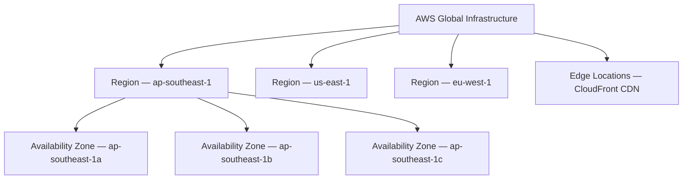

# AWS Global Infrastructure

## Learning Goal

Understand how AWS organizes its worldwide infrastructure so you can choose the right Region, design for high availability, and speak confidently in architecture discussions.

---

## AWS Is a Global Cloud Provider

Amazon Web Services (AWS) runs data centers across the world. As a customer, you provision **logical resources** (EC2 instances, S3 buckets, RDS databases) that run on AWS's physical infrastructure.

You do not pick a specific physical server in a rack. You choose:

- **Region** — geographic area
- **Availability Zone** — isolated data center within that Region
- **Edge location** — for content delivery (covered in the next lesson)

Default for this course: **`ap-southeast-1` (Asia Pacific — Singapore)**. You may use another Region if your instructor agrees — stay consistent across all labs.

---

## Global Infrastructure Hierarchy

---

## Key Components at a Glance

| Component | What It Is | DevOps Relevance |
|-----------|------------|------------------|
| **Region** | Geographic area with multiple AZs | Where your resources live; affects latency and compliance |
| **Availability Zone (AZ)** | One or more discrete data centers with independent power and networking | Deploy across AZs for high availability |
| **Local Zone** | Extension of a Region closer to users | Ultra-low latency (advanced) |
| **Wavelength Zone** | AWS at 5G network edge | Mobile/edge apps (advanced) |
| **Edge location** | CDN cache point worldwide | Faster static content via CloudFront |

For this course, focus on **Region** and **Availability Zone**.

---

## How Many Regions and AZs?

AWS continues to expand. Always verify current numbers on the official page.

As of common classroom references:

- **30+ Regions** worldwide
- Each Region has **at least 3 AZs** (most have 3 or more)
- **400+ edge locations** for CloudFront

> Check live data: [AWS Global Infrastructure](https://aws.amazon.com/about-aws/global-infrastructure/)

---

## Why Global Infrastructure Matters to DevOps

### 1. Latency

Deploy close to your users. A web app for customers in Singapore should use `ap-southeast-1`, not `us-east-1`.

### 2. High Availability

Spread EC2 instances across **multiple AZs** in one Region. If one data center fails, traffic shifts to another AZ.

### 3. Disaster Recovery

Replicate backups to a **second Region** (e.g., primary in Singapore, DR in Sydney `ap-southeast-2`).

### 4. Compliance and Data Residency

Some laws require data to stay in a specific country. Region choice is a **legal and architectural** decision.

### 5. Service Availability

Not every AWS service is available in every Region. Always check service availability for your Region before designing.

---

## Real-World DevOps Examples

| Scenario | Infrastructure Choice |
|----------|----------------------|
| Startup MVP for Southeast Asia users | Single Region (`ap-southeast-1`), multi-AZ ALB + ASG |
| Global SaaS product | Multi-Region active-passive or active-active |
| CI/CD artifact storage | S3 in same Region as compute to reduce transfer cost |
| Student lab | One Region only — simpler and cheaper |

---

## AWS Partition (Bonus)

AWS groups Regions into **partitions**:

| Partition | Regions | Typical Use |
|-----------|---------|-------------|
| `aws` | Commercial Regions worldwide | Standard customers |
| `aws-us-gov` | AWS GovCloud | US government workloads |
| `aws-cn` | China Regions | Operated by local partners |

Most students use the commercial **`aws`** partition.

---

## Common Confusion

| Confusion | Clarification |
|-----------|---------------|
| "Region and AZ are the same" | A Region contains multiple AZs. AZs are isolated within a Region |
| "More Regions = better for one small app" | Usually one Region with multi-AZ is enough. Multi-Region adds complexity |
| "I can access any Region from the Console" | Yes, but resources in `ap-southeast-1` do not automatically appear in `us-east-1` |
| "Edge locations are AZs" | No. Edge locations are for CDN caching (CloudFront), not for running EC2 |
| "AWS automatically makes my app highly available" | No. **You** must design multi-AZ or multi-Region architectures |

---

## Small Example (Conceptual)

Your team deploys a web API:

| Design | Uptime if one AZ fails |
|--------|------------------------|
| 1 EC2 in `ap-southeast-1a` only | **Outage** — app is down |
| 2 EC2 across `1a` and `1b` behind ALB | **Survives** — ALB routes to healthy instance |

You will build the second pattern in the ALB + Auto Scaling lab.

---

## Interview-Style Questions

1. **What is an AWS Region?**
   - *A geographic area containing multiple isolated Availability Zones.*

2. **Why deploy across multiple AZs?**
   - *To survive failure of a single data center and improve availability.*

3. **What is the default Region for this course?**
   - *ap-southeast-1 (Singapore).*

4. **Can you run EC2 in an edge location?**
   - *No. EC2 runs in AZs within Regions. Edge locations are for CloudFront.*

5. **Why does Region choice affect compliance?**
   - *Data residency laws may require data to remain in specific countries or jurisdictions.*

---

## References to Verify

- [AWS Global Infrastructure](https://aws.amazon.com/about-aws/global-infrastructure/) — Regions, AZs, edge locations (live map)
- [AWS Regional Services List](https://aws.amazon.com/about-aws/global-infrastructure/regional-product-services/) — which services exist in which Region
- [AWS Well-Architected — Reliability Pillar](https://docs.aws.amazon.com/wellarchitected/latest/reliability-pillar/welcome.html) — designing for failure

---

**Next:** [02-region-az-edge-location.md](02-region-az-edge-location.md) — deep dive into Region, AZ, and edge locations.
