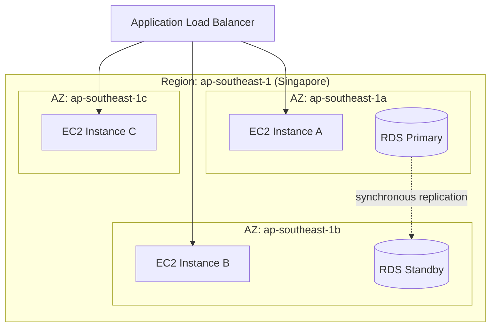
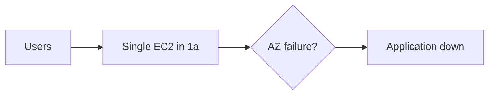
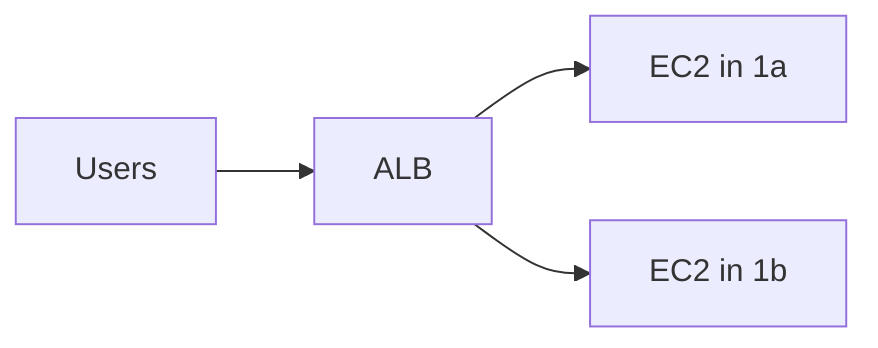

# Region, Availability Zone, and Edge Location

## Learning Goal

Clearly distinguish **Region**, **Availability Zone (AZ)**, and **edge location** — three terms every AWS engineer must use correctly.

---

## Region

A **Region** is a physical geographic area where AWS clusters data centers.

### Properties

| Property | Detail |
|----------|--------|
| **Naming** | `ap-southeast-1`, `us-east-1`, `eu-west-1` |
| **Independence** | Each Region is fully isolated from others |
| **Data** | Data in one Region does not automatically replicate to another |
| **Pricing** | Can differ between Regions |
| **Latency** | Lower when users are geographically close |

### DevOps Example

Your production stack for Southeast Asia:

```
Region: ap-southeast-1 (Singapore)
├── VPC
├── EC2 instances
├── RDS database
└── S3 bucket
```

All resources share the same Region for lower latency and simpler networking.

---

## Availability Zone (AZ)

An **Availability Zone** is one or more discrete data centers within a Region, with **independent power, cooling, and networking**.

### Properties

| Property | Detail |
|----------|--------|
| **Naming** | `ap-southeast-1a`, `ap-southeast-1b`, `ap-southeast-1c` |
| **Isolation** | Failure in one AZ should not take down another AZ |
| **Connection** | AZs in the same Region are connected by **low-latency private fiber** |
| **Design pattern** | Run redundant workloads in **at least 2 AZs** |

### Diagram 2 (Required): Region and AZ



> **Classroom rule:** ALB + instances in multiple AZs = high availability within a Region.

---

## Edge Location

An **edge location** is a site worldwide where **Amazon CloudFront** caches copies of content close to end users.

### Properties

| Property | Detail |
|----------|--------|
| **Purpose** | Content delivery (CDN) — not general compute |
| **Count** | 400+ globally (verify on AWS site) |
| **Services** | CloudFront, AWS Global Accelerator, some Lambda@Edge |
| **Benefit** | Lower latency for static assets (images, JS, CSS, video) |

### DevOps Example

Your React app is hosted on S3:

| Without CloudFront | With CloudFront |
|--------------------|-----------------|
| User in Tokyo fetches files from S3 in Singapore | User in Tokyo gets cached copy from nearest edge location |
| Higher latency | Lower latency |
| All requests hit origin | Most requests served from cache |

Edge locations do **not** replace Regions. They **cache content from** your origin in a Region.

---

## Comparison Table

| | Region | Availability Zone | Edge Location |
|---|--------|-------------------|---------------|
| **Scope** | Geographic area | Data center(s) in Region | Global cache point |
| **Run EC2?** | Yes (in AZs) | Yes | No |
| **Run RDS?** | Yes (in AZs) | Yes | No |
| **CDN cache?** | No | No | Yes |
| **Isolation** | From other Regions | From other AZs | N/A |
| **This course** | ✅ Primary focus | ✅ HA labs | Mentioned only |

---

## Choosing a Region — Checklist

| Question | Action |
|----------|--------|
| Where are your users? | Pick closest Region |
| Is the service available there? | Check [Regional services](https://aws.amazon.com/about-aws/global-infrastructure/regional-product-services/) |
| Any data residency rules? | Legal/compliance review |
| What is the price? | Compare on pricing page |
| Is your team aligned? | One Region for all labs |

**Course default:** `ap-southeast-1`

---

## High Availability Patterns

### Single AZ (Avoid for Production)



### Multi-AZ (Recommended)



You will configure this in Module 03 (ALB + Auto Scaling lab).

---

## Data Transfer Between AZs

Traffic between AZs in the **same Region** is charged (per GB). Design matters:

| Pattern | Cost Impact |
|---------|-------------|
| App and DB in same AZ | Lower transfer cost; lower availability |
| App and DB in different AZs | Small transfer cost; better fault tolerance |
| Resources spread across Regions | Higher transfer cost; disaster recovery |

For labs, keep related resources in the same Region. Spread EC2 across AZs when learning HA.

---

## Common Confusion

| Confusion | Clarification |
|-----------|---------------|
| "`ap-southeast-1a` is in a different country than `1b`" | No. AZs in a Region are typically within the same metro area, isolated at the data center level |
| "I need multi-Region for every app" | No. Multi-AZ within one Region is enough for many workloads |
| "CloudFront replaces S3" | No. S3 is origin storage; CloudFront caches and delivers |
| "Edge location = Local Zone" | Different. Local Zones run compute closer to users; edge locations primarily cache content |
| "AZ names are the same for every account" | AZ names are mapped per account. Your `1a` might be another account's `1c` physically — use subnet design, not AZ letters alone |

---

## Small Example (Conceptual)

| Resource | Region | AZ | Edge |
|----------|--------|-----|------|
| EC2 web server | `ap-southeast-1` | `1a` | — |
| RDS Multi-AZ | `ap-southeast-1` | `1a` + `1b` | — |
| S3 bucket (origin) | `ap-southeast-1` | — | — |
| CloudFront distribution | Global | — | Tokyo, Singapore, Sydney, … |

---

## Interview-Style Questions

1. **What is the relationship between Region and AZ?**
   - *A Region contains multiple isolated Availability Zones connected by low-latency links.*

2. **What is an edge location used for?**
   - *Caching and delivering content closer to users, primarily via CloudFront.*

3. **How do you improve availability within one Region?**
   - *Deploy across multiple Availability Zones, often with a load balancer.*

4. **Can RDS span AZs?**
   - *Yes. Multi-AZ RDS maintains a standby in another AZ for failover.*

5. **Why use one Region for all student labs?**
   - *Consistency, lower cross-Region transfer cost, and simpler troubleshooting.*

---

## References to Verify

- [AWS Global Infrastructure — Regions and AZs](https://aws.amazon.com/about-aws/global-infrastructure/)
- [Amazon CloudFront — How it works](https://docs.aws.amazon.com/AmazonCloudFront/latest/DeveloperGuide/Introduction.html)
- [AWS High Availability whitepaper concepts](https://docs.aws.amazon.com/whitepapers/latest/aws-fault-isolation-boundaries/abstract-and-introduction.html) — fault isolation boundaries

---

**Next:** [03-aws-well-architected-framework.md](03-aws-well-architected-framework.md) — the six pillars of good cloud architecture.
