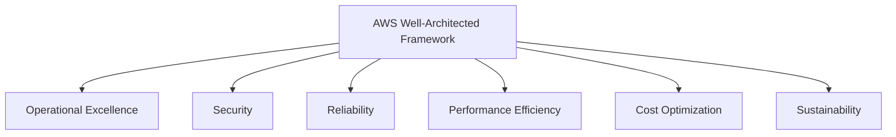

# AWS Well-Architected Framework

## Learning Goal

Learn the six pillars of the **AWS Well-Architected Framework** — AWS's guide for building secure, high-performing, resilient, and efficient systems.

---

## What Is the Well-Architected Framework?

The **AWS Well-Architected Framework** helps cloud architects and DevOps teams evaluate architectures against best practices. It is not a product you install — it is a **set of design principles and questions**.

Use it when you:

- Design a new workload on AWS
- Review an existing system before production
- Prepare for a **Well-Architected Review** with your team

Official tool: **AWS Well-Architected Tool** in the Console (free) — walks you through pillar questions.

---

## The Six Pillars

---

## Pillar 1: Operational Excellence

**Focus:** Run and monitor systems to deliver business value, and improve supporting processes and procedures.

### Key Ideas

| Principle | DevOps Practice |
|-----------|-----------------|
| Operations as code | Terraform, CloudFormation for repeatable infra |
| Automate changes | CI/CD pipelines for app and infra |
| Learn from failures | Post-incident reviews, runbooks |
| Frequent small changes | Reduce blast radius of deployments |
| Annotate documentation | Runbooks, architecture diagrams in Git |

### DevOps Example

Your team stores nginx config in Git, deploys via GitHub Actions, and uses CloudWatch alarms for CPU > 80%. When an alarm fires, a runbook in the repo tells the on-call engineer what to check.

### Questions to Ask

- Can we deploy without manual Console clicks?
- Do we have logs and metrics for every production service?
- Can we roll back a bad deploy in minutes?

---

## Pillar 2: Security

**Focus:** Protect information, systems, and assets while delivering business value through risk assessments and mitigation strategies.

### Key Ideas

| Principle | DevOps Practice |
|-----------|-----------------|
| Implement strong identity foundation | IAM users, roles, MFA, least privilege |
| Enable traceability | CloudTrail, CloudWatch Logs |
| Protect data in transit and at rest | TLS, S3 encryption, EBS encryption |
| Automate security best practices | IaC with security groups, SCPs (advanced) |
| Prepare for security events | Incident response plan |

### DevOps Example

No root user for daily work. CI/CD uses an IAM **role** (not long-lived keys). S3 buckets block public access by default. Security groups allow only port 443 from the ALB.

> Deep dive: [06-basic-aws-security.md](06-basic-aws-security.md) and [05-shared-responsibility-model.md](05-shared-responsibility-model.md)

---

## Pillar 3: Reliability

**Focus:** Recover from failures, meet demand, and mitigate disruptions (network issues, AZ failures, misconfigurations).

### Key Ideas

| Principle | DevOps Practice |
|-----------|-----------------|
| Automatically recover from failure | Auto Scaling, health checks, Multi-AZ RDS |
| Test recovery procedures | Chaos drills, restore from snapshot |
| Scale horizontally | More small instances vs one giant server |
| Stop guessing capacity | Auto Scaling on metrics |
| Manage change through automation | Terraform plan/apply with review |

### DevOps Example

ALB health checks detect a broken EC2 instance and stop sending traffic. Auto Scaling replaces it. RDS Multi-AZ fails over to standby if primary AZ fails.

You will practice this in the ALB + Auto Scaling lab.

---

## Pillar 4: Performance Efficiency

**Focus:** Use computing resources efficiently and adapt as requirements change.

### Key Ideas

| Principle | DevOps Practice |
|-----------|-----------------|
| Democratize advanced technologies | Use managed services (RDS vs self-hosted DB) |
| Go global in minutes | Deploy in Regions close to users |
| Use serverless where it fits | Lambda for event-driven tasks |
| Experiment more often | Quick A/B tests with separate environments |
| Mechanical sympathy | Match instance type to workload (CPU vs memory) |

### DevOps Example

Instead of a `m5.4xlarge` "just in case," the team right-sizes to `t3.small`, monitors CPU/memory for two weeks, and adjusts. Static assets move to S3 + CloudFront to reduce load on EC2.

---

## Pillar 5: Cost Optimization

**Focus:** Avoid unnecessary costs and understand where money is spent.

### Key Ideas

| Principle | DevOps Practice |
|-----------|-----------------|
| Implement cloud financial management | Budgets, Cost Explorer, tagging |
| Adopt a consumption model | Pay for what you use; tear down dev envs |
| Measure overall efficiency | Cost per customer, cost per transaction |
| Stop spending on undifferentiated heavy lifting | Managed services over self-managed |
| Analyze and attribute expenditure | Tag `Project`, `Environment`, `Owner` |

### DevOps Example

Every Terraform resource gets tags. AWS Budget sends email at $10. Friday script runs `terraform destroy` on `env=dev` workspaces. RDS right-sized from `db.m5.large` to `db.t3.micro` after metrics review.

> Pricing basics: [05-cloud-pricing-basics.md](../01-cloud-fundamentals/05-cloud-pricing-basics.md)

---

## Pillar 6: Sustainability

**Focus:** Minimize environmental impact of running cloud workloads.

### Key Ideas

| Principle | DevOps Practice |
|-----------|-----------------|
| Understand your impact | Track compute utilization |
| Establish sustainability goals | Reduce idle resources |
| Maximize utilization | Right-size; use Graviton instances where supported |
| Use managed services | Higher utilization of shared infrastructure |
| Reduce downstream impact | Efficient code, fewer wasted CPU cycles |

### DevOps Example

Team schedules dev clusters to shut down nights and weekends. Production uses Graviton (`t4g.micro`) instances with same performance at lower power draw. Removing 10 idle EC2 instances reduces cost **and** carbon footprint.

---

## Pillars at a Glance

| Pillar | One-Line Summary | DevOps Keyword |
|--------|------------------|----------------|
| **Operational Excellence** | Run systems well; automate ops | CI/CD, runbooks, IaC |
| **Security** | Protect data and access | IAM, encryption, least privilege |
| **Reliability** | Survive failure; meet SLAs | Multi-AZ, backups, Auto Scaling |
| **Performance Efficiency** | Right resources for the job | Right-sizing, CDN, managed services |
| **Cost Optimization** | Spend wisely | Tags, budgets, teardown |
| **Sustainability** | Reduce waste and impact | Utilization, scheduling, Graviton |

---

## How Pillars Work Together

No pillar stands alone. Trade-offs are normal:

| Decision | Pillar tension |
|----------|----------------|
| Multi-AZ everything | **Reliability** ↑, **Cost** ↑ |
| Largest instance type "to be safe" | **Reliability** ↑, **Cost** ↓, **Performance** wasted |
| No logging to save money | **Cost** ↑ short-term savings, **Security** and **Operational Excellence** ↓ |
| Aggressive auto shutdown of dev | **Cost** and **Sustainability** ↑, developer convenience ↓ |

Good architects document trade-offs explicitly.

---

## Common Confusion

| Confusion | Clarification |
|-----------|---------------|
| "Well-Architected is only for enterprises" | Teams of any size benefit from the pillar questions |
| "Security pillar replaces shared responsibility" | No. Shared responsibility defines *who* secures what; Well-Architected defines *how* to design well |
| "If I use Auto Scaling, Reliability is solved" | Auto Scaling helps, but you still need health checks, graceful deploys, and data durability |
| "Cost Optimization means always choose cheapest" | Choose **cost-effective** — cheapest option that meets reliability and performance needs |
| "Sustainability is optional for engineers" | AWS includes it as a pillar; efficient design often saves money too |

---

## Small Example (Conceptual)

**Student lab web app architecture review:**

| Pillar | Current Lab Design | Improvement |
|--------|-------------------|-------------|
| Operational Excellence | Manual Console deploy | Add Terraform in Module 05 |
| Security | Security group allows SSH from 0.0.0.0/0 | Restrict to your IP only |
| Reliability | Single EC2 | ALB + ASG across 2 AZs |
| Performance | `t3.micro` adequate for lab | Keep it — right-sized |
| Cost | Terminate after lab | Add billing alert |
| Sustainability | Short-lived lab | Good — no 24/7 idle servers |

---

## Interview-Style Questions

1. **Name the six pillars of the AWS Well-Architected Framework.**
   - *Operational Excellence, Security, Reliability, Performance Efficiency, Cost Optimization, Sustainability.*

2. **Which pillar covers Multi-AZ and Auto Scaling?**
   - *Reliability.*

3. **Which pillar covers IAM and encryption?**
   - *Security.*

4. **What is the Well-Architected Tool?**
   - *A free AWS Console tool that guides architecture reviews using pillar-based questions.*

5. **Give one Cost Optimization practice for DevOps.**
   - *Resource tagging, billing alerts, tearing down non-production environments, right-sizing instances.*

---

## References to Verify

- [AWS Well-Architected Framework](https://aws.amazon.com/architecture/well-architected/) — official overview
- [Well-Architected Framework PDF](https://docs.aws.amazon.com/wellarchitected/latest/framework/welcome.html) — detailed pillar documentation
- [AWS Well-Architected Tool](https://aws.amazon.com/well-architected-tool/) — hands-on review in Console

---

**Next:** [04-aws-cloud-adoption-framework.md](04-aws-cloud-adoption-framework.md) — how organizations adopt cloud, not just technology.
