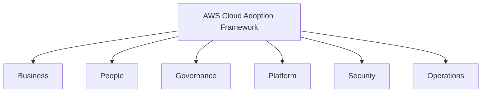
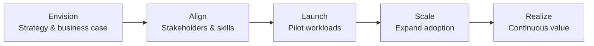

# AWS Cloud Adoption Framework (CAF)

## Learning Goal

Understand the **AWS Cloud Adoption Framework (CAF)** — how organizations plan people, process, and platform changes when moving to AWS, not just the technical migration.

---

## What Is AWS CAF?

Moving to cloud is not only a **technology** project. It is also a **business**, **people**, and **governance** change.

The **AWS Cloud Adoption Framework (CAF)** provides guidance and best practices across six perspectives so organizations can transform successfully.

> **For DevOps engineers:** You will mostly work in the **Platform**, **Security**, and **Operations** perspectives — but knowing all six helps you communicate with managers, security teams, and business stakeholders.

---

## The Six Perspectives

Each perspective has **capabilities**, **outcomes**, and **stakeholders**. Below is a beginner-friendly summary.

---

## Perspective 1: Business

**Stakeholders:** CEO, CFO, product owners, business managers

**Focus:** Align cloud adoption with business outcomes and measure value.

### Key Outcomes

| Outcome | Example |
|---------|---------|
| Faster time to market | Launch new feature in weeks, not months |
| Cost transformation | Shift CapEx to OpEx; optimize spend over time |
| Revenue enablement | Scale for seasonal traffic without upfront hardware |
| Business agility | Enter new markets using global Regions |

### DevOps Connection

You demonstrate business value when:

- CI/CD reduces deploy time from days to hours
- Auto Scaling prevents lost sales during traffic spikes
- Cost reports show dev environments shut down after hours

---

## Perspective 2: People

**Stakeholders:** HR, training leads, engineering managers, team leads

**Focus:** Build cloud skills, roles, and culture across the organization.

### Key Outcomes

| Outcome | Example |
|---------|---------|
| Cloud fluency | Engineers understand AWS services and patterns |
| New roles | Cloud engineer, DevOps engineer, FinOps analyst |
| Training paths | Certifications, hands-on labs (like this course) |
| Culture of experimentation | Safe sandboxes, blameless postmortems |

### DevOps Connection

**You are the People perspective in action.** This course builds:

- Console skills → CLI → Terraform progression
- Naming conventions and cleanup habits
- Shared vocabulary for interviews and teams

---

## Perspective 3: Governance

**Stakeholders:** CIO, compliance, finance, enterprise architects

**Focus:** Policies, controls, and accountability for cloud usage.

### Key Outcomes

| Outcome | Example |
|---------|---------|
| Policy enforcement | Only approved Regions and instance types |
| Compliance | Meet ISO, SOC, HIPAA requirements (industry-dependent) |
| Financial oversight | Budgets, chargeback by team tags |
| Risk management | Standard architectures approved by architecture board |

### DevOps Connection

| Practice | Governance tie-in |
|----------|-------------------|
| Resource tagging | Cost allocation and ownership |
| IaC code review | Changes audited in Git |
| AWS Organizations + SCPs (advanced) | Prevent creating resources in wrong Region |
| Separate AWS accounts per environment | Prod vs dev isolation |

---

## Perspective 4: Platform

**Stakeholders:** Platform engineers, solutions architects, DevOps teams

**Focus:** Design and build the **shared cloud foundation** others deploy on.

### Key Outcomes

| Outcome | Example |
|---------|---------|
| Landing zone | Standard VPC, subnets, IAM baselines for new projects |
| Self-service | Developers deploy via Terraform modules without rebuilding networking |
| Hybrid connectivity | VPN/Direct Connect to on-prem |
| Service catalog | Approved Terraform modules for EC2, RDS, S3 patterns |

### DevOps Connection

This is your **primary technical home** in CAF:

- VPC design (Module 03 custom VPC lab)
- CI/CD integration with AWS
- Terraform modules in Module 05
- ECS platform for container workloads

---

## Perspective 5: Security

**Stakeholders:** CISO, security engineers, auditors

**Focus:** Protect data, workloads, and accounts during and after migration.

### Key Outcomes

| Outcome | Example |
|---------|---------|
| Identity foundation | IAM, SSO, MFA everywhere |
| Detective controls | CloudTrail, GuardDuty, Config |
| Preventive controls | SCPs, encryption policies |
| Incident response | Playbooks for compromised keys |

### DevOps Connection

- Never use root for daily tasks (IAM lab)
- Least privilege IAM policies
- Security groups and NACLs in VPC lab
- No secrets in Git

> See [05-shared-responsibility-model.md](05-shared-responsibility-model.md) and [06-basic-aws-security.md](06-basic-aws-security.md)

---

## Perspective 6: Operations

**Stakeholders:** SREs, operations managers, on-call engineers

**Focus:** Run production workloads reliably on AWS day to day.

### Key Outcomes

| Outcome | Example |
|---------|---------|
| Observability | Metrics, logs, traces in CloudWatch |
| Event management | Alerts, on-call rotations, runbooks |
| Change management | Controlled deploys, maintenance windows |
| Continual improvement | Well-Architected reviews, capacity planning |

### DevOps Connection

| Activity | Operations capability |
|----------|----------------------|
| CloudWatch alarms on EC2 CPU | Monitoring |
| RDS backup and restore lab | Backup & recovery |
| ALB health checks | Service health management |
| `terraform destroy` in dev | Environment management |

---

## CAF Perspectives Summary Table

| Perspective | Primary Question | DevOps Role |
|-------------|------------------|-------------|
| **Business** | Why move to cloud? What value? | Show speed, cost, reliability wins |
| **People** | Who has skills? How do we train? | Learn and share automation practices |
| **Governance** | What rules and guardrails? | Tags, IaC review, account structure |
| **Platform** | What shared infra do teams use? | Build VPC, CI/CD, Terraform modules |
| **Security** | How do we stay secure? | IAM, encryption, secure pipelines |
| **Operations** | How do we run in production? | Monitoring, backups, incident response |

---

## CAF vs Well-Architected Framework

| Framework | Scope | When to Use |
|-----------|-------|-------------|
| **CAF** | Organization-wide cloud **adoption** (people, process, platform) | Migration planning, executive alignment |
| **Well-Architected** | Individual **workload** architecture quality | Design review of one application |

They complement each other: CAF gets the organization to cloud; Well-Architected keeps each system healthy.

---

## Migration Phases (CAF Context)

CAF often aligns with migration phases:

Your course labs sit in the **Launch** and **Scale** learning phase — hands-on skills for pilots and production patterns.

---

## Common Confusion

| Confusion | Clarification |
|-----------|---------------|
| "CAF is only for managers" | Engineers benefit from knowing stakeholder perspectives |
| "Platform perspective = only EC2" | Platform means the entire shared foundation: network, identity, deployment patterns |
| "Security perspective replaces Security pillar" | CAF Security is organizational; Well-Architected Security is workload design — related but different scope |
| "We adopted cloud when we created an AWS account" | Adoption includes people, governance, and operations — not just account creation |
| "DevOps only cares about Platform" | DevOps touches Platform, Security, Operations, and even Governance (IaC policies) |

---

## Small Example (Conceptual)

**Company launches a new mobile app on AWS:**

| Perspective | Action |
|-------------|--------|
| Business | Project ROI: 50% faster releases |
| People | Train 10 engineers with this AWS course |
| Governance | Mandate tagging; dev account separate from prod |
| Platform | Shared VPC + ECS cluster for all microservices |
| Security | MFA, IAM roles for CI/CD, WAF on ALB (later) |
| Operations | CloudWatch dashboards, PagerDuty on-call |

---

## Interview-Style Questions

1. **What is AWS CAF?**
   - *A framework with six perspectives to guide organizational cloud adoption beyond just technology.*

2. **Name the six CAF perspectives.**
   - *Business, People, Governance, Platform, Security, Operations.*

3. **Which perspective covers training and skills?**
   - *People.*

4. **How is CAF different from Well-Architected?**
   - *CAF focuses on organization-wide adoption; Well-Architected evaluates individual workload architecture.*

5. **Which CAF perspective is most aligned with building a shared VPC and Terraform modules?**
   - *Platform.*

---

## References to Verify

- [AWS Cloud Adoption Framework](https://aws.amazon.com/cloud-adoption-framework/) — official overview and downloads
- [AWS CAF Perspectives](https://docs.aws.amazon.com/whitepapers/latest/overview-aws-cloud-adoption-framework/welcome.html) — detailed whitepaper
- [AWS Migration Hub](https://aws.amazon.com/migration-hub/) — migration tracking tools

---

**Next:** [05-shared-responsibility-model.md](05-shared-responsibility-model.md) — who secures what in AWS.
