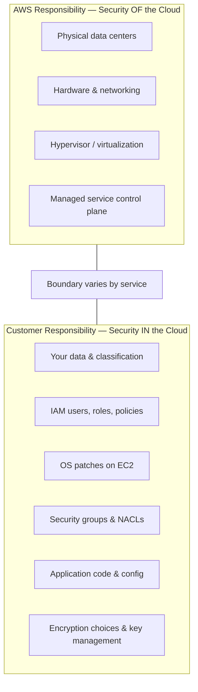
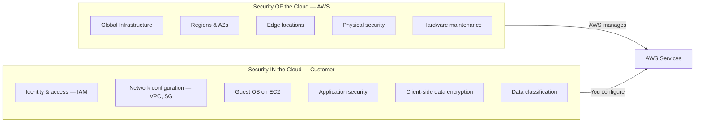

# Shared Responsibility Model

## Learning Goal

Explain clearly who is responsible for what in AWS:

- **AWS** is responsible for security **OF** the cloud
- **Customer** is responsible for security **IN** the cloud

This is one of the most important concepts for interviews and real operations.

---

## The Core Idea

Security and operations are **shared** between AWS and you. The boundary depends on the service type.

---

## Diagram 3 (Required): Shared Responsibility Model

---

## Responsibility Shifts by Service Model

| Service Type | AWS Manages More | You Manage More |
|--------------|------------------|-----------------|
| **IaaS (EC2)** | Physical infra, hypervisor | OS, apps, network config, data |
| **Managed DB (RDS)** | OS patching, DB engine patching, hardware | DB users, schemas, security groups, encryption settings |
| **Object storage (S3)** | Storage durability, physical layer | Bucket policies, public access, encryption, object data |
| **SaaS (external)** | Entire application stack | Users, config, data you upload |

> **Trend:** As you move to more managed services, AWS takes more operational burden — but you **never** hand off all security responsibility.

---

## Service Examples (Required)

### Amazon EC2

| AWS Responsible (OF cloud) | Customer Responsible (IN cloud) |
|---------------------------|--------------------------------|
| Physical servers and racks | Operating system patches |
| Hypervisor security | Installed software (nginx, Docker) |
| Physical network in data center | Security groups attached to instance |
| EC2 service availability in Region | SSH key management |
| | IAM role attached to instance |
| | Data on instance store / attached EBS |
| | Application vulnerabilities |

**DevOps example:** You launch Ubuntu on EC2. AWS secures the hypervisor. **You** must `apt update` for OS patches, configure the security group to allow only port 443, and not store AWS keys in `/home/ubuntu/.bashrc`.

---

### Amazon S3

| AWS Responsible (OF cloud) | Customer Responsible (IN cloud) |
|---------------------------|--------------------------------|
| Durability and availability of storage platform | Bucket names and object keys |
| Physical storage infrastructure | **Bucket policies** and IAM permissions |
| S3 API service | **Block Public Access** settings |
| | Server-side encryption configuration (SSE-S3, SSE-KMS) |
| | Classification of sensitive data in objects |
| | Lifecycle rules and versioning choices |

**DevOps example:** A misconfigured bucket policy that exposes customer PII to the internet is **your** responsibility — not AWS's. AWS provides Block Public Access tools; you must enable and verify them.

---

### Amazon RDS

| AWS Responsible (OF cloud) | Customer Responsible (IN cloud) |
|---------------------------|--------------------------------|
| Database engine patching (managed) | Database users and passwords |
| Underlying OS for managed instance | Security group rules (who can connect) |
| Physical storage and replication infra | Schema design, queries, indexes |
| Automated backup infrastructure (when enabled) | Whether to enable encryption at rest |
| Multi-AZ failover mechanism | Parameter groups, backup retention settings |
| | Network placement (public vs private subnet) |

**DevOps example:** RDS MySQL in a private subnet with strong password and security group allowing only the app EC2 security group — **your** design. AWS patches MySQL minor versions on your maintenance window.

---

### AWS IAM

| AWS Responsible (OF cloud) | Customer Responsible (IN cloud) |
|---------------------------|--------------------------------|
| IAM service availability and API | **Creating and deleting users** |
| Authentication service infrastructure | **Policies** (permissions granted) |
| Global IAM control plane security | MFA enforcement for users |
| | Access keys — create, rotate, delete |
| | Root user lockdown |
| | Permission boundaries and least privilege |
| | Not sharing credentials in Git |

**DevOps example:** If a developer commits an access key to GitHub and an attacker uses it — that is a **customer** failure in the shared model. AWS provided IAM; you misused credentials.

---

## Comparison Table — All Four Services

| Area | EC2 | S3 | RDS | IAM |
|------|-----|-----|-----|-----|
| Physical security | AWS | AWS | AWS | AWS |
| Hypervisor | AWS | N/A | AWS | N/A |
| OS patching | **Customer** | N/A | AWS | N/A |
| Network firewall rules | **Customer** (SG) | N/A | **Customer** (SG) | N/A |
| Data encryption config | **Customer** | **Customer** | **Customer** | N/A |
| Who can access | **Customer** (IAM) | **Customer** (IAM + policy) | **Customer** (IAM + SG) | **Customer** |
| Application security | **Customer** | N/A | **Customer** (SQL injection etc.) | N/A |

---

## What This Means for DevOps Daily Work

| Your Task | Shared Model Reminder |
|-----------|----------------------|
| Launch EC2 | You own OS hardening and security groups |
| Create S3 bucket | You own public access and bucket policy |
| Deploy RDS | You own network exposure and credentials |
| Create IAM user | You own least privilege and key rotation |
| Use Terraform | You own what `apply` creates — including insecure rules |

**AWS secures the building. You secure what you put inside and who gets keys.**

---

## Common Confusion

| Confusion | Clarification |
|-----------|---------------|
| "AWS is responsible for my data security" | AWS provides encryption tools; **you** enable them and control access |
| "Managed service = AWS handles everything" | RDS still needs your security groups, credentials, and subnet design |
| "If AWS gets hacked, it's always AWS fault" | Depends on layer. Customer misconfig is the most common breach cause |
| "Shared responsibility means 50/50" | Split is **not** equal — it is **layer-based** |
| "Compliance certification = my app is compliant" | AWS certifications cover **OF cloud**. You must still prove **IN cloud** controls |

---

## Small Example (Conceptual)

**Incident:** Public S3 bucket with employee salary CSV files.

| Question | Answer |
|----------|--------|
| Did AWS fail physical security? | No |
| Did AWS fail to offer Block Public Access? | No — feature exists |
| Who is responsible? | **Customer** misconfigured bucket policy / ACL |
| Fix | Block public access, audit policies, enable CloudTrail, train team |

---

## Interview-Style Questions

1. **State the shared responsibility model in one sentence each for AWS and customer.**
   - *AWS: security OF the cloud. Customer: security IN the cloud.*

2. **Who patches the OS on EC2?**
   - *The customer.*

3. **Who patches the MySQL engine on RDS?**
   - *AWS manages engine patching; customer manages configuration and access.*

4. **Who is responsible if an S3 bucket is accidentally public?**
   - *The customer — bucket access configuration is customer responsibility.*

5. **Who manages IAM policies?**
   - *The customer.*

6. **Does shared responsibility change for SaaS on AWS?**
   - *For AWS services like S3/RDS, AWS takes more at managed layers. For third-party SaaS, that vendor has their own model too.*

---

## References to Verify

- [AWS Shared Responsibility Model](https://aws.amazon.com/compliance/shared-responsibility-model/) — official page
- [AWS Security Documentation](https://docs.aws.amazon.com/security/) — customer security best practices
- [RDS Security](https://docs.aws.amazon.com/AmazonRDS/latest/UserGuide/UsingWithRDS.html) — RDS-specific customer responsibilities
- [Amazon S3 Security](https://docs.aws.amazon.com/AmazonS3/latest/userguide/security.html) — S3 access and encryption

---

**Next:** [06-basic-aws-security.md](06-basic-aws-security.md) — practical security habits before your first lab.
