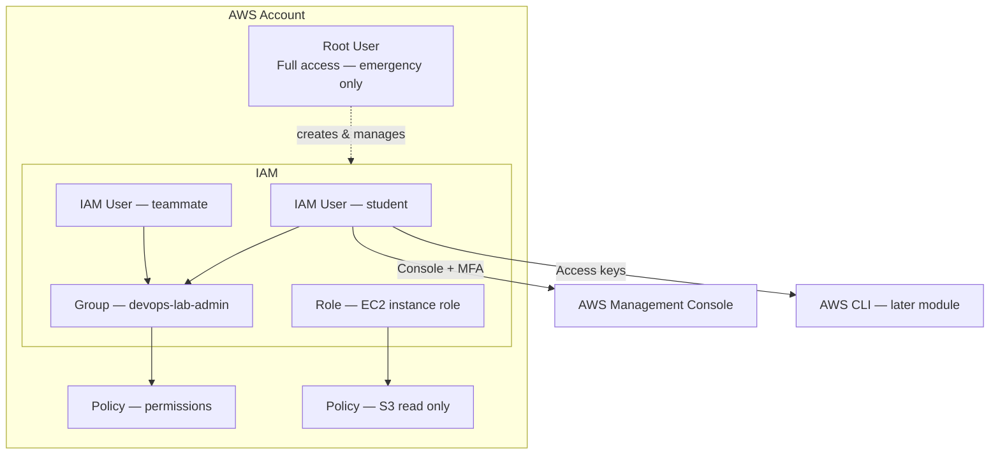

# Root User vs IAM User

## 1. Concept Overview

When you create an AWS account, AWS gives you one special login called the **root user**. This login uses the email address you used to sign up.

For everyday work, AWS recommends you create **IAM users** (or use **IAM Identity Center** in companies). IAM stands for **Identity and Access Management**.

| Identity | What it is |
|----------|------------|
| **Root user** | Owner of the entire AWS account — full access to everything |
| **IAM user** | Named user inside the account with specific permissions |

Think of root as the **building owner master key**. IAM users are **staff badges** with limited access.

---

## 2. Why DevOps Engineers Use IAM (Not Root)

| Reason | Explanation |
|--------|-------------|
| **Least privilege** | Developers get only what they need — not full account control |
| **Audit trail** | CloudTrail shows *which IAM user* did an action, not just "root" |
| **Safer daily work** | If an IAM key leaks, damage is limited by policy |
| **Team scaling** | Each person gets their own user — no shared passwords |
| **Automation** | CI/CD uses IAM **roles**, not root credentials |

**DevOps rule:** Use root only for rare account-level tasks. Use IAM for labs, CLI, and Terraform.

---

## 3. Important Terms

| Term | Meaning |
|------|---------|
| **Root user** | Account creator; has unrestricted access |
| **IAM user** | Human or machine identity with attached policies |
| **IAM group** | Collection of users sharing the same permissions |
| **IAM policy** | JSON document listing Allow/Deny actions on resources |
| **IAM role** | Temporary credentials for AWS services or apps (no password) |
| **MFA** | Multi-Factor Authentication — second step after password |
| **Access key** | Access Key ID + Secret Access Key for CLI/API (like username + password) |
| **Console password** | Password for signing in to AWS Management Console |

---

## 4. Architecture Diagram

---

## 5. Before You Start

| Requirement | Detail |
|-------------|--------|
| **AWS account** | Active account (Free Tier eligible) |
| **Region** | Default lab region: `ap-southeast-1` (Singapore). You may use another region if your instructor allows — stay consistent for all labs |
| **Browser** | Chrome, Firefox, or Edge |
| **Login** | You need root access **once** to set up IAM and MFA |
| **Cost** | IAM is **free** — no charge for users, groups, or policies |

> **Cost warning:** IAM itself costs nothing. The risk is *what IAM users can create* (EC2, RDS, etc.) in later labs. Use billing alerts.

---

## 6. Step-by-Step AWS Console Lab

### Part A — Sign in as root and find IAM

1. Open [https://console.aws.amazon.com/](https://console.aws.amazon.com/)
2. Sign in with **root user** (your account email + password)
3. Confirm region in the top-right bar shows **Asia Pacific (Singapore) `ap-southeast-1`** (or your agreed region)
4. In the search bar at the top, type **IAM** and open **IAM**

### Part B — Enable MFA on root (required)

1. In IAM left menu, click **Dashboard**
2. Find the alert: **"Add MFA for root user"** (or go to **Users** → your root account summary)
3. Click **Add MFA**
4. Choose **Authenticator app** (Google Authenticator, Microsoft Authenticator, or Authy)
5. Scan the QR code with your phone app
6. Enter two consecutive MFA codes to confirm
7. Click **Assign MFA**

> **Why:** Root without MFA is a major security risk. One stolen password = full account takeover.

### Part C — Review root vs IAM on the dashboard

1. On IAM **Dashboard**, read the **Security recommendations** panel
2. Note these recommendations:
   - Root access keys should not exist
   - MFA should be enabled on root
   - Unused credentials should be removed

### Part D — Understand the users list

1. Click **Users** in the left menu
2. You may see only your account summary initially — IAM users are created in the next lesson
3. Click **User groups**, **Policies**, and **Roles** in the left menu — just explore the layout

### Part E — Verify root access keys do not exist

1. Click your **account name** (top right) → **Security credentials**
2. Scroll to **Access keys**
3. If any root access keys exist, **delete them** (root should not have programmatic keys)
4. If none exist, leave it that way

---

## 7. Validation / Testing Steps

| Check | Expected Result |
|-------|-----------------|
| MFA on root | IAM Dashboard shows root MFA as enabled |
| No root access keys | Access keys section shows none for root |
| IAM service opens | You can navigate Users, Groups, Policies, Roles |
| Region | Top bar shows `ap-southeast-1` (or your chosen region) |

Sign out and sign in again with root + MFA to confirm MFA works.

---

## 8. Troubleshooting

| Problem | Solution |
|---------|----------|
| Cannot find IAM | Use top search bar — type "IAM" |
| MFA codes rejected | Check phone time is automatic/synced; wait for new code |
| Locked out of root | Use account recovery via email; contact AWS support if needed |
| Wrong region shown | Click region dropdown → select **Asia Pacific (Singapore)** |
| "Access denied" in IAM | You must be signed in as root or an admin IAM user |

---

## 9. Cleanup

This lesson creates no resources to delete. Keep MFA enabled on root.

| Item | Action |
|------|--------|
| MFA on root | **Keep** — do not remove |
| IAM users | None created yet — nothing to delete |

---

## 10. Interview Questions

1. **What is the AWS root user?**
   - *The account owner with full access to all AWS services and billing.*

2. **Why should you not use root for daily tasks?**
   - *Unlimited access, poor audit separation, and high impact if credentials are compromised.*

3. **What is MFA and why use it on root?**
   - *A second authentication factor (app/token) that protects against password theft.*

4. **What is the difference between IAM user and IAM role?**
   - *User is a long-term identity for people; role provides temporary credentials, often for services.*

5. **Should root have access keys?**
   - *No — AWS best practice is no programmatic access keys on root.*

---

## 11. What We Achieved

- Understood **root user vs IAM user**
- Enabled **MFA on root**
- Confirmed **no root access keys**
- Explored the **IAM Console** layout
- Set default region to **`ap-southeast-1`**

**Next:** [02-create-iam-user-for-lab.md](02-create-iam-user-for-lab.md) — create your lab IAM user.
