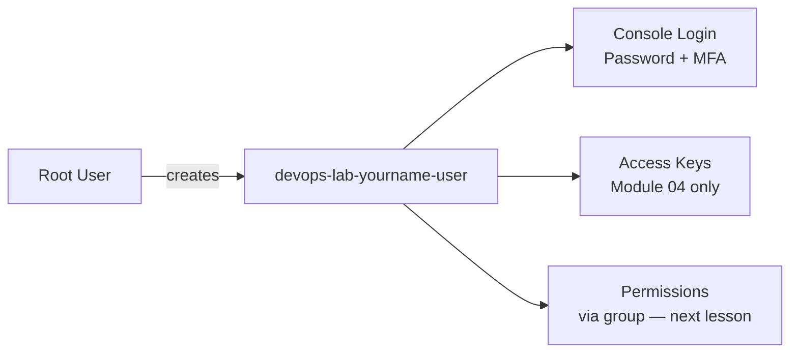

# Create IAM User for Lab

## 1. Concept Overview

An **IAM user** is a named identity in your AWS account. Each student should have their own IAM user for labs instead of sharing root.

Your lab user will have:

- **Console access** — sign in to AWS Management Console with password + MFA
- **Programmatic access** — access keys for AWS CLI (Module 04) — created only when needed

**Naming pattern for this course:**

```
devops-lab-<yourname>-user
```

Example: `devops-lab-faizul-user`

---

## 2. Why DevOps Engineers Use IAM Users

| Practice | Benefit |
|----------|---------|
| One user per person | Clear audit trail in CloudTrail |
| Separate lab vs production accounts (companies) | Blast radius control |
| Access keys per user | Revoke one key without affecting whole team |
| Password policy | Enforce strong passwords and rotation |

---

## 3. Important Terms

| Term | Meaning |
|------|---------|
| **Console access** | User can sign in at `https://<account-id>.signin.aws.amazon.com/console` |
| **Programmatic access** | User can use CLI/SDK with access keys |
| **Permissions boundary** | Advanced — max permissions cap (not used in this lab) |
| **Tags** | Key-value labels — use `Project=aws-basic-lab`, `Owner=<yourname>` |

---

## 4. Architecture Diagram



---

## 5. Before You Start

| Requirement | Detail |
|-------------|--------|
| **Signed in as** | Root user (or admin) |
| **Region** | `ap-southeast-1` (or agreed region) |
| **Name ready** | `devops-lab-<yourname>-user` |
| **MFA app** | Same authenticator used for root |

> **Cost warning:** IAM users are free. Do not create access keys until Module 04 unless instructed.

---

## 6. Step-by-Step AWS Console Lab

### Step 1 — Open IAM Users

1. Sign in to AWS Console as **root**
2. Search **IAM** → open **IAM**
3. Click **Users** → **Create user**

### Step 2 — Set user name and type

1. **User name:** `devops-lab-<yourname>-user`
2. **Provide user access to the AWS Management Console** → select **I want to create an IAM user**
3. **Console password:**
   - Choose **Custom password**
   - Enter a strong password (save in your password manager — **not** in Git)
   - Uncheck **Users must create a new password at next sign-in** (for lab simplicity)
4. Click **Next**

### Step 3 — Set permissions (temporary — group comes next lesson)

For now, attach permissions directly so you can complete setup:

1. Select **Attach policies directly**
2. Search and check **`IAMUserChangePassword`** (allows user to change own password)
3. **Do not** attach `AdministratorAccess` yet — we use a group in the next lesson
4. Click **Next**

> If you cannot sign in without admin rights, your instructor may allow temporary `AdministratorAccess` here — prefer the group method in lesson 03.

### Step 4 — Tags (optional but recommended)

Add tags:

| Key | Value |
|-----|-------|
| `Project` | `aws-basic-lab` |
| `Owner` | `<yourname>` |
| `Environment` | `training` |

Click **Next** → **Create user**

### Step 5 — Save sign-in details

1. On the success page, note:
   - **Console sign-in URL** (e.g. `https://123456789012.signin.aws.amazon.com/console`)
   - **User name:** `devops-lab-<yourname>-user`
2. Click **Download .csv** or copy details to your password manager
3. **Never commit this file to Git**

### Step 6 — Enable MFA on IAM user

1. Stay in IAM → **Users** → click `devops-lab-<yourname>-user`
2. Click **Security credentials** tab
3. Under **Multi-factor authentication (MFA)**, click **Assign MFA device**
4. Choose **Authenticator app**
5. Scan QR code → enter two codes → **Assign MFA**

### Step 7 — Test IAM user login

1. Sign **out** of root (top right → Sign out)
2. Open your **Console sign-in URL**
3. Sign in as `devops-lab-<yourname>-user` with password + MFA
4. Confirm you reach the Console home page

### Step 8 — Do NOT create access keys yet

1. In IAM → your user → **Security credentials**
2. **Access keys** — leave empty until [Module 04 AWS CLI](../../04-aws-cli/03-create-access-key.md)

---

## 7. Validation / Testing Steps

| Check | How |
|-------|-----|
| User exists | IAM → Users → `devops-lab-<yourname>-user` listed |
| MFA enabled | Security credentials shows MFA device assigned |
| Console login works | Sign in as IAM user with MFA |
| No access keys | Access keys section empty |
| Tags visible | User tags show `Project=aws-basic-lab` |

---

## 8. Troubleshooting

| Problem | Solution |
|---------|----------|
| Cannot sign in as IAM user | Verify account ID URL, username, and password; caps lock off |
| MFA fails | Sync phone time; use fresh code |
| "Not authorized" everywhere | Attach group admin policy in next lesson, or ask instructor |
| Forgot password | Root user → IAM → user → Security credentials → Manage password |
| Created access key by mistake | Delete key immediately; never commit to Git |

---

## 9. Cleanup

**Do not delete this user until course end** — you need it for all labs.

At course end, see [cleanup.md](cleanup.md).

| Now | Action |
|-----|--------|
| Lab user | **Keep** |
| Access keys | **Do not create** yet |
| MFA | **Keep** enabled |

---

## 10. Interview Questions

1. **Why create an IAM user instead of using root?**
   - *Least privilege, individual accountability, and safer credential management.*

2. **What two types of access can an IAM user have?**
   - *Console access and programmatic (API/CLI) access.*

3. **When should you create access keys?**
   - *Only when CLI/SDK access is needed; prefer roles for applications.*

4. **Why enable MFA on IAM users?**
   - *Protects against password compromise.*

5. **Should you commit the IAM credentials CSV to Git?**
   - *Never.*

---

## 11. What We Achieved

- Created IAM user `devops-lab-<yourname>-user`
- Enabled **MFA** on lab user
- Tested **Console sign-in** as IAM user
- Applied **tags** for organization
- Deferred **access keys** to CLI module

**Next:** [03-create-admin-group-for-training.md](03-create-admin-group-for-training.md)
