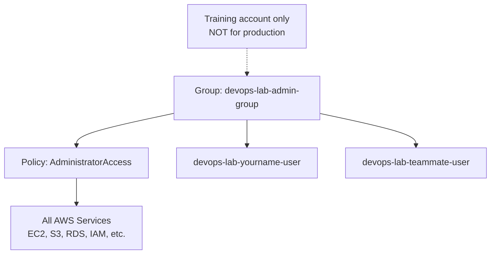

# Create Admin Group for Training

## 1. Concept Overview

An **IAM group** is a collection of IAM users that share the same permissions. Instead of attaching policies to each user, you attach policies to the group and add users to it.

For this **training account only**, we create an admin group with broad permissions so you can complete all labs without constant "access denied" errors.

> **⚠️ Production warning:** `AdministratorAccess` on a shared group is **NOT** acceptable in production. In real companies, use least-privilege policies per role (e.g. `DevOps-EC2-Only`, `ReadOnly-Auditor`).

---

## 2. Why DevOps Engineers Use Groups

| Practice | Benefit |
|----------|---------|
| Group per role | `Developers`, `Admins`, `ReadOnly` |
| Onboarding | Add new hire to group — inherits permissions |
| Offboarding | Remove from group — access revoked |
| Policy management | Update one group policy instead of 50 users |

---

## 3. Important Terms

| Term | Meaning |
|------|---------|
| **Managed policy** | AWS-prebuilt policy (e.g. `AdministratorAccess`) |
| **Customer managed policy** | Policy you create and name |
| **Inline policy** | Policy attached directly to one user/group (harder to reuse) |
| **AdministratorAccess** | Full access to all AWS services — lab/training only here |

---

## 4. Architecture Diagram

---

## 5. Before You Start

| Requirement | Detail |
|-------------|--------|
| **Signed in as** | Root user (required to create admin groups initially) |
| **IAM user** | Created in previous lesson |
| **Group name** | `devops-lab-admin-group` |

> **Cost warning:** The group is free. Admin permissions let you create **billable** resources in later labs. Set a billing alert today.

### Set a billing alert (recommended now)

1. Search **Billing** → **Budgets**
2. **Create budget** → **Cost budget** → monthly → amount e.g. **$10 USD**
3. Set email alert at 80% and 100%
4. Create budget

---

## 6. Step-by-Step AWS Console Lab

### Step 1 — Create the group

1. Sign in as **root**
2. Open **IAM** → **User groups** → **Create group**
3. **Group name:** `devops-lab-admin-group`
4. **Attach permissions policies** → search **`AdministratorAccess`**
5. Check the box for **AdministratorAccess**
6. Click **Create group**

### Step 2 — Add your lab user to the group

1. Click group name `devops-lab-admin-group`
2. Click **Add users**
3. Select `devops-lab-<yourname>-user`
4. Click **Add users**

### Step 3 — Remove direct policies from user (cleanup)

1. Go to **Users** → `devops-lab-<yourname>-user`
2. **Permissions** tab
3. If only `IAMUserChangePassword` is attached directly, you can leave it OR rely on AdministratorAccess from group (admin includes password change)
4. **Do not** attach `AdministratorAccess` directly to user AND group — group alone is enough

### Step 4 — Verify effective permissions

1. Still on user page → **Permissions** tab
2. **Permissions policies** should show via group:
   - `AdministratorAccess` (from `devops-lab-admin-group`)
3. Click **Effective permissions** tab → explore what the user can do (optional)

### Step 5 — Test as IAM user

1. Sign out → sign in as `devops-lab-<yourname>-user`
2. Search **EC2** → open EC2 dashboard — should load without "not authorized"
3. Search **S3** → should open successfully

---

## 7. Validation / Testing Steps

| Check | Expected |
|-------|----------|
| Group exists | `devops-lab-admin-group` in IAM User groups |
| Policy attached | `AdministratorAccess` on group |
| User in group | Your lab user listed under group members |
| EC2 access | IAM user can open EC2 console |
| Root still works | Root can still sign in for billing/account tasks |

---

## 8. Troubleshooting

| Problem | Solution |
|---------|----------|
| Cannot attach AdministratorAccess | Must be signed in as root or existing admin |
| User still denied | Wait 1 minute; sign out and in; confirm user is in group |
| Attached policy to user twice | Remove duplicate; use group only |
| Accidentally gave admin to wrong user | Remove user from group immediately |

---

## 9. Cleanup

Keep group and user for all remaining labs.

| Resource | End of course action |
|----------|---------------------|
| `devops-lab-admin-group` | Delete after removing users |
| `devops-lab-<yourname>-user` | Delete user (after deleting keys) |

See [cleanup.md](cleanup.md) for full steps.

---

## 10. Interview Questions

1. **Why use IAM groups?**
   - *Manage permissions for many users in one place.*

2. **Is AdministratorAccess OK for production?**
   - *No — use least privilege per job function.*

3. **What is the difference between managed and inline policy?**
   - *Managed policies are reusable documents; inline policies belong to one identity.*

4. **How do group permissions reach a user?**
   - *User inherits all policies attached to groups they belong to.*

5. **What should you set up before labs with admin access?**
   - *Billing alerts and a personal cleanup habit.*

---

## 11. What We Achieved

- Created group `devops-lab-admin-group`
- Attached **AdministratorAccess** (training only)
- Added lab IAM user to the group
- Verified EC2/S3 Console access works
- Set up **billing budget** (recommended)

**IAM module complete.** Next lab: [02-ec2-default-vpc](../02-ec2-default-vpc/README.md)
