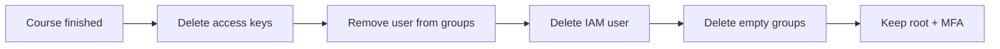

# IAM Basics — Cleanup

## 1. Concept Overview

IAM resources do not cost money, but **unused IAM users and access keys** are a security risk. Clean up when the course ends or when offboarding a student from a shared training account.

---

## 2. Why DevOps Engineers Clean Up IAM

| Risk | Why it matters |
|------|----------------|
| Orphaned access keys | Attackers scan Git for leaked keys |
| Old admin users | Former students retain full account access |
| Too many policies | Harder to audit who can do what |

---

## 3. Important Terms

| Term | Meaning |
|------|---------|
| **Deactivate** | Temporarily disable access keys or console password |
| **Delete** | Permanently remove user, group, or key |

---

## 4. Architecture Diagram

---

## 5. Before You Start

| Item | Detail |
|------|--------|
| **When** | After all labs, CLI, Terraform, and capstone projects |
| **Sign in as** | Root or admin IAM user |
| **Do NOT delete** | Root user |

> **Cost warning:** IAM cleanup has no direct cost. Failing to cleanup risks unauthorized resource creation on your bill.

---

## 6. Step-by-Step AWS Console Lab — Cleanup

### Step 1 — Delete access keys (if created in Module 04)

1. **IAM** → **Users** → `devops-lab-<yourname>-user`
2. **Security credentials** tab
3. Under **Access keys**, select each key → **Actions** → **Delete**
4. Type confirmation → Delete

### Step 2 — Remove MFA device (optional before delete)

1. Same page → **MFA** → **Remove** (only if deleting user)

### Step 3 — Remove user from group

1. **IAM** → **User groups** → `devops-lab-admin-group`
2. Select user → **Remove from group**

### Step 4 — Delete IAM user

1. **IAM** → **Users** → select `devops-lab-<yourname>-user`
2. **Delete**
3. Confirm by typing user name

### Step 5 — Delete empty group

1. **IAM** → **User groups** → `devops-lab-admin-group`
2. **Delete group** (only if no users remain)

### Step 6 — Verify root security

1. Sign in as **root**
2. Confirm **MFA enabled**
3. Confirm **no root access keys**

---

## 7. Validation / Testing Steps

| Check | Expected |
|-------|----------|
| Lab user gone | User not in IAM Users list |
| Group gone or empty | No training admin group with active users |
| No stray keys | Security credentials clean for all remaining users |
| Root MFA | Still enabled |

---

## 8. Troubleshooting

| Problem | Solution |
|---------|----------|
| Cannot delete user | Delete access keys and login profile first |
| Cannot delete group | Remove all users from group first |
| Deleted wrong user | Recreate user; restore from backup policies if exported |

---

## 9. Cleanup Checklist

- [ ] Access keys deleted
- [ ] Lab IAM user deleted
- [ ] `devops-lab-admin-group` deleted
- [ ] Root MFA still enabled
- [ ] No root access keys

---

## 10. Interview Questions

1. **Should you delete the root user?**
   - *No — root cannot be deleted; secure it with MFA instead.*

2. **What do you delete first — user or group?**
   - *Remove user from group, delete keys, then delete user, then empty group.*

3. **Why delete unused access keys?**
   - *Reduce attack surface if keys were exposed.*

---

## 11. What We Achieved

- Removed lab IAM identities safely
- Preserved root account with MFA
- Reduced long-term security risk on training account
