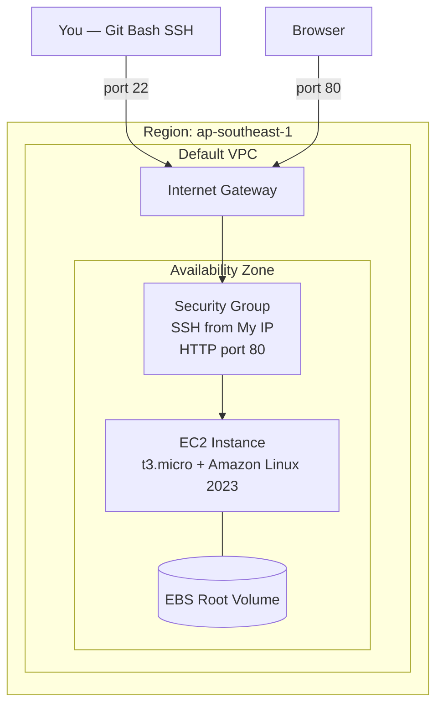

# EC2 Theory

## 1. Concept Overview

**Amazon Elastic Compute Cloud (EC2)** provides virtual servers in AWS. You choose an operating system image, instance size, storage, and network — then AWS runs a VM on shared physical hardware.

EC2 is **IaaS**: you manage the OS, applications, and configuration. AWS manages the physical servers and hypervisor.

---

## 2. Why DevOps Engineers Use EC2

| Use Case | Example |
|----------|---------|
| Web servers | nginx, Apache, Node.js behind ALB |
| CI/CD runners | GitLab Runner, Jenkins agents |
| Bastion / jump host | SSH entry point to private network (advanced) |
| Legacy apps | Lift-and-shift from on-premises VMs |
| Learning | First hands-on AWS compute service |

Most teams also use containers (ECS/EKS) or Lambda, but **EC2 fundamentals** are required for interviews and troubleshooting.

---

## 3. Important Terms

| Term | Meaning |
|------|---------|
| **Instance** | A running virtual server |
| **AMI** | Amazon Machine Image — template with OS and optional software |
| **Instance type** | CPU, memory, network size (e.g. `t3.micro`) |
| **Instance family** | First letter = family: `t` (general burstable), `m` (balanced), `c` (compute), `r` (memory) |
| **Key pair** | Public/private SSH keys for Linux login |
| **Security group** | Virtual firewall for instance network interfaces |
| **Public IP** | Reachable from internet (if configured) |
| **Private IP** | Internal VPC address |
| **EBS volume** | Persistent disk attached to instance (root volume) |
| **Default VPC** | AWS-created VPC in each Region — quick start for labs |

### Instance family quick reference

| Family | Use | Lab choice |
|--------|-----|------------|
| **t3 / t4g** | Burstable general purpose | ✅ `t3.micro` — Free Tier eligible |
| **m5 / m6i** | Balanced production workloads | Larger apps |
| **c5 / c6i** | CPU-heavy | Batch processing |
| **r5 / r6i** | Memory-heavy | Databases on EC2 (prefer RDS) |

---

## 4. Architecture Diagram

---

## 5. Before You Start

| Requirement | Detail |
|-------------|--------|
| **IAM user** | `devops-lab-<yourname>-user` with admin group |
| **Region** | `ap-southeast-1` (Singapore) — or agreed region |
| **Key pair name** | `devops-lab-<yourname>-key` |
| **Git Bash** | Installed on Windows for SSH |

> **Cost warning:** EC2 charges per second while **running**. `t3.micro` may be Free Tier eligible (750 hrs/month for 12 months for new accounts). **Terminate** instances after each lab. A forgotten instance can cost $10–15+/month.

---

## 6. Step-by-Step AWS Console Lab

This theory lesson has no resources to create. Review the EC2 dashboard:

1. Console → search **EC2** → open **EC2**
2. Left menu → **Dashboard** — note instance count
3. Left menu → **Instances** — empty until next lesson
4. Left menu → **Key Pairs** — empty until launch
5. Left menu → **Security Groups** — note `default` VPC security group exists
6. Left menu → **AMIs** → **Browse more AMIs** → search **Amazon Linux 2023**

---

## 7. Validation / Testing Steps

| Check | Expected |
|-------|----------|
| EC2 dashboard loads | No authorization errors |
| Region | `ap-southeast-1` in top bar |
| Default VPC | **VPC** → **Your VPCs** → one VPC marked **default** |

---

## 8. Troubleshooting

| Problem | Solution |
|---------|----------|
| EC2 not authorized | Confirm IAM admin group membership |
| No default VPC | **VPC** → **Create default VPC** (or use custom VPC lab later) |
| Wrong region | Switch to `ap-southeast-1` before launching instances |

---

## 9. Cleanup

Nothing to clean up in this theory lesson.

---

## 10. Interview Questions

1. **What is EC2?**
   - *Resizable virtual servers in AWS.*

2. **What is an AMI?**
   - *Template defining OS and root volume for an instance.*

3. **What does t3.micro mean?**
   - *T family (burstable), size micro — 2 vCPU, 1 GiB RAM ( specs verify on AWS site).*

4. **What is a security group?**
   - *Stateful virtual firewall controlling inbound/outbound traffic for an instance.*

5. **What is the difference between public and private IP on EC2?**
   - *Public IP reachable from internet; private IP used inside VPC.*

---

## 11. What We Achieved

- Understood EC2, AMI, instance types, key pairs, security groups
- Located EC2 Console and default VPC
- Ready to launch an instance

**Next:** [02-launch-ec2-default-vpc.md](02-launch-ec2-default-vpc.md)
