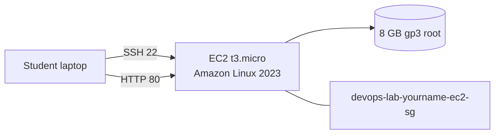

# Launch EC2 in Default VPC

## 1. Concept Overview

You will launch a **Linux EC2 instance** in the **default VPC** with a public IP, security group, and SSH key pair. This is the fastest way to get a server running in AWS.

**Resource names for this lab:**

| Resource | Name |
|----------|------|
| Key pair | `devops-lab-<yourname>-key` |
| Security group | `devops-lab-<yourname>-ec2-sg` |
| Instance | tagged `Name=devops-lab-<yourname>-web` |

---

## 2. Why DevOps Engineers Launch EC2 This Way

- Prove networking and SSH access before custom VPC
- Baseline pattern: AMI + instance type + SG + key pair
- Same settings later automated in CLI and Terraform

---

## 3. Important Terms

| Term | Meaning |
|------|---------|
| **Auto-assign public IP** | Instance gets internet-routable address |
| **gp3** | General-purpose SSD EBS volume type (default) |
| **User data** | Script run at first boot (optional) |

---

## 4. Architecture Diagram

---

## 5. Before You Start

| Item | Value |
|------|-------|
| Region | `ap-southeast-1` |
| AMI | Amazon Linux 2023 |
| Instance type | `t3.micro` |
| Login user | `ec2-user` (Amazon Linux) |

> **Cost warning:** Running instance billed hourly. Terminate same day after lab.

---

## 6. Step-by-Step AWS Console Lab

### Step 1 — Create key pair

1. **EC2** → left menu **Key pairs** (under Network & Security) → **Create key pair**
2. **Name:** `devops-lab-<yourname>-key`
3. **Key pair type:** RSA
4. **Private key format:** `.pem` (for OpenSSH / Git Bash)
5. **Create key pair** — `.pem` file downloads automatically
6. Move file to `~/.ssh/` or a safe folder — **never commit to Git**
7. In Git Bash: `chmod 400 devops-lab-<yourname>-key.pem`

### Step 2 — Create security group

1. **EC2** → **Security Groups** → **Create security group**
2. **Name:** `devops-lab-<yourname>-ec2-sg`
3. **Description:** `Lab SG for SSH and HTTP`
4. **VPC:** select **default** VPC
5. **Inbound rules** → **Add rule**:

| Type | Port | Source | Purpose |
|------|------|--------|---------|
| SSH | 22 | **My IP** | SSH from your laptop only |
| HTTP | 80 | **My IP** | Test nginx from browser (lab only) |

> **Security note:** **My IP** restricts access to your current public IP. Do **not** use `0.0.0.0/0` for SSH — that exposes SSH to the entire internet and is a common attack target.

6. Leave outbound as default (All traffic → 0.0.0.0/0)
7. **Create security group**

### Step 3 — Launch instance

1. **EC2** → **Instances** → **Launch instances**
2. **Name:** `devops-lab-<yourname>-web`
3. **AMI:** Amazon Linux 2023 AMI (64-bit x86) — Free tier eligible
4. **Instance type:** `t3.micro`
5. **Key pair:** `devops-lab-<yourname>-key`
6. **Network settings** → **Edit**:
   - **VPC:** default VPC
   - **Subnet:** any default public subnet
   - **Auto-assign public IP:** Enable
   - **Security group:** Select existing → `devops-lab-<yourname>-ec2-sg`
7. **Configure storage:** 8 GiB gp3 (default is fine)
8. **Advanced details** — skip for now
9. **Tags:**

| Key | Value |
|-----|-------|
| Name | `devops-lab-<yourname>-web` |
| Project | `aws-basic-lab` |
| Owner | `<yourname>` |

10. **Launch instance**
11. Click instance ID → wait until **Instance state** = **Running**
12. Copy **Public IPv4 address** (e.g. `54.255.x.x`)

---

## 7. Validation / Testing Steps

| Check | How |
|-------|-----|
| Instance running | EC2 → Instances → Status checks: 2/2 passed |
| Public IP assigned | Public IPv4 address visible |
| Security group attached | SG shows SSH + HTTP from My IP |
| Key pair exists | Key pairs list shows your `.pem` |

---

## 8. Troubleshooting

| Problem | Solution |
|---------|----------|
| No public IP | Stop instance → Actions → Networking → Manage IP → enable auto-assign public IP → start (or terminate and relaunch) |
| Cannot select My IP | Click My IP button — AWS detects your IP; update SG if your IP changes |
| Instance pending long | Wait 2–3 minutes; check status checks |
| Wrong VPC | Terminate and relaunch in default VPC |

---

## 9. Cleanup

Full cleanup in [cleanup.md](cleanup.md) after nginx lab. For now, **keep instance running** for next lessons.

---

## 10. Interview Questions

1. **Why use My IP instead of 0.0.0.0/0 for SSH?**
   - *Limits SSH exposure to your address, reducing brute-force risk.*

2. **What is the default VPC?**
   - *AWS-created VPC with internet gateway and subnets for quick starts.*

3. **Why store the .pem file securely?**
   - *It is the private key for SSH — anyone with it can access the instance.*

---

## 11. What We Achieved

- Created key pair, security group, and EC2 instance in default VPC
- Applied secure SSH rule (**My IP**)
- Instance running with public IP

**Next:** [03-connect-using-ssh.md](03-connect-using-ssh.md)
