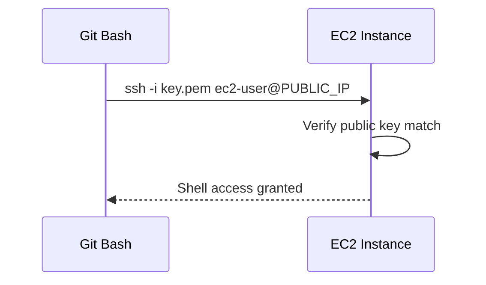

# Connect Using SSH

## 1. Concept Overview

**SSH (Secure Shell)** lets you securely log in to a Linux EC2 instance over the network. You authenticate with a **private key** (`.pem` file) instead of a password.

On Windows, we use **Git Bash** (includes OpenSSH client).

---

## 2. Why DevOps Engineers Use SSH

- Install software (nginx, Docker)
- Read logs and debug
- Run commands when no SSM Session Manager (advanced alternative)
- First skill before automation (Ansible, user data scripts)

---

## 3. Important Terms

| Term | Meaning |
|------|---------|
| **Private key (.pem)** | Secret file — proves your identity |
| **Public key** | Stored on EC2 in `~/.ssh/authorized_keys` |
| **ec2-user** | Default login for Amazon Linux |
| **chmod 400** | Restrict `.pem` permissions so SSH accepts it |

---

## 4. Architecture Diagram



---

## 5. Before You Start

| Item | Detail |
|------|--------|
| Instance | Running with public IP |
| Key file | `devops-lab-<yourname>-key.pem` |
| Security group | SSH (22) from **My IP** |
| Tool | Git Bash on Windows |

> **Cost warning:** Instance still billing while running.

---

## 6. Step-by-Step Lab (Git Bash on Windows)

### Step 1 — Open Git Bash

Open **Git Bash** from Start menu.

### Step 2 — Fix key permissions

```bash
cd ~/.ssh
# or cd to folder where you saved the .pem
chmod 400 devops-lab-<yourname>-key.pem
```

### Step 3 — Connect via SSH

Replace `<PUBLIC_IP>` with your instance public IP:

```bash
ssh -i devops-lab-<yourname>-key.pem ec2-user@<PUBLIC_IP>
```

Example:

```bash
ssh -i devops-lab-faizul-key.pem ec2-user@54.255.123.45
```

### Step 4 — Accept host key

First connection asks:

```
Are you sure you want to continue connecting (yes/no)?
```

Type `yes` and press Enter.

### Step 5 — Verify you are on the server

```bash
whoami
# ec2-user

hostname
uname -a

curl -s http://169.254.169.254/latest/meta-data/instance-id
# shows instance ID — confirms you are on EC2
```

### Step 6 — Disconnect

```bash
exit
```

---

## 7. Validation / Testing Steps

| Check | Expected |
|-------|----------|
| SSH login | Shell prompt shows `[ec2-user@ip-...` |
| `whoami` | `ec2-user` |
| Instance metadata | Returns instance ID |

---

## 8. Troubleshooting

| Problem | Solution |
|---------|----------|
| `Permission denied (publickey)` | Wrong `.pem`, wrong user (`ec2-user`), or `chmod 400` not set |
| `Connection timed out` | SG missing SSH rule; wrong public IP; instance stopped; your IP changed — update SG **My IP** |
| `WARNING: UNPROTECTED PRIVATE KEY` | Run `chmod 400` on `.pem` |
| `Connection refused` | SSH service down (rare on fresh AMI) — reboot instance |
| Works yesterday, not today | Home ISP changed your IP — update security group inbound SSH to new **My IP** |

### Update My IP in security group

1. EC2 → **Security Groups** → `devops-lab-<yourname>-ec2-sg`
2. **Inbound rules** → **Edit**
3. SSH rule → Source → **My IP** → Save

---

## 9. Cleanup

Keep instance for nginx lab. No cleanup this lesson.

---

## 10. Interview Questions

1. **Why use key pairs instead of passwords on EC2?**
   - *Stronger authentication; AWS disables password login by default on Amazon Linux.*

2. **What does chmod 400 do?**
   - *Owner read-only — SSH requires restricted private key permissions.*

3. **What if your IP changes?**
   - *Update security group SSH source to new My IP.*

---

## 11. What We Achieved

- Connected to EC2 from Git Bash using SSH and `.pem` key
- Verified shell access on Amazon Linux

**Next:** [04-install-nginx-and-test.md](04-install-nginx-and-test.md)
