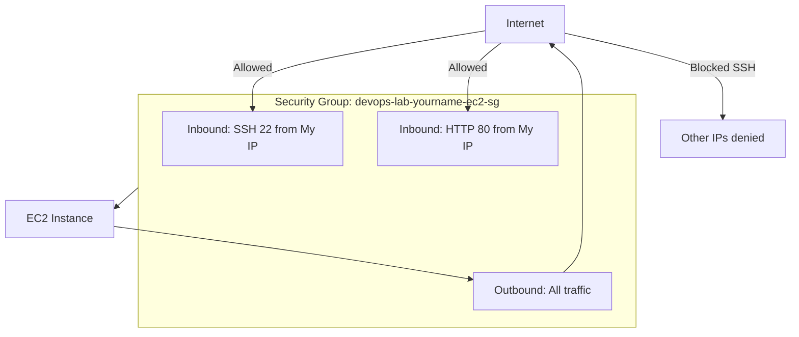

# Security Group Explanation

## 1. Concept Overview

A **security group** is a virtual firewall attached to an EC2 instance's network interface. It controls **inbound** (incoming) and **outbound** (outgoing) traffic.

**Key properties:**

| Property | Behavior |
|----------|----------|
| **Stateful** | If inbound is allowed and connection starts, return traffic is automatically allowed |
| **Default deny inbound** | Everything blocked unless you add allow rules |
| **Default allow outbound** | All outbound traffic allowed by default |
| **Attachment** | Applied to ENI (network interface), not subnet |

---

## 2. Why DevOps Engineers Use Security Groups

- First line of network defense for EC2 and RDS
- Document who can reach a service (ALB SG → app SG → DB SG)
- Change rules without OS firewall edits

---

## 3. Important Terms

| Term | Meaning |
|------|---------|
| **Inbound rule** | Who can connect TO the instance |
| **Outbound rule** | Where instance can connect FROM |
| **Source** | IP/CIDR or another security group |
| **0.0.0.0/0** | All IPv4 addresses on the internet — **high risk for SSH** |

---

## 4. Architecture Diagram

---

## 5. Before You Start

| Item | Detail |
|------|--------|
| Instance | Running with `devops-lab-<yourname>-ec2-sg` attached |
| Console | EC2 → Security Groups |

---

## 6. Step-by-Step AWS Console Lab

### Step 1 — Review current rules

1. **EC2** → **Security Groups** → select `devops-lab-<yourname>-ec2-sg`
2. **Inbound rules** tab — note SSH and HTTP from your IP
3. **Outbound rules** tab — default all traffic

### Step 2 — Understand stateful behavior

1. SSH to instance
2. Run: `curl https://google.com` — works because **outbound** is allowed
3. Response packets return without extra inbound rule (stateful)

### Step 3 — Safe lab exercise — reference another SG (concept)

Production pattern: ALB security group allows 443 from internet; app SG allows 80 **only from ALB security group** (not from 0.0.0.0/0).

In Console (view only for now):

1. Note **Source** can be `sg-xxxx` (another security group ID) — not just IP

### Step 4 — Demonstrate risk of 0.0.0.0/0 (read only — do NOT apply for SSH)

| Rule | Risk |
|------|------|
| SSH from `0.0.0.0/0` | Bots scan port 22 constantly — brute force attempts |
| HTTP from `0.0.0.0/0` | Needed for **public websites** behind proper design — OK with ALB + WAF in production |
| HTTP from `My IP` | Fine for **personal lab testing** |

**Classroom rule:** Use **My IP** for SSH. For public demo sites later, use ALB lab.

### Step 5 — Edit rule when IP changes

1. **Edit inbound rules**
2. SSH → Source → **My IP** (refreshes current IP)
3. Save rules

---

## 7. Validation / Testing Steps

| Test | Expected |
|------|----------|
| SSH from your laptop | Works |
| Browser HTTP | Works |
| Remove SSH rule temporarily | SSH fails — proves SG effect |
| Re-add My IP SSH rule | SSH works again |

---

## 8. Troubleshooting

| Problem | Solution |
|---------|----------|
| Rule added but no access | Wrong SG attached to instance; check instance networking tab |
| Multiple SGs on instance | **All** must allow traffic (intersection logic — each SG evaluated) |
| IPv6 issues | Add separate rules for ::/0 if using IPv6 |

---

## 9. Cleanup

Proceed to [cleanup.md](cleanup.md) after this lesson to terminate EC2 and delete SG.

---

## 10. Interview Questions

1. **Are security groups stateful or stateless?**
   - *Stateful.*

2. **Why not open SSH to 0.0.0.0/0?**
   - *Exposes SSH to entire internet; constant attack traffic.*

3. **Can source be another security group?**
   - *Yes — common pattern for ALB → app → database tiers.*

4. **Default inbound policy?**
   - *Deny all unless explicitly allowed.*

---

## 11. What We Achieved

- Understood security group **inbound/outbound** rules
- Practiced **My IP** restriction for SSH
- Learned production pattern: SG-to-SG references
- Ready to clean up EC2 lab resources

**Next:** [cleanup.md](cleanup.md)
