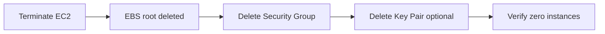

# EC2 Default VPC — Cleanup

## Important: Lab sequence with EBS (Lab 04)

**If you plan to do Lab 04 EBS next**, do **not** run this cleanup yet. Lab 04 attaches a data volume to `devops-lab-<yourname>-web` from this lab. Complete Lab 04 [cleanup.md](../04-ebs/cleanup.md) first — it terminates this EC2 and removes related resources.

**If you are skipping Lab 04 or already finished it**, proceed with cleanup below.

---

## 1. Concept Overview

Terminate billable resources: EC2 instance, optional Elastic IP, security group, and key pair. EBS root volume deletes with instance if **Delete on termination** is enabled (default).

---

## 2. Why DevOps Engineers Clean Up

Forgotten EC2 instances are the #1 student billing surprise.

---

## 3. Important Terms

| Term | Meaning |
|------|---------|
| **Terminate** | Permanently destroy instance (cannot undo) |
| **Delete on termination** | Root EBS volume deleted with instance |

---

## 4. Architecture Diagram

---

## 5. Before You Start

| Item | Detail |
|------|--------|
| Region | `ap-southeast-1` |
| Save | Download any data you need from instance first |

> **Cost warning:** Resources bill until terminated. Elastic IPs cost money if **not** attached to running instance.

---

## 6. Step-by-Step AWS Console Lab — Cleanup

### Step 1 — Terminate EC2 instance

1. **EC2** → **Instances**
2. Select `devops-lab-<yourname>-web`
3. **Instance state** → **Terminate instance**
4. Confirm **Terminate**
5. Wait until **Instance state** = **Terminated**

### Step 2 — Release Elastic IP (if you created one)

1. **EC2** → **Elastic IPs**
2. If any allocated and unused → **Release Elastic IP addresses**

> Skip if you never allocated Elastic IP (lab uses auto-assigned public IP).

### Step 3 — Delete security group

1. **EC2** → **Security Groups**
2. Select `devops-lab-<yourname>-ec2-sg` (not `default`)
3. **Actions** → **Delete security groups**
4. If "in use" error — wait until instance fully terminated

### Step 4 — Delete key pair (optional)

1. **EC2** → **Key pairs**
2. Delete `devops-lab-<yourname>-key` from AWS
3. Also delete local `.pem` file securely

> Keep key if reusing for custom VPC lab — or create new key there.

### Step 5 — Check EBS volumes

1. **EC2** → **Volumes**
2. Delete any **available** (unattached) volumes named for your lab

---

## 7. Validation / Testing Steps

| Check | Expected |
|-------|----------|
| Instances | No running `devops-lab-*` instances |
| Volumes | No unattached lab volumes |
| Security groups | Custom lab SG deleted |
| Billing | No EC2 compute charges after terminate |

---

## 8. Troubleshooting

| Problem | Solution |
|---------|----------|
| Cannot delete SG | Instance still shutting down — wait 2–5 min |
| Volume remains | Manually delete unattached volume |
| Still charged | Check other Regions — switch region dropdown |

---

## 9. Cleanup Checklist

- [ ] EC2 instance terminated
- [ ] No orphaned EBS volumes
- [ ] Custom security group deleted
- [ ] Elastic IP released (if any)
- [ ] Local `.pem` removed or secured

---

## 10. Interview Questions

1. **Terminate vs stop?**
   - *Stop preserves instance; terminate destroys it. Both may leave EBS if configured.*

2. **Does stopped instance cost money?**
   - *No compute charge; attached EBS still costs.*

---

## 11. What We Achieved

- Removed all EC2 default VPC lab resources
- Avoided ongoing EC2/EBS charges

**Next lab:** [03-custom-vpc-ec2](../03-custom-vpc-ec2/README.md)
