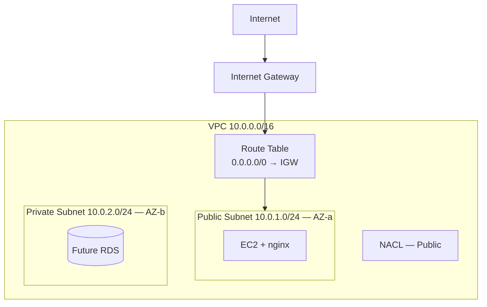

# VPC Theory

## 1. Concept Overview

A **Virtual Private Cloud (VPC)** is your own isolated network inside AWS. You control IP ranges, subnets, routing, and firewalls.

**Default VPC** is auto-created. A **custom VPC** gives full control — required for production-style designs.

---

## 2. Why DevOps Engineers Use Custom VPC

| Reason | Benefit |
|--------|---------|
| Network isolation | Separate dev/stage/prod |
| Public + private subnets | App in public, database in private |
| Custom CIDR | Plan IP space for growth |
| Compliance | Control internet exposure |

---

## 3. Important Terms

| Term | Meaning |
|------|---------|
| **CIDR** | IP range notation (e.g. `10.0.0.0/16`) |
| **Subnet** | Segment of VPC IP space in one AZ |
| **Public subnet** | Route to Internet Gateway |
| **Private subnet** | No direct route to IGW |
| **Internet Gateway (IGW)** | VPC component for internet access |
| **Route table** | Rules directing traffic |
| **NACL** | Stateless subnet firewall (optional extra layer) |

---

## 4. Architecture Diagram

---

## 5. Before You Start

| Item | Value |
|------|-------|
| Region | `ap-southeast-1` |
| VPC name | `devops-lab-<yourname>-vpc` |
| CIDR | `10.0.0.0/16` |

> **Cost warning:** VPC, subnets, IGW, route tables are **free**. EC2 and NAT Gateway cost money — **do not create NAT Gateway** in this lab.

---

## 6. Step-by-Step AWS Console Lab

Explore VPC dashboard only:

1. Search **VPC** → open **VPC**
2. **Your VPCs** — note default VPC and any existing
3. Left menu — **Subnets**, **Route tables**, **Internet gateways**
4. Read CIDR of default VPC for comparison

---

## 7. Validation / Testing Steps

| Check | Expected |
|-------|----------|
| VPC Console opens | No errors |
| Region | `ap-southeast-1` |

---

## 8. Troubleshooting

| Problem | Solution |
|---------|----------|
| VPC menu missing | Search "VPC" in top bar |

---

## 9. Cleanup

None this lesson.

---

## 10. Interview Questions

1. **What is a VPC?**
   - *Isolated virtual network in AWS.*

2. **What is CIDR 10.0.0.0/16?**
   - *65,536 IP addresses from 10.0.0.0 to 10.0.255.255.*

3. **Public vs private subnet?**
   - *Public has route to IGW; private does not.*

---

## 11. What We Achieved

- Understood VPC, CIDR, subnets, IGW, route tables, NACLs
- Ready to build custom VPC

**Next:** [02-create-vpc.md](02-create-vpc.md)
