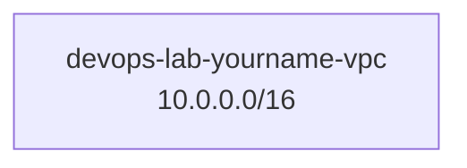

# Create VPC

## 1. Concept Overview

Create a custom VPC with CIDR block `10.0.0.0/16` — provides 65,536 private IP addresses for subnets.

---

## 2. Why DevOps Engineers Create Custom VPCs

Foundation for all network resources — every EC2, RDS, ALB in this VPC shares your IP plan.

---

## 3. Important Terms

| Term | Meaning |
|------|---------|
| **Tenancy** | Default (shared hardware) — use for labs |
| **DNS hostnames** | Enable for public DNS on instances |

---

## 4. Architecture Diagram

---

## 5. Before You Start

| Item | Value |
|------|-------|
| Name | `devops-lab-<yourname>-vpc` |
| IPv4 CIDR | `10.0.0.0/16` |

> **Cost warning:** VPC is free.

---

## 6. Step-by-Step AWS Console Lab

### Option A — VPC Wizard (recommended for beginners)

1. **VPC** → **Create VPC**
2. Select **VPC and more** (or **VPC only** for manual steps in following lessons)
3. If using **VPC only**:
   - **Name:** `devops-lab-<yourname>-vpc`
   - **IPv4 CIDR:** `10.0.0.0/16`
   - **IPv6:** No IPv6 CIDR block
   - **Tenancy:** Default
   - **Tags:** `Project=aws-basic-lab`, `Owner=<yourname>`
4. **Create VPC**

### Enable DNS (if not auto-enabled)

1. **VPC** → **Your VPCs** → select your VPC
2. **Actions** → **Edit VPC settings**
3. Enable **DNS resolution** and **DNS hostnames**
4. Save

---

## 7. Validation / Testing Steps

| Check | Expected |
|-------|----------|
| VPC listed | State **available** |
| CIDR | `10.0.0.0/16` |
| Default | Not marked as default VPC |

---

## 8. Troubleshooting

| Problem | Solution |
|---------|----------|
| CIDR overlap | Choose unused range (10.1.0.0/16) if 10.0.0.0/16 conflicts locally |

---

## 9. Cleanup

See [cleanup.md](cleanup.md) at module end.

---

## 10. Interview Questions

1. **How many IPs in /16?**
   - *65,536 addresses.*

2. **Is VPC regional?**
   - *Yes — VPC exists in one Region.*

---

## 11. What We Achieved

- Created custom VPC `devops-lab-<yourname>-vpc`

**Next:** [03-create-subnets.md](03-create-subnets.md)
