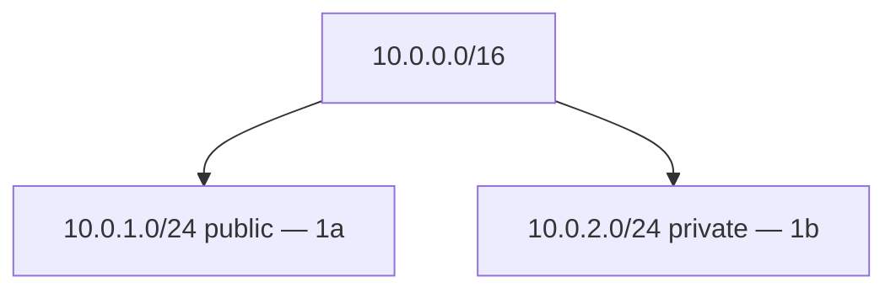

# Create Subnets

## 1. Concept Overview

**Subnets** divide your VPC IP space across Availability Zones. This lab creates:

| Subnet | CIDR | AZ | Type |
|--------|------|-----|------|
| Public | `10.0.1.0/24` | `ap-southeast-1a` | Public (for EC2 + nginx) |
| Private | `10.0.2.0/24` | `ap-southeast-1b` | Private (for future RDS concept) |

---

## 2. Why DevOps Engineers Use Subnets

- **AZ isolation** — multi-AZ high availability
- **Tier separation** — web public, data private
- **Route control** — public subnets get internet via IGW

---

## 3. Important Terms

| Term | Meaning |
|------|---------|
| **/24 subnet** | 256 IP addresses (251 usable) |
| **Auto-assign public IP** | Enable on **public** subnet only |

---

## 4. Architecture Diagram

---

## 5. Before You Start

VPC `devops-lab-<yourname>-vpc` must exist.

> **Cost warning:** Subnets are free.

---

## 6. Step-by-Step AWS Console Lab

### Create public subnet

1. **VPC** → **Subnets** → **Create subnet**
2. **VPC:** `devops-lab-<yourname>-vpc`
3. **Subnet name:** `devops-lab-<yourname>-public-1a`
4. **AZ:** `ap-southeast-1a`
5. **IPv4 CIDR:** `10.0.1.0/24`
6. **Create subnet**

### Enable auto-assign public IP on public subnet

1. Select `devops-lab-<yourname>-public-1a`
2. **Actions** → **Edit subnet settings**
3. Enable **Auto-assign public IPv4 address**
4. Save

### Create private subnet

1. **Create subnet** again
2. **Name:** `devops-lab-<yourname>-private-1b`
3. **AZ:** `ap-southeast-1b`
4. **CIDR:** `10.0.2.0/24`
5. **Create subnet**
6. Do **not** enable auto-assign public IP

---

## 7. Validation / Testing Steps

| Check | Expected |
|-------|----------|
| Two subnets | Different AZs |
| Public subnet | Auto-assign public IP enabled |
| Private subnet | No public IP auto-assign |

---

## 8. Troubleshooting

| Problem | Solution |
|---------|----------|
| CIDR outside VPC | Must fit inside 10.0.0.0/16 |
| AZ not available | Pick another AZ in same Region |

---

## 9. Cleanup

Module [cleanup.md](cleanup.md).

---

## 10. Interview Questions

1. **Why subnet per AZ?**
   - *Resources in multiple AZs for fault tolerance.*

2. **How many usable IPs in /24?**
   - *251 (AWS reserves 5 per subnet).*

---

## 11. What We Achieved

- Public and private subnets in two AZs

**Next:** [04-create-internet-gateway.md](04-create-internet-gateway.md)
