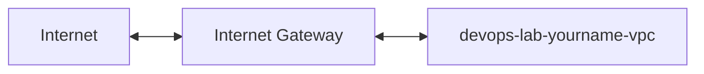

# Create Internet Gateway

## 1. Concept Overview

An **Internet Gateway (IGW)** allows resources in a **public subnet** to communicate with the internet. It is attached to the VPC (not a single instance).

One VPC → one IGW (typical lab setup).

---

## 2. Why DevOps Engineers Use IGW

Without IGW, public subnets cannot reach the internet for SSH, package updates, or HTTP tests.

---

## 3. Important Terms

| Term | Meaning |
|------|---------|
| **Attach** | Link IGW to VPC — required before routing works |
| **NAT Gateway** | Alternative for **private** subnet outbound internet — **costly; skip in this lab** |

---

## 4. Architecture Diagram

---

## 5. Before You Start

| Name | `devops-lab-<yourname>-igw` |

> **Cost warning:** IGW is free. NAT Gateway is **not** — do not create NAT for this lab.

---

## 6. Step-by-Step AWS Console Lab

### Step 1 — Create IGW

1. **VPC** → **Internet gateways** → **Create internet gateway**
2. **Name:** `devops-lab-<yourname>-igw`
3. **Create internet gateway**

### Step 2 — Attach to VPC

1. Select the new IGW
2. **Actions** → **Attach to VPC**
3. Choose `devops-lab-<yourname>-vpc`
4. **Attach**

### Step 3 — Verify state

- **State:** Attached
- **VPC ID** matches your VPC

---

## 7. Validation / Testing Steps

| Check | Expected |
|-------|----------|
| IGW state | Attached |
| VPC | Correct VPC ID |

---

## 8. Troubleshooting

| Problem | Solution |
|---------|----------|
| Cannot attach | VPC may already have IGW — one per VPC |
| Detach fails | Remove IGW route from route table first |

---

## 9. Cleanup

[cleanup.md](cleanup.md) — detach then delete IGW.

---

## 10. Interview Questions

1. **What does IGW do?**
   - *Enables internet connectivity for public subnets in a VPC.*

2. **IGW vs NAT Gateway?**
   - *IGW for public subnets; NAT for private subnets to initiate outbound internet.*

---

## 11. What We Achieved

- Created and attached Internet Gateway

**Next:** [05-route-table-and-routing.md](05-route-table-and-routing.md)
