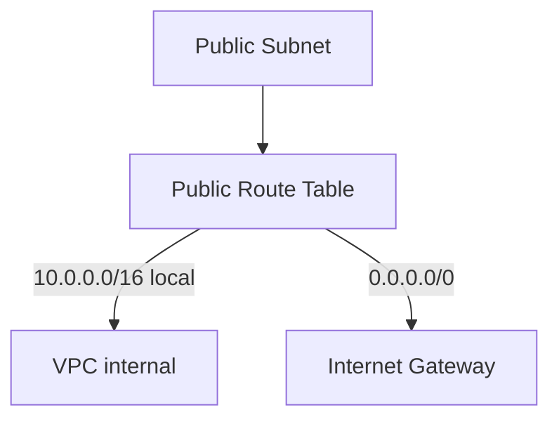

# Route Table and Routing

## 1. Concept Overview

A **route table** contains routes that direct network traffic. For a **public subnet**, add route:

```
0.0.0.0/0 → Internet Gateway
```

This means "all internet traffic goes through the IGW."

---

## 2. Why DevOps Engineers Configure Route Tables

Without this route, instances have IPs but cannot reach the internet — SSH and `dnf install` fail.

---

## 3. Important Terms

| Term | Meaning |
|------|---------|
| **Main route table** | Default for VPC — avoid using for public subnet without IGW route |
| **Subnet association** | Links subnet to specific route table |
| **0.0.0.0/0** | Default route — all traffic not matching local VPC CIDR |

---

## 4. Architecture Diagram



---

## 5. Before You Start

IGW attached to VPC.

> **Cost warning:** Route tables are free.

---

## 6. Step-by-Step AWS Console Lab

### Step 1 — Create public route table

1. **VPC** → **Route tables** → **Create route table**
2. **Name:** `devops-lab-<yourname>-public-rt`
3. **VPC:** `devops-lab-<yourname>-vpc`
4. **Create**

### Step 2 — Add internet route

1. Select `devops-lab-<yourname>-public-rt`
2. **Routes** tab → **Edit routes** → **Add route**
3. **Destination:** `0.0.0.0/0`
4. **Target:** Internet Gateway → `devops-lab-<yourname>-igw`
5. **Save changes**

### Step 3 — Associate public subnet

1. **Subnet associations** tab → **Edit subnet associations**
2. Check `devops-lab-<yourname>-public-1a`
3. **Save associations**

### Step 4 — Private subnet (no internet route)

1. Create route table `devops-lab-<yourname>-private-rt` (optional)
2. Associate `devops-lab-<yourname>-private-1b`
3. **Do not** add `0.0.0.0/0` to IGW — private subnet stays private

---

## 7. Validation / Testing Steps

| Check | Expected |
|-------|----------|
| Public RT route | `0.0.0.0/0` → igw-xxx |
| Association | Public subnet linked to public RT |

---

## 8. Troubleshooting

| Problem | Solution |
|---------|----------|
| No internet on EC2 | Wrong RT association; missing IGW route |
| Private subnet has IGW route | Remove association or use private RT only |

---

## 9. Cleanup

[cleanup.md](cleanup.md)

---

## 10. Interview Questions

1. **What route makes a subnet public?**
   - *0.0.0.0/0 pointing to Internet Gateway on the subnet's route table.*

2. **Can one route table serve multiple subnets?**
   - *Yes.*

---

## 11. What We Achieved

- Public route table with IGW route
- Public subnet associated

**Next:** [06-security-group-and-nacl.md](06-security-group-and-nacl.md)
