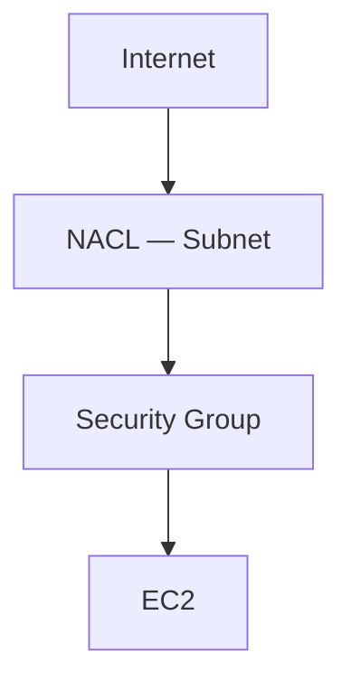

# Security Group and NACL

## 1. Concept Overview

Two firewall layers:

| Layer | Scope | Stateful? |
|-------|-------|-----------|
| **Security Group (SG)** | Instance ENI | Yes — stateful |
| **Network ACL (NACL)** | Subnet | No — stateless |

**Defense in depth:** SG for instance rules; NACL for subnet-level allow/deny lists.

---

## 2. Why DevOps Engineers Use Both

- SG: daily rules (SSH from My IP, HTTP from ALB SG)
- NACL: block IP ranges at subnet edge (advanced)

For this lab, customize **SG**; use **default NACL** (allows all) unless instructor asks otherwise.

---

## 3. Important Terms

| Term | Meaning |
|------|---------|
| **Inbound / Outbound** | Both exist for SG and NACL |
| **Rule number (NACL)** | Lower number evaluated first |
| **Ephemeral ports** | NACL outbound must allow return traffic (stateless complexity) |

---

## 4. Architecture Diagram

---

## 5. Before You Start

| SG name | `devops-lab-<yourname>-vpc-sg` |

> **Cost warning:** Free.

---

## 6. Step-by-Step AWS Console Lab

### Create security group in custom VPC

1. **EC2** → **Security Groups** → **Create security group**
2. **Name:** `devops-lab-<yourname>-vpc-sg`
3. **VPC:** `devops-lab-<yourname>-vpc` (not default)
4. **Inbound rules:**

| Type | Port | Source |
|------|------|--------|
| SSH | 22 | My IP |
| HTTP | 80 | My IP |

5. **Create security group**

### Review NACL (read-only)

1. **VPC** → **Network ACLs**
2. Find NACL associated with your public subnet (often default)
3. Note **Inbound** and **Outbound** rules — default allows all
4. **Do not** restrict NACL unless you understand ephemeral port rules

### NACL vs SG classroom note

| Mistake | Result |
|---------|--------|
| NACL denies port 80 | HTTP fails even if SG allows |
| SG open SSH to 0.0.0.0/0 | High risk — use My IP |

---

## 7. Validation / Testing Steps

| Check | Expected |
|-------|----------|
| SG in custom VPC | vpc-id matches your VPC |
| Inbound | SSH + HTTP from My IP |

---

## 8. Troubleshooting

| Problem | Solution |
|---------|----------|
| HTTP works with SG but not NACL | Check NACL inbound/outbound deny rules |

---

## 9. Cleanup

[cleanup.md](cleanup.md)

---

## 10. Interview Questions

1. **SG stateful vs NACL stateless?**
   - *SG remembers connections; NACL evaluates each packet both ways.*

2. **Which is applied first?**
   - *NACL at subnet boundary, then SG at instance.*

---

## 11. What We Achieved

- Security group in custom VPC
- Understood SG vs NACL roles

**Next:** [07-launch-ec2-in-custom-vpc.md](07-launch-ec2-in-custom-vpc.md)
