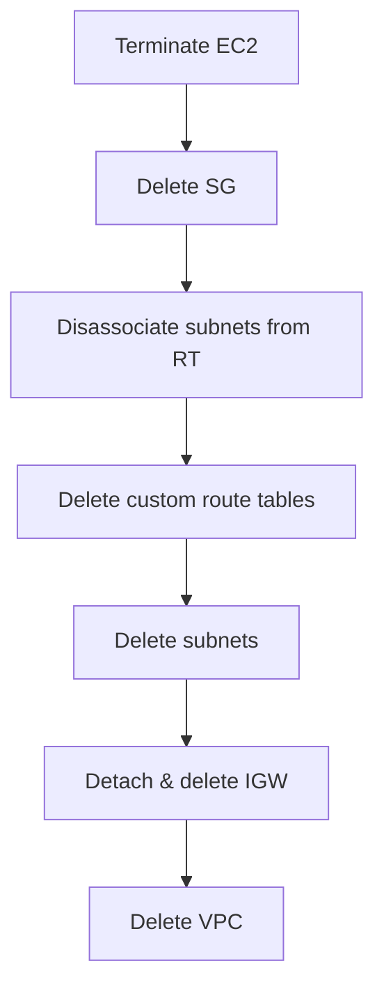

# Custom VPC EC2 — Cleanup

## 1. Concept Overview

Delete in **dependency order**: EC2 → SG → subnet associations → route tables → subnets → detach/delete IGW → VPC.

---

## 2. Why DevOps Engineers Clean Up VPC Labs

Orphaned VPCs are free but attached EC2/NAT cost money. Clean habits prevent clutter.

---

## 3. Important Terms

**Dependency order** — delete children before parents.

---

## 4. Architecture Diagram

---

## 5. Before You Start

Region `ap-southeast-1`. Download any data from EC2 first.

> **Cost warning:** EC2 must be terminated first.

---

## 6. Step-by-Step Cleanup

### Step 1 — Terminate EC2

**EC2** → **Instances** → terminate `devops-lab-<yourname>-vpc-web`

### Step 2 — Delete security group

**EC2** → **Security Groups** → delete `devops-lab-<yourname>-vpc-sg`

### Step 3 — Disassociate subnets from custom route tables

You must disassociate subnets **before** deleting route tables or subnets.

1. **VPC** → **Route tables** → select `devops-lab-<yourname>-public-rt` (and `private-rt` if created)
2. Open the **Subnet associations** tab
3. Select each lab subnet association → **Disassociate**
4. Repeat for every custom route table tied to your lab subnets

> The **main** route table cannot be deleted — only disassociate lab subnets from custom route tables.

### Step 4 — Delete route tables (non-main)

**VPC** → **Route tables** → delete `devops-lab-<yourname>-public-rt` and `private-rt` if created

### Step 5 — Delete subnets

**VPC** → **Subnets** → delete public and private lab subnets

### Step 6 — Detach and delete IGW

**VPC** → **Internet gateways** → detach → delete `devops-lab-<yourname>-igw`

### Step 7 — Delete VPC

**VPC** → **Your VPCs** → delete `devops-lab-<yourname>-vpc`

### Step 8 — Delete key pair (optional)

1. **EC2** → **Key pairs** → delete `devops-lab-<yourname>-key` from AWS (if not reused)
2. Delete local `.pem` file securely

---

## 7. Validation

| Check | Expected |
|-------|----------|
| VPC gone | Not in VPC list |
| No lab instances | EC2 empty |
| IGW gone | Detached and deleted |

---

## 8. Troubleshooting

| Problem | Solution |
|---------|----------|
| VPC has dependencies | Delete ENIs, NAT, endpoints if any created |
| IGW won't detach | Remove 0.0.0.0/0 routes first |

---

## 9. Cleanup Checklist

- [ ] EC2 terminated
- [ ] SG deleted
- [ ] Subnets disassociated from custom route tables
- [ ] Custom route tables deleted (main RT removed with VPC)
- [ ] Subnets deleted
- [ ] IGW detached and deleted
- [ ] VPC deleted
- [ ] Key pair removed (optional)

---

## 10. Interview Questions

1. **Why delete IGW before VPC?**
   - *IGW must be detached before VPC deletion.*

2. **Order of subnet vs route table?**
   - *Disassociate subnets, delete custom RTs, then delete subnets.*

---

## 11. What We Achieved

- Fully removed custom VPC lab environment

**Next:** [04-ebs](../04-ebs/README.md)
