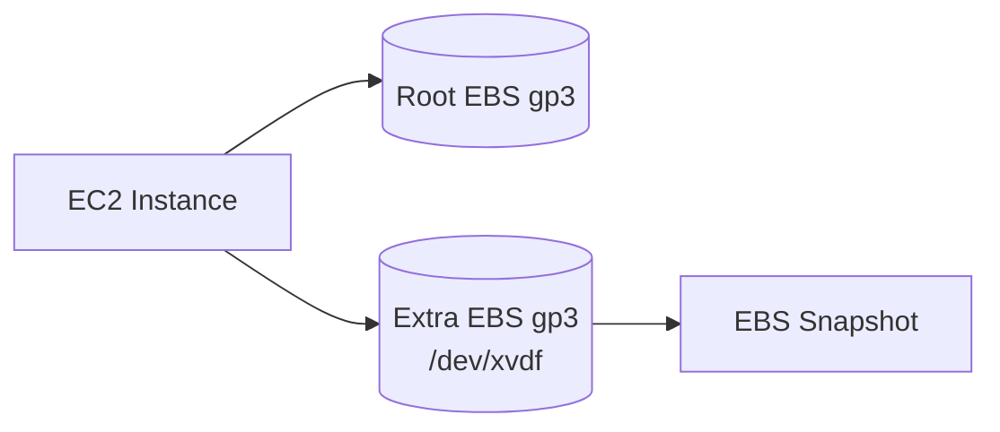

# EBS Theory

## 1. Concept Overview

**Amazon Elastic Block Store (EBS)** provides persistent block storage volumes for EC2. Like a USB drive for your virtual server — data survives reboots when attached.

---

## 2. Why DevOps Engineers Use EBS

| Use | Example |
|-----|---------|
| Root disk | OS and apps on gp3 volume |
| Data disk | Separate `/data` for databases or logs |
| Snapshots | Backup and clone volumes |

---

## 3. Important Terms

| Term | Meaning |
|------|---------|
| **gp3** | General-purpose SSD — default, cost-effective |
| **io2** | High IOPS SSD — databases (advanced) |
| **st1** | Throughput HDD — big sequential data |
| **AZ-bound** | Volume created in one AZ; attach only to EC2 in same AZ |
| **Snapshot** | Point-in-time backup to S3 (incremental) |

---

## 4. Architecture Diagram

---

## 5. Before You Start

Region `ap-southeast-1`. You need a running EC2 (launch one in default VPC if cleaned up).

> **Cost warning:** EBS charged per GB-month. Snapshots charged per GB-month. Use **8–10 GiB** for labs.

---

## 6–9. Theory Lab

1. **EC2** → **Volumes** — view existing volumes
2. Note **Volume state** (in-use / available)
3. Note **Availability Zone** — must match instance for attach

No resources created yet.

---

## 7. Validation

Understand volume list and AZ column.

---

## 8. Troubleshooting

| Problem | Solution |
|---------|----------|
| No volumes | Launch EC2 first — root volume auto-created |

---

## 9. Cleanup

N/A

---

## 10. Interview Questions

1. **EBS vs instance store?**
   - *EBS persistent; instance store ephemeral (lost on stop/terminate).*

2. **Can EBS attach cross-AZ?**
   - *No — same AZ only.*

---

## 11. What We Achieved

- Understood EBS volume types and AZ binding

**Next:** [02-create-and-attach-ebs.md](02-create-and-attach-ebs.md)
