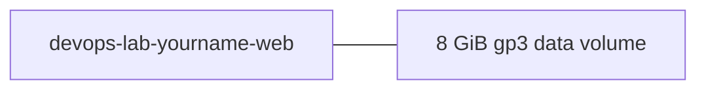

# Create and Attach EBS

## 1. Concept Overview

Create a new **8 GiB gp3** volume and attach to running EC2 as second disk.

**Names:** Volume tag `Name=devops-lab-<yourname>-data-vol`

---

## 2. Why DevOps Engineers Attach Extra EBS

Separate data from OS disk — easier backup, resize, and snapshot without touching root volume.

---

## 3. Important Terms

| Term | Meaning |
|------|---------|
| **Device name** | `/dev/sdf` or `/dev/xvdf` (console may show either) |
| **Attach** | Links volume to instance in same AZ |

---

## 4. Architecture Diagram



---

## 5. Before You Start

| Item | Detail |
|------|--------|
| EC2 | Running `devops-lab-<yourname>-web` from [Lab 02](../02-ec2-default-vpc/README.md) — **do not terminate Lab 02 yet** |
| AZ | Note instance AZ — volume must match |

> **Cost warning:** ~$0.08/GB-month for gp3 — delete volume after lab. Run [cleanup.md](cleanup.md) when finished (terminates Lab 02 EC2).

---

## 6. Step-by-Step Console Lab

### Step 1 — Create volume

1. **EC2** → **Volumes** → **Create volume**
2. **Size:** 8 GiB
3. **Volume type:** gp3
4. **AZ:** **same as EC2 instance**
5. **Tags:** `Name=devops-lab-<yourname>-data-vol`
6. **Create volume**

### Step 2 — Attach to instance

1. Select new volume → **Actions** → **Attach volume**
2. **Instance:** your EC2
3. **Device name:** `/dev/sdf`
4. **Attach volume**
5. State → **in-use**

### Step 3 — SSH and find disk

```bash
lsblk
```

Look for new disk (e.g. `xvdf` or `nvme1n1`) — **no filesystem yet**.

---

## 7. Validation

| Check | Expected |
|-------|----------|
| Volume state | in-use |
| lsblk | New disk without mountpoint |

---

## 8. Troubleshooting

| Problem | Solution |
|---------|----------|
| Attach greyed out | AZ mismatch — recreate volume in correct AZ |
| Disk not in lsblk | Wait 30s; reboot if needed |

---

## 9. Cleanup

[cleanup.md](cleanup.md) after snapshot lab.

---

## 10. Interview Questions

1. **Why match AZ?**
   - *EBS only attaches to EC2 in same AZ.*

---

## 11. What We Achieved

- Created and attached extra EBS volume

**Next:** [03-format-mount-persist-ebs.md](03-format-mount-persist-ebs.md)
