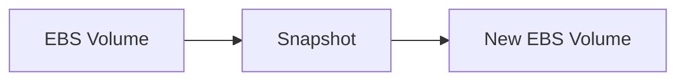

# Snapshot and Restore

## 1. Concept Overview

**EBS snapshot** is incremental backup stored in S3. Create snapshot from volume; restore by creating **new volume** from snapshot.

---

## 2. Why DevOps Engineers Use Snapshots

- Backup before changes
- Clone disk to new instance
- Disaster recovery baseline

---

## 3. Important Terms

| Term | Meaning |
|------|---------|
| **Snapshot** | Point-in-time copy |
| **Restore** | Create volume from snapshot (can pick AZ) |

---

## 4. Architecture Diagram



---

## 5. Before You Start

Data volume with files in `/data`.

> **Cost warning:** Snapshots cost per GB-month stored.

---

## 6. Step-by-Step Console Lab

### Create snapshot

1. **EC2** → **Volumes** → select data volume
2. **Actions** → **Create snapshot**
3. **Description:** `devops-lab-<yourname>-data-snap`
4. **Tags:** `Name=devops-lab-<yourname>-data-snap`
5. **Create snapshot**
6. **Snapshots** → wait **Status: completed**

### Restore (create volume from snapshot)

1. **Snapshots** → select snapshot → **Actions** → **Create volume from snapshot**
2. **Volume type:** gp3, **Size:** 8 GiB (or larger)
3. **AZ:** same as EC2
4. **Tags:** `Name=devops-lab-<yourname>-restored-vol`
5. **Create volume**
6. Optional: detach old volume, attach restored volume to `/dev/sdf`, mount `/data`

### Verify data (if reattached)

```bash
sudo mount /dev/xvdf /data
cat /data/testfile.txt
```

---

## 7. Validation

| Check | Expected |
|-------|----------|
| Snapshot | completed |
| Restored volume | available or in-use with data |

---

## 8. Troubleshooting

| Problem | Solution |
|---------|----------|
| Snapshot pending long | Normal for first snap — wait |

---

## 9. Cleanup

[cleanup.md](cleanup.md) — delete snapshots and volumes.

---

## 10. Interview Questions

1. **Where are snapshots stored?**
   - *Backed by S3 (managed by AWS).*

2. **Incremental?**
   - *Only changed blocks after first snapshot.*

---

## 11. What We Achieved

- Created snapshot and restored volume

**Next:** [cleanup.md](cleanup.md)
