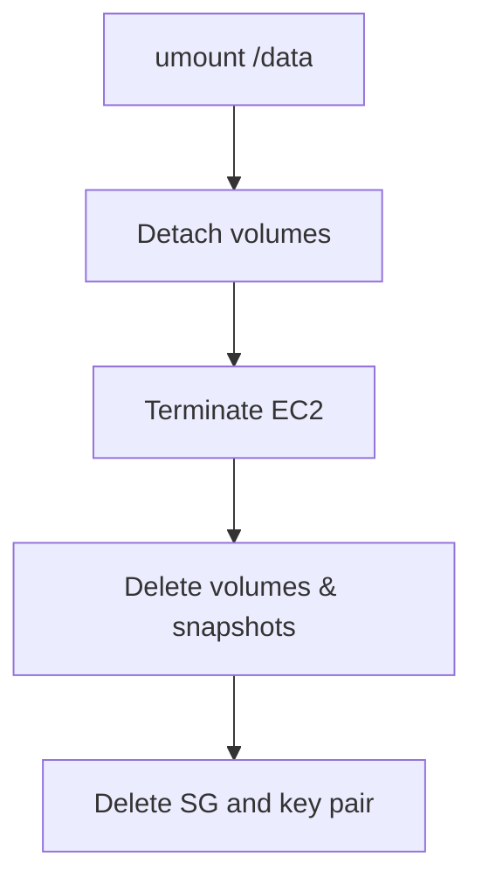

# EBS — Cleanup

## 1. Concept Overview

Unmount, detach, delete volumes and snapshots to stop storage charges.

---

## 2. Why Clean Up

EBS and snapshots bill even when EC2 is stopped.

---

## 3–4. Diagram



---

## 5. Before You Start

Region `ap-southeast-1`.

> **Cost warning:** Unattached volumes and snapshots keep charging.

---

## 6. Step-by-Step Cleanup

### On EC2 (SSH)

```bash
sudo umount /data
```

Remove `/data` line from `/etc/fstab` if added.

### Console

1. **Detach** data volume (`devops-lab-<yourname>-data-vol`) and restored volume (`devops-lab-<yourname>-restored-vol`) if attached
2. **Terminate** EC2 `devops-lab-<yourname>-web` (from Lab 02)
3. Wait until instance state is **Terminated**
4. **Volumes** → delete any lab volumes still in **available** state
5. **Snapshots** → delete `devops-lab-<yourname>-data-snap` and any restore-test snapshots
6. **Security Groups** → delete `devops-lab-<yourname>-ec2-sg` (after instance terminated)
7. **Key pairs** → delete `devops-lab-<yourname>-key` from AWS; delete local `.pem` file

---

## 7. Validation

No lab volumes or snapshots remain.

---

## 8. Troubleshooting

| Problem | Solution |
|---------|----------|
| Cannot detach | Stop instance first |
| Volume in-use | Detach from instance |

---

## 9. Checklist

- [ ] Volumes detached and deleted
- [ ] Snapshots deleted
- [ ] EC2 terminated
- [ ] Security group deleted
- [ ] Key pair deleted (AWS + local `.pem`)

---

## 10. Interview Questions

1. **Stopped EC2 EBS cost?**
   - *Volumes still billed.*

---

## 11. What We Achieved

- Zero EBS snapshot/volume charges from lab

**Next:** [05-s3](../05-s3/README.md)
