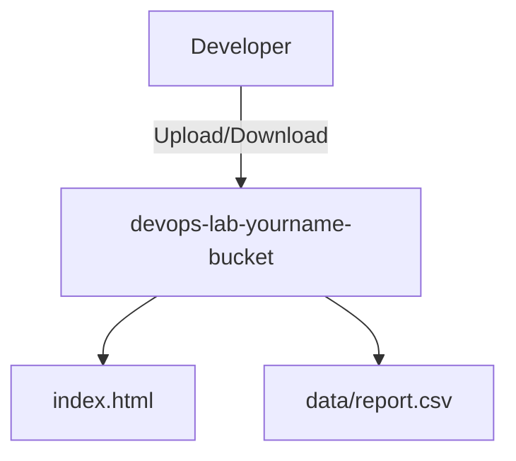

# S3 Theory

## 1. Concept Overview

**Amazon Simple Storage Service (S3)** is object storage. Store files as **objects** in **buckets** — unlimited scale, 99.999999999% (11 nines) durability.

Unlike EBS (one disk, one instance), S3 is accessed over HTTP/API from anywhere.

---

## 2. Why DevOps Engineers Use S3

| Use | Example |
|-----|---------|
| Artifacts | CI build outputs, Terraform state (with locking) |
| Static websites | HTML/CSS/JS hosting |
| Backups | DB dumps, log archives |
| Data lake | Analytics input files |

---

## 3. Important Terms

| Term | Meaning |
|------|---------|
| **Bucket** | Container — globally unique name |
| **Object** | File + metadata |
| **Key** | Object path/name (e.g. `images/logo.png`) |
| **Region** | Bucket lives in one Region |
| **Versioning** | Keep multiple versions of same key |
| **SSE** | Server-side encryption |
| **Block Public Access** | Account/bucket guard against public exposure |

---

## 4. Architecture Diagram

---

## 5. Before You Start

Region `ap-southeast-1`. Bucket names must be **globally unique**.

> **Cost warning:** Pennies for small labs; delete bucket when done.

---

## 6–9. Explore S3 Console

1. Open **S3**
2. Note **General purpose buckets**
3. Read **Block Public Access** settings for account

---

## 10. Interview Questions

1. **S3 vs EBS?**
   - *S3 object storage via API; EBS block disk for one EC2.*

2. **Bucket name uniqueness?**
   - *Global across all AWS accounts.*

---

## 11. What We Achieved

- Understood S3 buckets, objects, keys, region

**Next:** [02-create-bucket.md](02-create-bucket.md)
