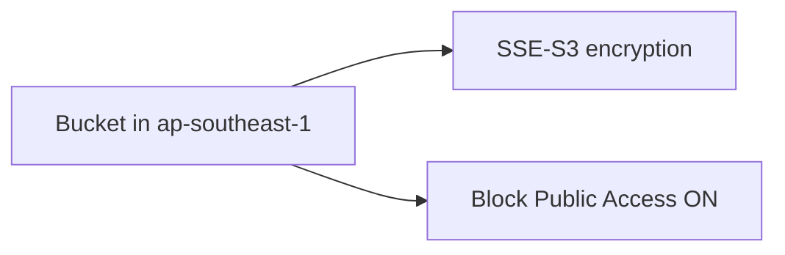

# Create Bucket

## 1. Concept Overview

Create bucket `devops-lab-<yourname>-bucket-<random>` in `ap-southeast-1` with encryption and Block Public Access enabled.

---

## 2. Why DevOps Engineers Configure Buckets Carefully

Misconfigured public buckets cause data leaks — Block Public Access is default best practice.

---

## 3. Important Terms

**Bucket name example:** `devops-lab-faizul-bucket-2026` (add random suffix if taken)

---

## 4. Architecture Diagram

---

## 5. Before You Start

> **Cost warning:** Storage + requests. Keep objects small.

---

## 6. Step-by-Step Console Lab

1. **S3** → **Create bucket**
2. **Bucket name:** `devops-lab-<yourname>-bucket-<random>`
3. **Region:** Asia Pacific (Singapore) `ap-southeast-1`
4. **Object Ownership:** ACLs disabled (recommended)
5. **Block Public Access:** ✅ **Keep all four enabled**
6. **Bucket versioning:** Disable for now (enable in lesson 04)
7. **Default encryption:** Enable — **SSE-S3**
8. **Tags:** `Project=aws-basic-lab`, `Owner=<yourname>`
9. **Create bucket**

---

## 7. Validation

| Check | Expected |
|-------|----------|
| Bucket listed | Correct Region |
| Public access | Blocked |
| Encryption | SSE-S3 enabled |

---

## 8. Troubleshooting

| Problem | Solution |
|---------|----------|
| Name taken | Add random suffix |
| Wrong region | Create new bucket in correct region |

---

## 9. Cleanup

[cleanup.md](cleanup.md)

---

## 10. Interview Questions

1. **Should lab buckets be public?**
   - *No — keep Block Public Access on unless intentional static site with controls.*

---

## 11. What We Achieved

- Created encrypted private S3 bucket

**Next:** [03-upload-download-objects.md](03-upload-download-objects.md)
