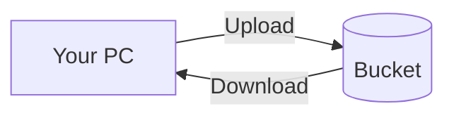

# Upload and Download Objects

## 1. Concept Overview

Upload files to S3 as **objects** with **keys**. Download via Console or presigned URLs.

---

## 2. Why DevOps Engineers Use S3 for Objects

Central artifact store for builds, logs, and static assets.

---

## 3. Important Terms

| Term | Meaning |
|------|---------|
| **Prefix** | Folder-like path (`logs/2026/app.log`) |
| **Upload** | Put object into bucket |

---

## 4. Architecture Diagram

---

## 5. Before You Start

Bucket created. Prepare small text file `hello.txt` on laptop.

---

## 6. Step-by-Step Console Lab

### Upload

1. Open bucket → **Upload**
2. Add `hello.txt`
3. **Prefix (optional):** `labs/week1/`
4. **Upload**

### Create second object via Console

1. **Create folder** (optional UI) `images/`
2. Upload a small `.png` or second txt file

### Download

1. Select `hello.txt` → **Download**
2. Open file locally — verify content

### View object details

1. Click object → **Properties**
2. Note **ETag**, **Size**, **Encryption**

---

## 7. Validation

| Check | Expected |
|-------|----------|
| Objects visible | Under correct prefix |
| Download works | File matches upload |

---

## 8. Troubleshooting

| Problem | Solution |
|---------|----------|
| Access denied | IAM permissions; bucket policy |

---

## 9. Cleanup

Keep for versioning lesson.

---

## 10. Interview Questions

1. **Key vs object?**
   - *Key is name/path; object is key + data + metadata.*

---

## 11. What We Achieved

- Uploaded and downloaded S3 objects

**Next:** [04-versioning.md](04-versioning.md)
