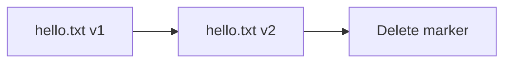

# Versioning

## 1. Concept Overview

**S3 versioning** keeps all versions of an object when overwritten or deleted (delete marker). Protects against accidental deletes and overwrites.

---

## 2. Why DevOps Engineers Enable Versioning

- Recover previous file version
- Compliance and audit trail
- Pair with lifecycle rules (advanced)

---

## 3. Important Terms

| Term | Meaning |
|------|---------|
| **Delete marker** | Placeholder hiding current version |
| **Version ID** | Unique per object version |

---

## 4. Architecture Diagram

---

## 5. Before You Start

> **Cost warning:** All versions stored — delete old versions in cleanup.

---

## 6. Step-by-Step Console Lab

### Enable versioning

1. Bucket → **Properties** → **Bucket Versioning** → **Edit** → **Enable** → Save

### Demonstrate versions

1. Upload `hello.txt` with content `version 1`
2. Upload again same key `labs/week1/hello.txt` with content `version 2`
3. Enable **Show versions** toggle on objects list
4. See two versions

### Delete and restore concept

1. Delete `hello.txt` — delete marker appears
2. **Show versions** → select delete marker → **Delete** (permanent delete of marker) OR restore previous version by making it current (Console: download old version, re-upload)

---

## 7. Validation

| Check | Expected |
|-------|----------|
| Versioning | Enabled |
| Two versions | Visible with Show versions |

---

## 8. Troubleshooting

| Problem | Solution |
|---------|----------|
| Cannot empty bucket | Delete all versions and delete markers |

---

## 9. Cleanup

[cleanup.md](cleanup.md) — must delete all versions.

---

## 10. Interview Questions

1. **Can you disable versioning after enable?**
   - *Only suspend — old versions remain.*

---

## 11. What We Achieved

- Enabled versioning and observed version history

**Next:** [05-bucket-policy-basic.md](05-bucket-policy-basic.md)
