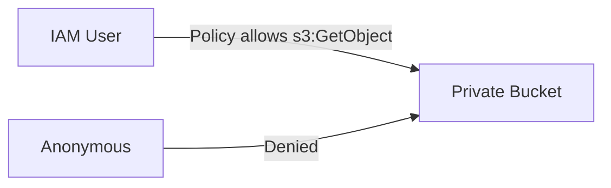

# Basic Bucket Policy

## 1. Concept Overview

A **bucket policy** is a JSON resource policy attached to the bucket. Controls who can access objects (IAM principals, accounts, conditions).

**Static website concept:** S3 can host static HTML — requires public read or CloudFront (production). This lab writes a **restrictive** policy example only — bucket stays **private** with Block Public Access.

---

## 2. Why DevOps Engineers Use Bucket Policies

- Cross-account access
- Enforce HTTPS (`aws:SecureTransport`)
- Allow only specific IAM role

---

## 3. Important Terms

| Term | Meaning |
|------|---------|
| **Principal** | Who (IAM user ARN, account, `*`) |
| **Action** | `s3:GetObject`, `s3:PutObject` |
| **Resource** | `arn:aws:s3:::bucket-name/*` |

---

## 4. Architecture Diagram



---

## 5. Before You Start

Bucket name and account ID ready. Find account ID: top right menu → account name.

> **Cost warning:** Free to store policy.

---

## 6. Step-by-Step Console Lab

### View Block Public Access

1. Bucket → **Permissions** → **Block public access** — all ON

### Add bucket policy (IAM user read-only example)

1. **Permissions** → **Bucket policy** → **Edit**
2. Paste (replace placeholders):

```json
{
  "Version": "2012-10-17",
  "Statement": [
    {
      "Sid": "AllowLabUserListBucket",
      "Effect": "Allow",
      "Principal": {
        "AWS": "arn:aws:iam::<ACCOUNT_ID>:user/devops-lab-<yourname>-user"
      },
      "Action": "s3:ListBucket",
      "Resource": "arn:aws:s3:::<your-bucket-name>"
    },
    {
      "Sid": "AllowLabUserGetObject",
      "Effect": "Allow",
      "Principal": {
        "AWS": "arn:aws:iam::<ACCOUNT_ID>:user/devops-lab-<yourname>-user"
      },
      "Action": "s3:GetObject",
      "Resource": "arn:aws:s3:::<your-bucket-name>/*"
    }
  ]
}
```

3. **Save changes**

### Static website (concept only — do NOT enable public)

Read **Properties** → **Static website hosting** — note it needs public access for direct S3 website endpoint. Production pattern: **S3 private + CloudFront + OAI/OAC**.

---

## 7. Validation

| Check | Expected |
|-------|----------|
| Policy saved | No syntax error |
| IAM user can list/get | Test as lab user |
| Public blocked | Anonymous URL fails |

---

## 8. Troubleshooting

| Problem | Solution |
|---------|----------|
| Policy error | Validate JSON; correct ARNs |
| Access denied | Principal ARN typo |

---

## 9. Cleanup

[cleanup.md](cleanup.md)

---

## 10. Interview Questions

1. **Bucket policy vs IAM policy?**
   - *Bucket policy on resource; IAM policy on identity.*

2. **Static site without public bucket?**
   - *CloudFront with Origin Access Control.*

---

## 11. What We Achieved

- Applied basic private bucket policy
- Understood static website vs Block Public Access

**Next:** [cleanup.md](cleanup.md)
