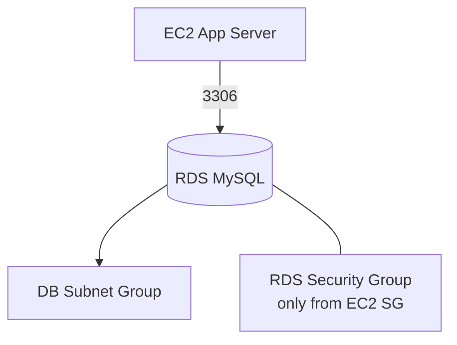

# RDS Theory

## 1. Concept Overview

**Amazon Relational Database Service (RDS)** runs managed databases (MySQL, PostgreSQL, MariaDB, etc.). AWS handles patching, backups infrastructure, and failover options.

You manage: schemas, users, security groups, instance sizing.

---

## 2. Why DevOps Engineers Use RDS

| vs MySQL on EC2 | RDS benefit |
|-----------------|-------------|
| OS/DB patching | AWS manages |
| Backups | Automated snapshots |
| Multi-AZ | Built-in failover |
| Ops time | Focus on app not database admin |

---

## 3. Important Terms

| Term | Meaning |
|------|---------|
| **DB instance** | Running database server |
| **DB subnet group** | Subnets where RDS can live |
| **Parameter group** | DB engine settings |
| **Multi-AZ** | Standby in another AZ (costs more) |
| **Publicly accessible** | Internet can reach DB — **avoid in production** |

---

## 4. Architecture Diagram

---

## 5. Before You Start

Region `ap-southeast-1`.

> **Cost warning:** RDS bills **hourly** + storage. **Most expensive beginner lab.** Delete same day. Use `db.t3.micro` or `db.t4g.micro`.

---

## 6. Explore RDS Console

1. Open **RDS** → **Databases** (empty)
2. Note **Subnet groups**, **Parameter groups**

---

## 10. Interview Questions

1. **RDS vs EC2 database?**
   - *RDS managed patching/backups; EC2 you manage everything.*

2. **Should RDS be public?**
   - *No for production — private subnet, SG from app only.*

---

## 11. What We Achieved

- Understood managed database concepts

**Next:** [02-create-rds-mysql.md](02-create-rds-mysql.md)
