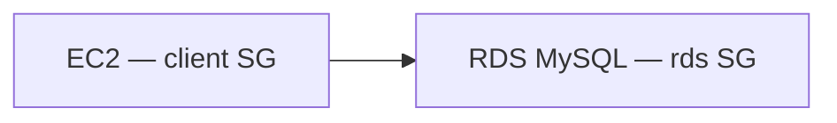

# Create RDS MySQL

## 1. Concept Overview

Create **MySQL** RDS in **default VPC** with `db.t3.micro`, **not publicly accessible**, security group allowing MySQL only from EC2 security group.

**Resource names:**

| Resource | Name |
|----------|------|
| DB identifier | `devops-lab-<yourname>-mysql` |
| Master user | `admin` |
| Master password | `<your-strong-password>` (placeholder — store locally) |
| RDS SG | `devops-lab-<yourname>-rds-sg` |
| EC2 SG | `devops-lab-<yourname>-rds-client-sg` |

---

## 2. Why DevOps Engineers Isolate RDS

Database should only accept connections from application tier — never open 3306 to `0.0.0.0/0`.

---

## 3. Important Terms

**Subnet group:** default VPC subnets OK for lab.

---

## 4. Architecture Diagram

---

## 5. Before You Start

Launch small EC2 in **default VPC** for later connection (`devops-lab-<yourname>-rds-client`).

> **Cost warning:** RDS ~$0.02+/hr for micro + storage. Delete within hours.

---

## 6. Step-by-Step Console Lab

### Step 1 — Create EC2 client SG and instance (if needed)

1. **EC2** → SG `devops-lab-<yourname>-rds-client-sg` — SSH from **My IP**
2. Launch `t3.micro` Amazon Linux in default VPC with this SG

### Step 2 — Create RDS security group

1. **EC2** → **Security Groups** → **Create**
2. **Name:** `devops-lab-<yourname>-rds-sg`
3. **VPC:** default
4. **Inbound:** MySQL/Aurora **3306** — Source: **security group** `devops-lab-<yourname>-rds-client-sg` (not IP range)
5. Create

### Step 3 — Create RDS database

1. **RDS** → **Create database**
2. **Standard create**
3. **Engine:** MySQL (8.x)
4. **Templates:** Free tier (if available) or Dev/Test
5. **DB instance identifier:** `devops-lab-<yourname>-mysql`
6. **Master username:** `admin`
7. **Master password:** strong password — save securely
8. **Instance class:** `db.t3.micro` or `db.t4g.micro`
9. **Storage:** 20 GiB gp3 (minimum) — reduce if option allows
10. **Connectivity:**
    - VPC: default
    - **Public access:** **No**
    - VPC security group: choose existing → `devops-lab-<yourname>-rds-sg`
    - **Availability Zone:** no preference
11. **Database authentication:** Password authentication
12. **Initial database name:** `devopslab`
13. **Backup:** disable automated backup for shortest lab OR 1 day retention (instructor choice)
14. **Delete protection:** **Off** (for easy cleanup)
15. **Create database**
16. Wait **Available** (10–15 min) — note **Endpoint** e.g. `devops-lab-faizul-mysql.xxxx.ap-southeast-1.rds.amazonaws.com`

---

## 7. Validation

| Check | Expected |
|-------|----------|
| Status | Available |
| Public access | No |
| SG | 3306 from EC2 SG only |

---

## 8. Troubleshooting

| Problem | Solution |
|---------|----------|
| Stuck creating | Wait; check service quotas |
| Wrong VPC | Must match EC2 VPC |

---

## 9. Cleanup

[cleanup.md](cleanup.md)

---

## 10. Interview Questions

1. **Why SG-to-SG rule?**
   - *Allows any EC2 with client SG without hardcoding IP.*

---

## 11. What We Achieved

- RDS MySQL private with SG restricted to EC2

**Next:** [03-connect-from-ec2.md](03-connect-from-ec2.md)
