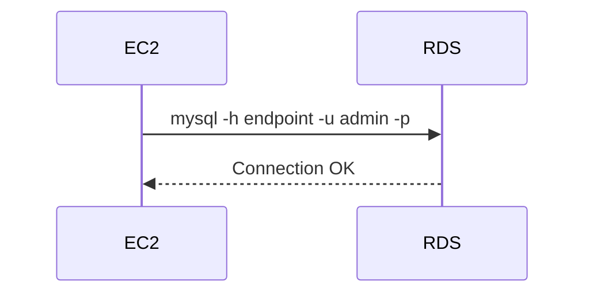

# Connect from EC2

## 1. Concept Overview

Install MySQL client on EC2, connect to RDS endpoint on port 3306, run basic SQL.

---

## 2. Why DevOps Engineers Test DB Connectivity

Validates security groups, subnet routing, credentials before app deployment.

---

## 3. Important Terms

| Term | Meaning |
|------|---------|
| **Endpoint** | RDS hostname for connections |
| **Port** | 3306 for MySQL |

---

## 4. Architecture Diagram



---

## 5. Before You Start

RDS Available. EC2 has client SG. Password saved.

---

## 6. Step-by-Step Lab (SSH to EC2)

```bash
# Install client
sudo dnf install mariadb105 -y

# Connect (replace endpoint)
mysql -h devops-lab-ntech-mysql.cda0j2kkxa0m.ap-southeast-1.rds.amazonaws.com -u admin -p --skip-ssl

for ubuntu
sudo apt update

# Install MySQL/MariaDB-compatible client
sudo apt install mariadb-client -y

For a quick lab test, try:


mysql -h devops-lab-ntech-mysql.cda0j2kkxa0m.ap-southeast-1.rds.amazonaws.com -u admin -p --skip-ssl

```

Enter password at prompt.

### SQL tests

```sql
CREATE DATABASE devopslab;
SHOW DATABASES;
USE devopslab;
CREATE TABLE students (id INT AUTO_INCREMENT PRIMARY KEY, name VARCHAR(50));
INSERT INTO students (name) VALUES ('devops-lab-<yourname>');
SELECT * FROM students;
EXIT;
```

---

## 7. Validation

| Check | Expected |
|-------|----------|
| mysql connect | No timeout |
| INSERT/SELECT | Works |

---

## 8. Troubleshooting

| Problem | Solution |
|---------|----------|
| Timeout | SG wrong; RDS not in same VPC; public access needed but disabled (fix SG not public) |
| Access denied | Wrong password/user |
| Unknown host | Copy endpoint from RDS console |

---

## 9. Cleanup

Keep for snapshot lesson.

---

## 10. Interview Questions

1. **Why connection timeout?**
   - *Usually SG or network path — not credentials.*

---

## 11. What We Achieved

- Connected EC2 to private RDS MySQL

**Next:** [04-backup-snapshot.md](04-backup-snapshot.md)
