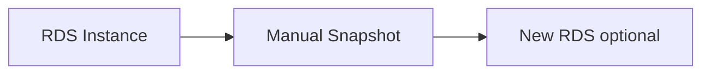

# Backup Snapshot

## 1. Concept Overview

**Manual DB snapshot** captures RDS state for restore. Automated backups (if enabled) run on schedule — manual snapshots persist until you delete them.

---

## 2. Why DevOps Engineers Snapshot RDS

Before schema migration, version upgrade, or lab teardown with restore demo.

---

## 3. Important Terms

| Term | Meaning |
|------|---------|
| **Snapshot** | Storage backup of entire DB instance |
| **Restore** | Creates **new** RDS instance from snapshot |

---

## 4. Architecture Diagram

---

## 5. Before You Start

> **Cost warning:** Snapshots cost per GB-month.

---

## 6. Step-by-Step Console Lab

### Manual snapshot

1. **RDS** → **Databases** → select instance
2. **Actions** → **Take snapshot**
3. **Name:** `devops-lab-<yourname>-mysql-snap`
4. **Take snapshot**
5. **Snapshots** → wait **Available**

### View automated backups (if enabled)

1. Instance → **Maintenance & backups** tab
2. Note backup window and retention

### Restore concept (optional — costs money)

1. **Snapshots** → select → **Actions** → **Restore snapshot**
2. New identifier `devops-lab-<yourname>-mysql-restored`
3. **Cancel** if instructor says snapshot-only — or restore then delete immediately

---

## 7. Validation

| Check | Expected |
|-------|----------|
| Snapshot | Available status |

---

## 8. Troubleshooting

| Problem | Solution |
|---------|----------|
| Long pending | Normal for first snapshot |

---

## 9. Cleanup

[cleanup.md](cleanup.md) — delete snapshots with instance.

---

## 10. Interview Questions

1. **Snapshot vs read replica?**
   - *Snapshot is backup; replica is live copy for read scaling.*

---

## 11. What We Achieved

- Created RDS manual snapshot

**Next:** [cleanup.md](cleanup.md)
