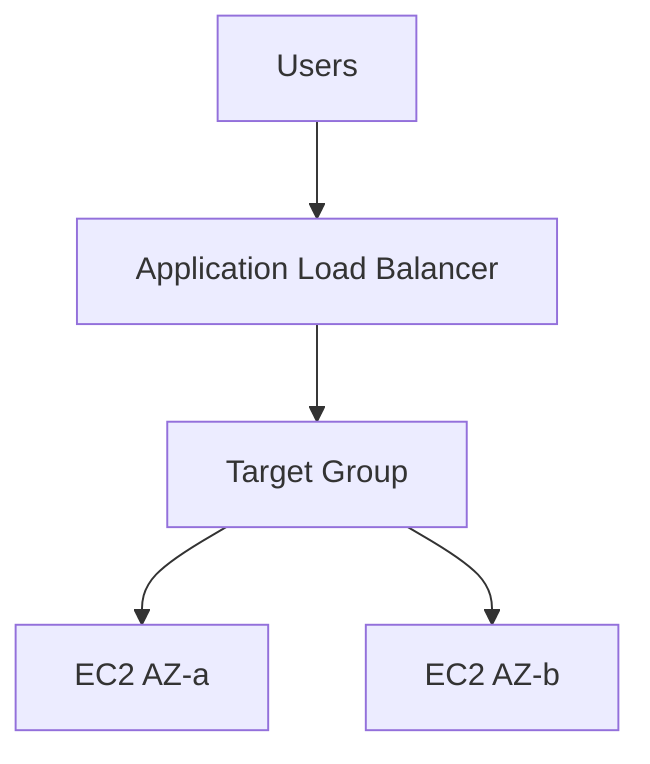

# ALB Theory

## 1. Concept Overview

**Application Load Balancer (ALB)** distributes HTTP/HTTPS traffic across multiple targets (EC2 instances) in multiple AZs. Includes health checks and path-based routing.

---

## 2. Why DevOps Engineers Use ALB

| Benefit | Detail |
|---------|--------|
| High availability | Traffic shifts to healthy instances |
| Scaling | Works with Auto Scaling Group |
| SSL termination | HTTPS at load balancer (advanced) |
| Health checks | Unhealthy instances removed automatically |

---

## 3. Important Terms

| Term | Meaning |
|------|---------|
| **Listener** | Port/protocol on ALB (e.g. HTTP:80) |
| **Target group** | Pool of instances receiving traffic |
| **Health check** | ALB pings path (e.g. `/`) |
| **DNS name** | ALB public hostname for users |

---

## 4. Architecture Diagram

---

## 5. Before You Start

Region `ap-southeast-1`, default VPC OK.

> **Cost warning:** ALB bills **~$0.025/hr** + LCU. **Delete same day.**

---

## 6. Explore ELB Console

1. **EC2** → **Load Balancers** (under Load Balancing)
2. **Target Groups**

---

## 10. Interview Questions

1. **ALB vs Classic LB?**
   - *ALB Layer 7 HTTP; Classic legacy Layer 4/7.*

2. **ALB vs NLB?**
   - *NLB Layer 4 TCP/UDP ultra-low latency.*

---

## 11. What We Achieved

- Understood ALB, listeners, target groups, health checks

**Next:** [02-ami-and-launch-template.md](02-ami-and-launch-template.md)
