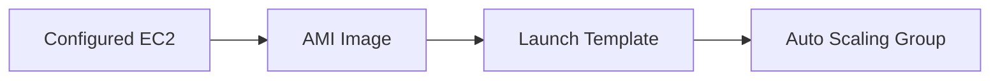

# AMI and Launch Template

## 1. Concept Overview

**AMI (Amazon Machine Image)** snapshots your configured EC2 disk. **Launch template** defines how Auto Scaling launches new instances (AMI, type, SG, user data).

---

## 2. Why DevOps Engineers Use Launch Templates

Consistent instance config every scale-out event — same nginx, same SG.

---

## 3. Important Terms

| Resource | Name |
|----------|------|
| Base EC2 | `devops-lab-<yourname>-alb-base` |
| AMI | `devops-lab-<yourname>-nginx-ami` |
| Launch template | `devops-lab-<yourname>-lt` |

---

## 4. Architecture Diagram



---

## 5. Before You Start

> **Cost warning:** AMI storage (snapshot) has small cost.

---

## 6. Step-by-Step Console Lab

### Step 1 — Launch and configure base EC2


1. Launch `t3.micro` Amazon Linux in **default VPC**
   EC2
→ Instances
→ Launch instances

Name
devops-ubuntu-base-image-builder

Amazon Machine Image

Select:

Ubuntu Server 24.04 LTS
Architecture: 64-bit (x86)
Instance type
t3.micro
Network settings

Configure:

VPC: Default VPC
Subnet: Any public subnet
Auto-assign public IP: Enable
Firewall: Select existing security group
Security group: devops-base-image-sg
Add the User Data script

Expand:

Advanced details
→ User data

#!/bin/bash
set -euxo pipefail

export DEBIAN_FRONTEND=noninteractive

# Update package information
apt-get update -y

# Install required packages
apt-get install -y nginx curl jq unzip

# Enable and start Nginx
systemctl enable nginx
systemctl start nginx

# Retrieve EC2 metadata using IMDSv2
TOKEN=$(curl --fail --silent --show-error \
  --request PUT \
  "http://169.254.169.254/latest/api/token" \
  --header "X-aws-ec2-metadata-token-ttl-seconds:21600")

PRIVATE_IP=$(curl --fail --silent --show-error \
  --header "X-aws-ec2-metadata-token:${TOKEN}" \
  "http://169.254.169.254/latest/meta-data/local-ipv4")

INSTANCE_ID=$(curl --fail --silent --show-error \
  --header "X-aws-ec2-metadata-token:${TOKEN}" \
  "http://169.254.169.254/latest/meta-data/instance-id")

AVAILABILITY_ZONE=$(curl --fail --silent --show-error \
  --header "X-aws-ec2-metadata-token:${TOKEN}" \
  "http://169.254.169.254/latest/meta-data/placement/availability-zone")

HOST_NAME=$(hostname)

# Create demo website
cat > /var/www/html/index.html <<EOF
<!DOCTYPE html>
<html lang="en">
<head>
    <meta charset="UTF-8">
    <meta name="viewport" content="width=device-width, initial-scale=1.0">
    <title>AWS ALB Test</title>

    <style>
        body {
            font-family: Arial, sans-serif;
            background: #f3f4f6;
            text-align: center;
            padding-top: 70px;
        }

        .container {
            display: inline-block;
            background: white;
            padding: 35px 55px;
            border-radius: 12px;
            box-shadow: 0 4px 18px rgba(0, 0, 0, 0.15);
        }

        h1 {
            margin-bottom: 30px;
        }

        .value {
            font-weight: bold;
            color: #232f3e;
        }
    </style>
</head>

<body>
    <div class="container">
        <h1>AWS EC2 and ALB Lab</h1>

        <p>Hostname: <span class="value">${HOST_NAME}</span></p>
        <p>Instance ID: <span class="value">${INSTANCE_ID}</span></p>
        <p>Private IP: <span class="value">${PRIVATE_IP}</span></p>
        <p>Availability Zone: <span class="value">${AVAILABILITY_ZONE}</span></p>
    </div>
</body>
</html>
EOF

# Create a simple ALB health-check endpoint
mkdir -p /var/www/html/health

cat > /var/www/html/health/index.html <<EOF
OK
EOF

# Set ownership and permissions
chown -R www-data:www-data /var/www/html
chmod -R 755 /var/www/html

# Validate Nginx configuration
nginx -t

# Restart Nginx
systemctl restart nginx

# Record completion
echo "Base-image initialization completed successfully at $(date -Is)" \
  > /var/log/base-image-build-complete.log


Now select:

Launch instance

Wait for the EC2 instance to initialize

Go to:

EC2
→ Instances
→ Select devops-ubuntu-base-image-builder

Wait until:

Instance state: Running
Status checks: 2/2 checks passed

User Data can take a few minutes to finish after the instance becomes running.

5. Test the Nginx webpage

Copy the EC2 instance’s:

Public IPv4 address

Open:

http://<PUBLIC-IP>

You should see:

AWS EC2 and ALB Lab

Hostname: ip-172-31-x-x
Instance ID: i-xxxxxxxxxxxxxxxxx
Private IP: 172.31.x.x
Availability Zone: ap-southeast-1a

Test the health endpoint:

http://<PUBLIC-IP>/health/

Expected result:

OK


Stop the base EC2 instance

Go to:

EC2
→ Instances
→ Select devops-ubuntu-base-image-builder
→ Instance state
→ Stop instance

Confirm:

Stop

Wait until:

Instance state: Stopped

10. Create the AMI

With the stopped instance selected, go to:

Actions
→ Image and templates
→ Create image

Configure:

Image name
devops-ubuntu-nginx-base-v1
Image description
Ubuntu 24.04 base AMI with Nginx and ALB demonstration page


Instance volumes

Review the root volume:

Device: /dev/sda1 or /dev/xvda
Size: 20 GiB
Volume type: gp3
Delete on termination: Enabled for future instances
Encryption: Enabled

Select:

Create image

11. Monitor AMI creation

Go to:

EC2
→ Images
→ AMIs
→ Owned by me

Find:

devops-ubuntu-nginx-base-v1

Initially, its status may be:

Pending

Wait until:

AMI state: Available


3. SG `devops-lab-<yourname>-alb-sg`:
   - SSH 22 from **My IP**
   - HTTP 80 from **Anywhere-IPv4** `0.0.0.0/0` **only on instance SG for ALB pattern** — better: create separate SG (see ALB lesson). For now allow HTTP from `0.0.0.0/0` on **ALB SG**, instance SG allows HTTP **only from ALB SG** (production pattern in step 3)

**Production pattern SGs:**

**ALB SG** `devops-lab-<yourname>-alb-sg`:
- HTTP 80 from `0.0.0.0/0` (public users)

**Instance SG** `devops-lab-<yourname>-app-sg`:
- HTTP 80 from **source: alb-sg** (not internet directly)
- SSH 22 from **My IP**

3. SSH and install nginx + custom page:

```bash
sudo dnf install nginx -y
sudo systemctl start nginx && sudo systemctl enable nginx
echo "<h1>devops-lab-<yourname> — ALB backend</h1>" | sudo tee /usr/share/nginx/html/index.html
```

### Step 2 — Create AMI

1. **EC2** → select instance → **Actions** → **Image and templates** → **Create image**
2. **Image name:** `devops-lab-<yourname>-nginx-ami`
3. **No reboot** (optional for lab)
4. **Create image**
5. **AMIs** → wait **Available**

### Step 3 — Create launch template

1. **EC2** → **Launch templates** → **Create launch template**
2. **Name:** `devops-lab-<yourname>-lt`
3. **AMI:** select your AMI
4. **Instance type:** `t3.micro`
5. **Key pair:** your key
6. **Security group:** `devops-lab-<yourname>-app-sg`
7. **Advanced** → User data (optional — ensure nginx starts):

```bash
#!/bin/bash
systemctl start nginx
```

8. **Create launch template**

### Step 4 — Terminate base instance (required)

After the AMI is **available**, terminate the base instance — ASG will launch new instances from the launch template.

1. **EC2** → **Instances** → select `devops-lab-<yourname>-alb-base`
2. **Instance state** → **Terminate instance**
3. Wait until **Terminated**

> If you skip this step, the base EC2 keeps billing. [cleanup.md](cleanup.md) also terminates it if still running.

---

## 7. Validation

| Check | Expected |
|-------|----------|
| AMI | Available |
| Launch template | Latest version default |

---

## 8. Troubleshooting

| Problem | Solution |
|---------|----------|
| AMI pending | Wait 5–10 min |

---

## 9. Cleanup

[cleanup.md](cleanup.md) — delete ASG, ALB, AMI, snapshots, and terminate `alb-base` if still running.

---

## 10. Interview Questions

1. **Launch template vs launch configuration?**
   - *Template is current; launch configuration legacy.*

---

## 11. What We Achieved

- Golden AMI and launch template for scaling

**Next:** [03-create-alb.md](03-create-alb.md)
