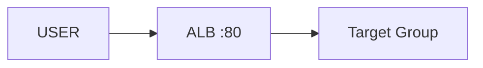

# Create ALB

## 1. Concept Overview

Create **Application Load Balancer** with HTTP listener on port 80 and **target group** for EC2 instances.

---

## 2. Why DevOps Engineers Create ALB First

Target group must exist before registering instances or attaching Auto Scaling Group.

---

## 3. Important Terms

| Resource | Name |
|----------|------|
| ALB | `devops-lab-<yourname>-alb` |
| Target group | `devops-lab-<yourname>-tg` |

---

## 4. Architecture Diagram

---

## 5. Before You Start

VPC: default (or custom with public subnets in 2 AZs).

> **Cost warning:** ALB hourly charge starts now.

---

## 6. Step-by-Step Console Lab

### Step 1 — Create target group

1. **EC2** → **Target Groups** → **Create target group**
2. **Target type:** Instances
3. **Name:** `devops-lab-<yourname>-tg`
4. **Protocol:** HTTP, **Port:** 80
5. **VPC:** default
6. **Health check path:** `/`
7. **Healthy threshold:** 2, **Unhealthy:** 2
8. **Next** — skip registering targets (ASG will attach)
9. **Create target group**

### Step 2 — Create ALB

1. **EC2** → **Load Balancers** → **Create load balancer** → **Application Load Balancer**
2. **Name:** `devops-lab-<yourname>-alb`
3. **Scheme:** Internet-facing
4. **IP address type:** IPv4
5. **Network mapping:** default VPC — select **at least 2 AZs** (e.g. 1a and 1b)
6. **Security group:** `devops-lab-<yourname>-alb-sg` (HTTP 80 from internet)
7. **Listeners:** HTTP port 80 → forward to `devops-lab-<yourname>-tg`
8. **Create load balancer**
9. Wait **Active** — copy **DNS name**

---

## 7. Validation

| Check | Expected |
|-------|----------|
| ALB state | Active |
| Target group | Empty or unhealthy until instances registered |

---

## 8. Troubleshooting

| Problem | Solution |
|---------|----------|
| No healthy targets | Normal until ASG attaches instances |

---

## 9. Cleanup

[cleanup.md](cleanup.md)

---

## 10. Interview Questions

1. **Why 2 AZs for ALB?**
   - *ALB requires subnets in multiple AZs for HA.*

---

## 11. What We Achieved

- ALB + target group ready for ASG

**Next:** [04-create-auto-scaling-group.md](04-create-auto-scaling-group.md)
