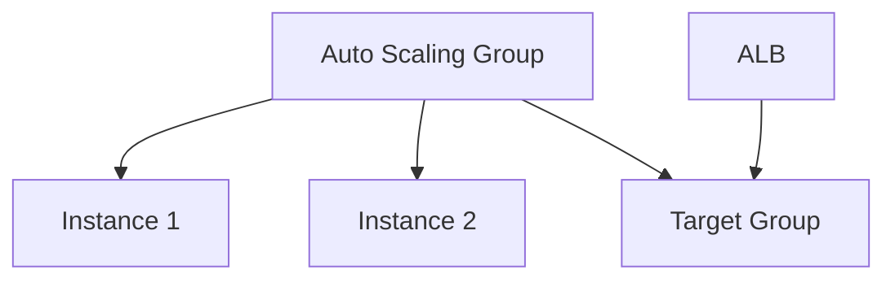

# Create Auto Scaling Group

## 1. Concept Overview

**Auto Scaling Group (ASG)** maintains desired instance count using launch template, spreads across AZs, registers instances with target group.

---

## 2. Why DevOps Engineers Use ASG

Replace failed instances, scale on demand, deploy consistent AMIs.

---

## 3. Important Terms

| Term | Meaning |
|------|---------|
| **Desired capacity** | Target instance count (use 2 for lab) |
| **Min / Max** | Scaling boundaries |
| **Scaling policy** | Simple — CPU target tracking (optional) |

---

## 4. Architecture Diagram

---

## 5. Before You Start

Launch template and target group exist.

> **Cost warning:** 2× `t3.micro` + ALB billing.

---

## 6. Step-by-Step Console Lab

### Create ASG

1. **EC2** → **Auto Scaling Groups** → **Create Auto Scaling group**
2. **Name:** `devops-lab-<yourname>-asg`
3. **Launch template:** `devops-lab-<yourname>-lt` (latest)
4. **Next**
5. **VPC:** default — select **multiple subnets** (2 AZs)
6. **Next**
7. **Attach to load balancer:** Existing → ALB `devops-lab-<yourname>-alb`
8. **Target group:** `devops-lab-<yourname>-tg`
9. **Health check type:** ELB (uses target group health check)
10. **Next**
11. **Group size:** Desired **2**, Min **2**, Max **2** (fixed for lab cost control)
12. **Next** — optional scaling policy: skip or add **Target tracking** CPU 50% (instructor choice)
13. **Next** → **Create Auto Scaling group**

### Wait for instances

1. **EC2** → **Instances** — 2 new instances **Running**
2. **Target Groups** → your TG → **Targets** tab — **healthy** (may take 2–3 min)

---

## 7. Validation

| Check | Expected |
|-------|----------|
| ASG | 2 instances InService |
| Target health | 2 healthy |

---

## 8. Troubleshooting

| Problem | Solution |
|---------|----------|
| Unhealthy targets | Check app-sg allows HTTP from ALB SG; nginx running; health path `/` |
| Instances not launching | Check launch template, subnet, limits |

---

## 9. Cleanup

[cleanup.md](cleanup.md)

---

## 10. Interview Questions

1. **ELB vs EC2 health check?**
   - *ELB checks app via target group; better for web apps.*

---

## 11. What We Achieved

- ASG with 2 instances behind ALB

**Next:** [05-test-high-availability.md](05-test-high-availability.md)
