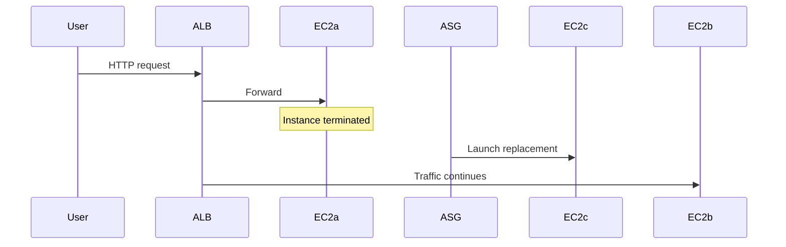

# Test High Availability

## 1. Concept Overview

Test ALB by opening DNS in browser, then **terminate one instance** — ASG replaces it and ALB routes to healthy targets.

---

## 2. Why DevOps Engineers Test Failover

Proves architecture survives single instance failure — core reliability practice.

---

## 3. Important Terms

| Term | Meaning |
|------|---------|
| **InService** | Instance passing health checks |
| **Terminating** | Instance shutting down — ASG launches replacement |

---

## 4. Architecture Diagram

---

## 5. Before You Start

ALB DNS name copied. 2 healthy targets.

> **Cost warning:** Still billing — cleanup after test.

---

## 6. Step-by-Step Lab

### Test 1 — Browser access

1. Open `http://<alb-dns-name>` (from ALB console)
2. See nginx page — refresh multiple times

### Test 2 — Terminate one instance

1. **EC2** → **Instances**
2. Select one instance from ASG (check **Auto Scaling Group** column)
3. **Instance state** → **Terminate instance**
4. Confirm

### Test 3 — Observe recovery

1. **Auto Scaling Groups** → **Activity** tab — launch activity
2. **Target group** → targets — temporarily 1 healthy, then 2 again (~3–5 min)
3. Browser — site still loads

### Test 4 — Optional scaling policy demo

If CPU policy enabled, stress test with `ab` or `stress` (advanced) — skip in basic lab.

---

## 7. Validation

| Check | Expected |
|-------|----------|
| ALB URL | Works before and after terminate |
| ASG | Maintains 2 instances |
| Target group | Returns to 2 healthy |

---

## 8. Troubleshooting

| Problem | Solution |
|---------|----------|
| 502 Bad Gateway | No healthy targets — check SG and nginx |
| Slow recovery | Normal — wait for health checks |

---

## 9. Cleanup

[cleanup.md](cleanup.md) **immediately**.

---

## 10. Interview Questions

1. **What happens when instance dies behind ALB?**
   - *ALB stops routing to it; ASG replaces instance.*

---

## 11. What We Achieved

- Verified HA with ALB + ASG failover test

**Next:** [cleanup.md](cleanup.md)
