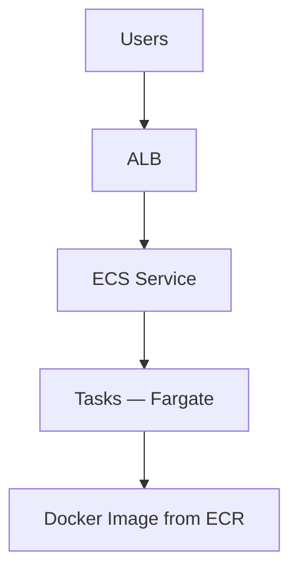

# ECS Theory

## 1. Concept Overview

**Amazon Elastic Container Service (ECS)** runs Docker containers on AWS without managing Kubernetes yourself.

| Launch type | Meaning |
|-------------|---------|
| **Fargate** | Serverless — no EC2 to manage (lab choice) |
| **EC2 launch type** | You manage ECS container instances |

**Core components:**

| Component | Role |
|-----------|------|
| **Cluster** | Logical grouping of tasks/services |
| **Task definition** | Blueprint — image, CPU, memory, ports |
| **Task** | Running containers from definition |
| **Service** | Keeps desired task count running |

---

## 2. Why DevOps Engineers Use ECS

- Deploy Docker images from CI/CD
- Scale services with load balancer
- Simpler than self-managed Kubernetes for many teams

---

## 3. Important Terms

See table above plus **Container**, **Image**, **Port mapping**.

---

## 4. Architecture Diagram

---

## 5. Before You Start

Docker installed locally (for build/push concept). Region `ap-southeast-1`.

> **Cost warning:** Fargate + ALB + ECR — delete same day.

---

## 6. Explore ECS Console

1. **ECS** → **Clusters** (empty)
2. **Task definitions**

---

## 10. Interview Questions

1. **ECS vs EKS?**
   - *ECS AWS-native; EKS managed Kubernetes.*

2. **Fargate vs EC2 launch?**
   - *Fargate no servers; EC2 you manage instances.*

---

## 11. What We Achieved

- Understood ECS cluster, task, service, Fargate

**Next:** [02-ecr-theory.md](02-ecr-theory.md)
